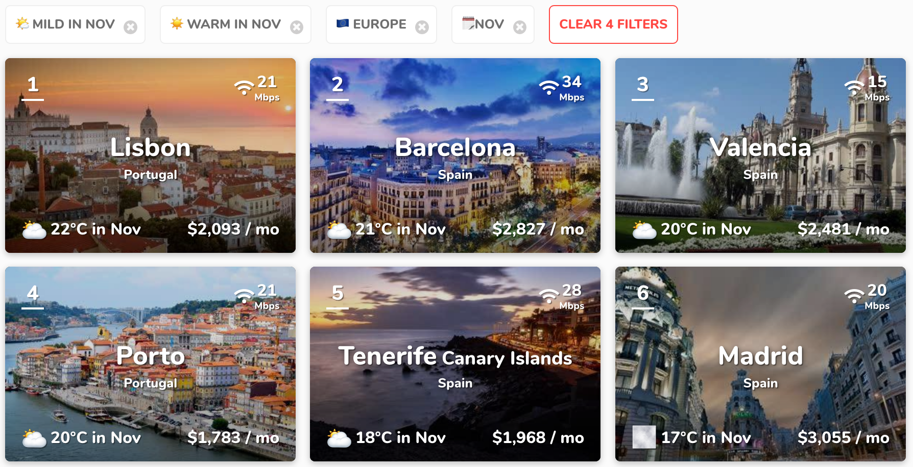

After 2 years, I decided to leave Dublin. I'm still working for the same company (VSware) but 100% remote.
When it comes to finding a "nomadic friendly" city, usually [Nomad List](https://nomadlist.com/) is the site to go. I put few parameters: Europe and good weather (I needed it!).

As you can see, Lisbon appear in the first position. Plus, I heard good things about this city. That's 2 good reasons to give a try!

## Accomodation

My plan was to stay a month in Lisbon. For short term stay, the best option remains Airbnb. In Lisbon, you can get something decent from 20 to 50€/night.
If you stay longer, you should probably take a look at some [dedicated Facebook groups](https://www.facebook.com/groups/1544177542561065/).

## Meeting people

The expat and digital communities here are very active. It results by tons of different events on [Meetup.com](https://www.meetup.com/find/events/?allMeetups=true&radius=25&userFreeform=Lisbon%2C+Portugal&mcId=c1032578&change=yes&eventFilter=mysugg).
Also, I've found this [Facebook group (Lisbon Digital Nomads)](https://www.facebook.com/groups/532696873566509/) very interesting.

## Good places to work from

One thing that really surprised me, is the very strong café culture in the city. It's very frequent to find people working
I usually stay 3-4h / place.

**Linha D'Agua**
* 🤗 Amazing view! 
* 👎 Unsympathetic staff
* 🔌 Power outlet: few
* 🌐 Network: ok

<blockquote class="twitter-tweet" data-lang="en">
👨🏼‍💻 here is my office of the day! I really enjoy my new nomad life 😃 <a href="https://t.co/JAjsMCCcQz">pic.twitter.com/JAjsMCCcQz</a>
&mdash; Maxence Poutord (@_maxpou) <a href="https://twitter.com/_maxpou/status/1052159706880507909?ref_src=twsrc%5Etfw">October 16, 2018</a></blockquote>

**Choupana**
* 🤗 Amazing staff, a lot of pastries. Price are ok.
* 🔌 Power outlet: Almost no one
* 🌐 Network: ok

**Galveias Palace (Library)** - There is also a caffe outside in the yard. I spent a lot of time in this coffee!
* 👍 Quiet atmosphere, very cheap
* 🔌 Almost a lot (in Library)
* 🌐 Network: bad. Like very bad!

**Wish Coffee** - Located in Lx Factory, an old industrial complex.
* 👍 Well placed.
* ⚠️ No laptop sticker on table. I came on the morning and it was ok for me to work there for few hours. A bit more expensive than other (2€ for a coffee when the average is 0.7-1€). 
* 🔌 Power outlet: few
* 🌐 Network: ok

**Ler Devagar** - Next to Wish Coffee. There's a bar downstairs.
* 👍 Well placed. Decoration is super nice.
* ⚠️ Can be noisy (visitors). Also, it's allowed to smoke inside 😩
* 🔌 Power outlet: many
* 🌐 Network: ok

<blockquote class="twitter-tweet" data-lang="en">
Another day, another office! Remote working 😍 <a href="https://t.co/i1uWLJEamt">pic.twitter.com/i1uWLJEamt</a>
&mdash; Maxence Poutord (@_maxpou) <a href="https://twitter.com/_maxpou/status/1053306794922176512?ref_src=twsrc%5Etfw">October 19, 2018</a></blockquote>

**Evolution Hotel**
* 👍 Nice sofa, excellent staff!
* 🔌 Power outlet: many
* 🌐 Network: good

## Mobile application

(android but I hope it's also available on other OS)

* Meetup.com.
* Foursquare. Say where you are and what you're looking for (coffee, things to do in the city), and the app will find it for you! I've found user review more accurate than other applications.
* WifiMap. Show a map of the city with all Wi-Fi access and passwords. It was very helpful. For example, one day I've found a very nice coffee but internet connection was very slow. Thank to this app, I've found a better network.
Only cons, it contains few adds.

## My feedback about Lisbon

My overall feedback about Lisbon is very positive. I really liked this city!

english spoken

Food: good food (Pastel de Nata).
Nightlife
Transports
I've met really good people
Weather was great (October)
perfect size: not too big, not too small.
exploration: lot of good things to visit like Sintra, Belem...

Negative point:
victim of success. Price are getting very high
