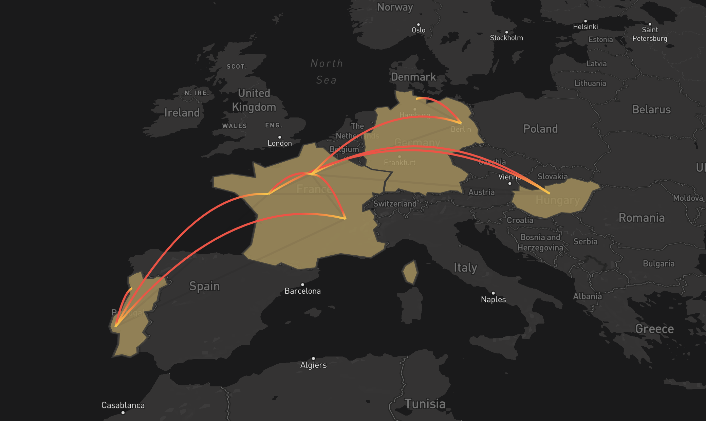

*Disclaimer: I mostly wrote this blog post for myself. Writing my Year in review helps me to celebrate my biggest wins, see what was wrong and define goals for the upcoming year.*

## 👨‍💻 Work

Still working

Gained interest in accessibility,

## 👨🏼‍🔬 Side projects + Blog

* Revamped my resume using web technologies.
* redisigned my blog
* mentoring G. He made very good progress over the last year.

## ✈️ Travels

## ✨ Random stuff

* moved to Berlin.
* I have my name on my doorbel. Might sounds stupid, but it didn't happened to me for years! But I don't think I'll stay long in this place. I'm still giving a fake adress everytime someone ask me :D
* Spent a few days helping my friend to change his roof! First time in my life I walked on a roof.
* reinstalled Age of Empires II a very strategic video game. I used to play this game 20y ago! Love it.

## Previous "high-level goals"

* ✅ & ❌ [Travel] Discover new countries (Hungary 🇭🇺 and Japan 🇯🇵) ~ *I only went to Hungary.*
* ❌ [Travel] Be more organised when it comes to my travels ~ *That was a stupid goal. I like to be somehow unorganised when I (used to) travel. It gives more room to improvisation... (as long as I don't miss my bus/train/plane)*
* ✅ [Life] Stay remote / nomad ~ *this one is partially true. I *;
* ❌ [Life] Continue to meet nomads when I travel;
* ❌ [Life] Better invest my money ~ *I'm still investing my money but not regulary.*
* ✅ [Life] Complete another Dry January ~ *I DID IT!!!*
* ✅ [Blog] Write 8 blog posts + continue to cross-post on dev.to ~ *I'm wrote 11 (some of them are in)*
* ✅ [Blog] Write one post in a new platform ~ *why not?*;
* ✅ [Blog] Add new functionalities on my blog (i.e. RSS) ~ *I added cool stuffs like RSS/darkmode/translated posts.*
* ❌ [Work] Learn more about Wasm (WebAssembly);
* ✅ [Work] Give 1 technical talk ~ *I was honoured to be the guest speaker for the 1st Vue.js Kenya!*

## High-level 2021 goals

* [Life] change job. I feel I'm stagning in my carreer. Time to step-up!
* [Life] make 2021 better than 2020.
* [Life] Complete another "Dry January" (can be in a different month)