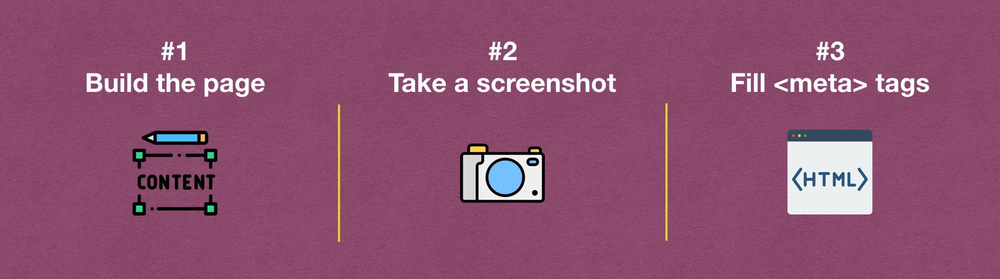
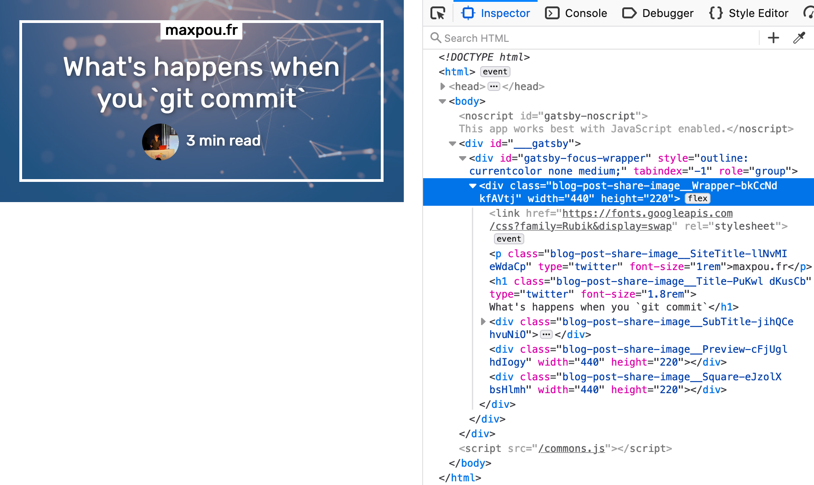
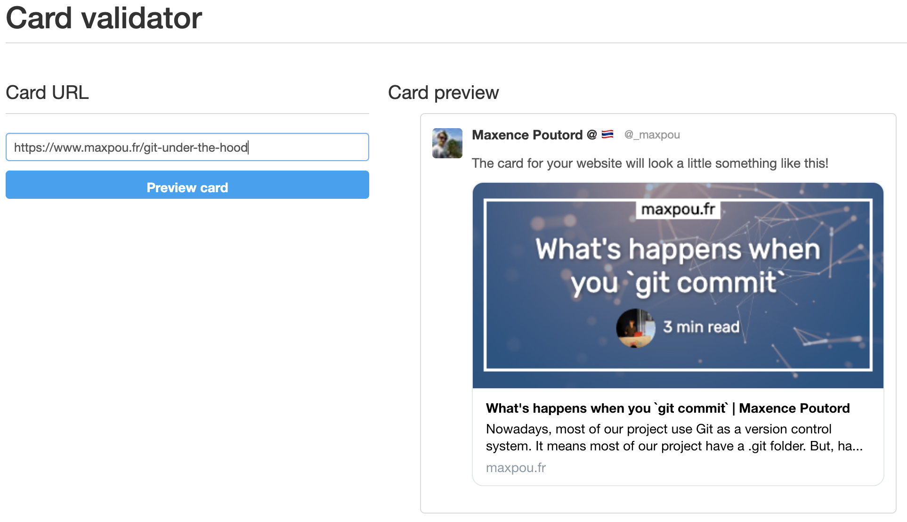

*TL;DR: Generating share images can be done in 3 steps*



1. create a preview page;
2. screenshot this page (with pupetter);
3. fill page's metatags and add screenshot in.

---

The idea behind this post is to show you how to generate preview images like this for your Gatsby.js website.
Social share images are used by social media (Twitter/Facebook/LinkedIn...) and also some conversational applications like Slack/Telegram/WhatsApp.


Before we start, keep in mind that Gatsby is static website generator. We can't generate image *"on the fly"* like we do with other languages (i.e. PHP...).

## Step 1: create the preview page

Your blog post page should be generated with something like `createPage`. So, we are going to duplicate this statement to create the preview page. 

```js
// gatsby-node.js
posts.forEach((post, index, posts) => {
  // create the blogpost page
  createPage({
    path: post.node.frontmatter.slug,
    component: require.resolve('./src/templates/blog-post.js'),
    context: {
      slug: post.node.frontmatter.slug
    },
  })

  // create the blogpost page preview
  createPage({
    path: `${post.node.frontmatter.slug}/image_tw`,
    component: require.resolve('./src/templates/blog-post-share-image.js'),
    context: {
      slug: post.node.frontmatter.slug,
      // optionnal infos (i.e. if you want to generate multiple pictures)
      width: 440,
      height: 220,
    },
  })
  // create another one for OG tags with different context
})
```

---

💡**How to disable this page in production?**

I guess you don't want to see this page is production right?
In this case, you can wrap the `createPage` in an if condition. So, the page will be only accessible with `gatsby develop`.

```js
if (process.env.gatsby_executing_command.includes('develop')) {
  createPage({
    // ... 
  })
}
```

---

You can duplicate the `blog-post.js` to create `blog-post-share-image.js`. After that, the preview accessible at `http://localhost:8000/your-article-slug/image_tw`. Now, you can use your html/css skill to make the nicest preview 💪. 

I reccommend you to create something that fit in 440 x 220 pixels.



## Step 2: screenshot the preview

To take a screenshot, I use pupetter. Here's the script I am using to take a screenshot:

```js
// scripts/generatePostPreviewImages.js
// full script available here: 
// https://github.com/maxpou/gatsby-starter-morning-dew/blob/master/scripts/generatePostPreviewImages.js

// #!/usr/bin/env node
const puppeteer = require('puppeteer')

const takeScreenshot = async (url, width, height, destination) => {
  const browser = await puppeteer.launch({
    args: ['--no-sandbox', '--disable-setuid-sandbox'],
  })
  const page = await browser.newPage()
  await page.goto(url, {
    waitUntil: 'networkidle2',
  })
  await page.screenshot({
    path: destination,
    clip: {
      x: 0,
      y: 0,
      width,
      height,
    },
  })

  await browser.close()
}

const main = async () => {
  const files = await Promise.all(getArticleFiles().map(parseFile))

  for (let i = 0; i < files.length; i++) {
    const file = files[i]
    const destinationFile = join(file.directory, `${file.slug}-share.png`)

    if (file['generate-card'] !== false && !existsSync(destinationFile)) {
      await takeScreenshot(
        `${baseUrl}${file.slug}/image_share`,
        440,
        220,
        destinationFile
      )
      console.log(`Created ${destinationFile}`)
    }
  }
}

main()
```

...and in the package.json, add the following script. The bin part is necessary if you're working on a npm package. Otherwise, you can skip it!

```json
{
  "scripts": {
    /* ... */
    "generatePostPreviewImages": "./scripts/generatePostPreviewImages.js"
  },
  "bin": {
    "generatePostPreviewImages": "./scripts/generatePostPreviewImages.js"
  },
}
```

To generate pictures, open 2 terminals:

* Terminal 1: `npm run gatsby develop`;
* Terminal 2: `npm run generatePostPreviewImages`.

You should have generated some preview images. The script above put the image directly in the blog post folder.


## Step 3: integrate the picture in the DOM

Now we have generated images for our blog post. We now need to link the generated images with the screenshot generated.


```yml
# ./my-blog-post.md
---
title: "How to generate social share images with Gatsby"
slug: generate-social-image-share-with-gatsby
cover: ./cover.png
# links preview image
imageShare: ./git-under-the-hood-share.png
---

Your blog post content
```

If you don't have it already, you can now create an SEO component to manage meta information in the `<head>`. 
You can get some inspiration in the [Gatsby-starter-blog](https://github.com/gatsbyjs/gatsby-starter-blog/blob/master/src/components/seo.js). You can also copy/paste [the code I use for my website](https://github.com/maxpou/gatsby-starter-morning-dew/blob/master/src/components/SEO.js#L33-L45). Both use [react-helmet](https://github.com/nfl/react-helmet).

At the end, you should have something similar:

```html
<!-- Open Graph meta tags -->
<meta property="og:url" content="https://www.maxpou.fr/super-cool-blog">
<meta property="og:type" content="article">
<meta property="og:title" content="My super-cool blog post | maxpou.fr">
<meta property="og:description" content="This is my very cool blog post description!">
<meta property="og:image" content="https://www.maxpou.fr/path/to/image/generated.png">


<!-- Twitter Card Tags -->
<meta name="twitter:card" content="summary_large_image">
<meta name="twitter:creator" content="_maxpou">
<meta name="twitter:title" content="My super-cool blog post | gatsby-starter-morning-dew">
<meta name="twitter:description" content="This is my very cool blog post description!">
<meta name="twitter:image" content="https://www.maxpou.fr/path/to/image/generated.png">
```


and... tadaa it should works 🎉


## Conclusion

If you want to check your metatags, you can use [Twitter cards Validator](https://cards-dev.twitter.com/validator). And to test the OG tags, I usually send a message to myself on Slack.



---

That's it for today! I hope this post will help you to generate your social images share. I copied all examples from my Gatsby starter/theme: [gatsby-starter-morning-dew](https://github.com/maxpou/gatsby-starter-morning-dew).
