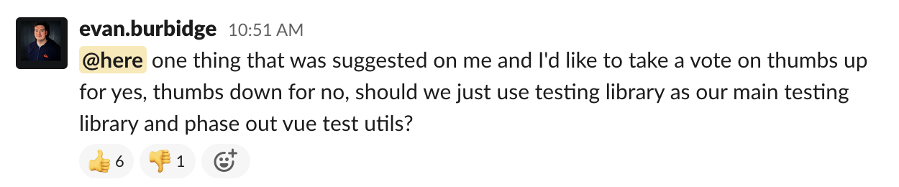

il faut tester. Il y a vue-testing library. Ca marche tres bien pour les tests unitaires de components.
Par contre pour les test d'integration ca devient vite tres verbeux. On devait sans arret mettre des timeout a zero et attendre...


Il y a un peu plus d'un an et demi, mon collegue John m'a fait decouvrir une superbe librairie: testing-library.
C'est developpe par Kent C. Dodds.

Au debut on a supporte les deux: vue-test-utils and testing library. A few months ago, an colleague asked this question:



Why we all like it? Because it provides an easy way to 

Ok enough talking. I guess you want some code :)

## Let's get it started!

for this article, I'll take a small app I created.


Functionnalities are quite basic:
* fetch products from the Star Wars API and print it to the screen;
* load more product when user click on "Load more data...";
* filter products by name when user type something in the textbox;
* add product in the basket;
* ~~buy products.~~ Nah, I'm sorry. I'm just Max. Not Elon Musk. I can't sell starships 😁

Code is available here and a demo


## Our first test

The first this I want to test is the presence of starships on my page!

```js
// tests/unit/catalog.spec.js
import { render } from '@testing-library/vue'

it('should show products name, detail and price', async () => {
  const { getByText } = await render(App)

  getByText('Executor')
  getByText('Kuat Drive Yards, Fondor Shipyards')
  getByText('$1,143,350,000.00')
})
```

💥 Boom! That's it!

1. `render(App)`: this is where we instanciate the component.
2. `const { getByText }`: we define the query we want to use. If you have intellisense on your IDE, you will see a few other queries available.
3. `getByText('Executor')`: we search for the _"Executor"_ occurence in the mounted component. This value must be unique!


## Interacting with the page (click, keypress...)

Now we want to test the filter functionnality.

```js{3}
it('should be able to filter products', async () => {
  const { queryByText, getByLabelText } = await render(App)
  await fireEvent.change(getByLabelText('Filter results'), { target: { value: 'wing' } })

  expect(queryByText('Death Star')).not.toBeInTheDocument()
  expect(queryByText('X-wing')).toBeInTheDocument()
  expect(queryByText('Y-wing')).toBeInTheDocument()
})
```

To interact within the DOM, we use `fireEvent.change(selector, options)`. If we wanted to click on something, we will use `fireEvent.click`. Keep in mind, `fireEvent` return a promise, don't forget the await statement.


## Store (Vuex) 


## Routing (vue-router)

When you load your component, this one is not aware of the 

```js
import { render as r } from '@testing-library/vue'

export function render (ui) {
  return r(ui, { routes })
}
```


```js{5}
it('basket should be empty', async () => {
  const { getByText } = await render(App)
  await fireEvent.click(getByText('Basket'))

  await waitFor(() => getByText('Your basket is empty!'))
})
```


## One render to rule them all!

## The quest for the perfect query

Finding the right query to use can be tricky.

https://testing-playground.com/
https://testing-library.com/docs/guide-which-query

When you're lost, think about your users. How do you want them to log in: 
* by puttiing their your credential in a textbox with a `class="form form-password"`?
* by puttiing their your credential in a textbox with a label "password"?

See? 😉
[Think users](/10-tips-write-better-tests#6---test-your-app-in-the-same-way-as-a-user-will-use-it). If you pick the 2nd, you will kill two birds with one stone. You will test the login feature plus your component accessiblility!

## Debugging

testing lib ne vous donne pas acces a tous les mecamismes internes du composant. C'est volontaire.
Il veulent que l'on utilise 

Sinon il y a l'option debug.

```js{4}
it('should test something but it\'s not working', async () => {
  const { getByText, debug } = await render(App)

  debug()
  // getByText('broken assertion')
})
```

Then, if you `npm test`, you will see the DOM in the console (with a nice syntax color).

> Help, my output is truncated!

You can override the debug max size like this.

```bash
DEBUG_PRINT_LIMIT=100000 npm test
```

