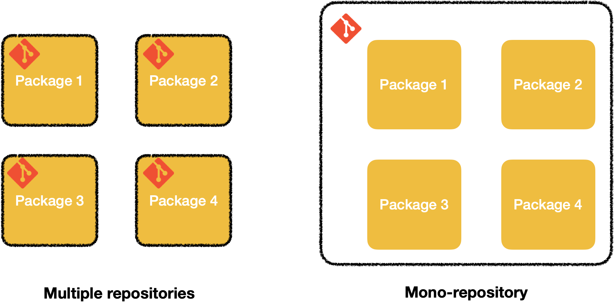
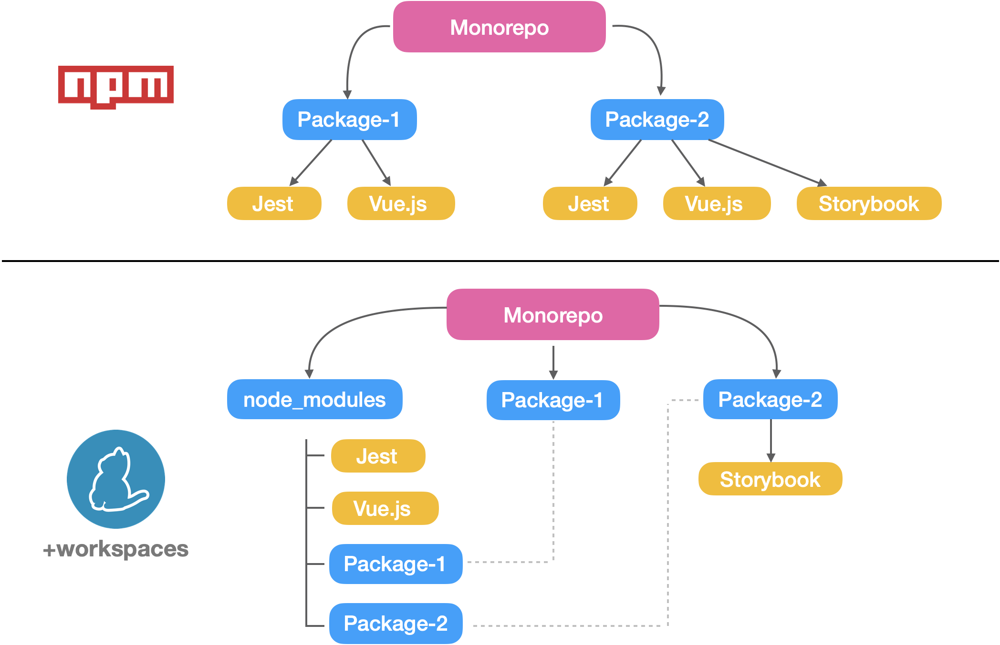

Trends today is to splits application. Microservices, microFrontends...
Against this trend, some companies had decided to put multiple application/libraries under the same git repository.



I've been using and maintaining a monorepo for 2 years now. Here are my thoughts about it.


## Pros

### 🤝 Team work

**Single source of truth**:  
The project I'm working on used to have a very weird name for main branch. When we changed this name to another one, some repositories were updated, some were not (oversight). With a monorepo, You only have to find this information once.

**Favor contribution**:  
When you already have the code, contribution is easier. You don't need to search for the repo, clone it and install it beforehand.


**Better overview of the whole system**:  
Don't need to go to the repo url, then clone it and realising.
a plain old ctrl + F is enough

**Favor large refactoring**:  
Let say you want to change something in one package used everywhere else. You can update all the package in one commit!

**Remove unused code with confidence**:  
How many times you wanted to remove code but you didn't because you didn't knew if code was used somewhere else? Again, if you can search 


### 👨‍👩‍👧 Dependencies

**Less space on your hard drive**:  
If you're familiar with the JavaScript ecosystem, you're probably aware that the `node_module` folder can be [insanely heavy](https://www.reddit.com/r/ProgrammerHumor/comments/6s0wov/heaviest_objects_in_the_universe/). Our ~30 apps/packages used to take 12Gb on our hard drive. Yes, 12 Giga bytes. We had dependencies like Vue.js installed 30 times. Fortunatelly, some tools (like yarn) symlink redundant dependencies when workspaces are enabled. Thanks to this functionnality, [we went from 12Gb to 1.7Gb](https://twitter.com/_maxpou/status/1263426573379739651).


_Note: npm 7.0 now support workspaces. However it's still on the early stage._

**Cross-package hot-reload**:  
Some tools automatically symlinks local dependencies together. (so you can get hot-reload between local repos ✨)

**No Diamond dependency problem**  
Diamond dependency problem: https://www.youtube.com/embed/W71BTkUbdqE?start=1189
make backward compatible changes easily, in one commit you can revert change in multiple packages

**Super easy to add new package**:  
To need to ask to someone the authorisation...

## Cons

### 🛠 Git & code hosting platforms (GitLab/GitHub...)

**Git log may become unreadable and unusable**:  
If merge requests are merged "as it" with no squashing option with 10-15 commits, the `git log` can quicly become unreadable, and so unusable. Believe me!

**💡 Tip:** You can use [conventional commit](git-conventional-commits) and put in parenthesis the name of the package. So if you want to retrieve one old commit, it becomes straightforward.
```bash
# will list all feature added in package-B
git log --all --grep="feat(package-B):"
```

_Note: you can also do something similar with `git log path/to/package-b`._

**Authorization**:  
When you set user permission on GitLab/GitHub/etc., it's for the whole repo. You can't manage user permission per sub-package.

### 🤖 Continuous Integration (CI)

**When it's broken, everything is!**  
If `master` branch is marked as red by your continuous integration, everybody is impacted. You can sweet this problem under the carpet. It needs to be adressed directly.

**The Continuous Integration dilemma**:  
If codebases are mutualized, you have more code. So every time you merge code or open a pull request, your Continuous Integration (CI) also have more code to test, to lint and to build.

I see 2 options: you run test/lint/build commands everywhere or, you reduce the commande to the package scope.
* #1st option: will be slower but will be eager to spot a cross-package regression.
* #2nd option: will be faster. But you might miss a regression. Let say you're updating `Package-A`. Everything tests are green, everything is fine. But, if this package is used by `Package-B` and ⚠️ TODO ⚠️ 

**💡 Tips:** 
  * If your pipeline is good enough and you have parralel tasks CI, enable the fail-fast option.
  * I reccomend you to add a specific label to short-circuit the CI. Like if you change a typo in the README, you don't need to run unecessary commands. (i.e. If the pull request have a "NO_CI" label, build will not be triggered)


### 🤝 Team work

**Hidden changes**:  
Some repo are usually more sensitive than other. It's easy to add a small piece of code with a big impact.


**Amount of code can be intimidating**:  
This point also reminds me the first time I git pulled the source code of Gatsby.js. I pulled the full history of ~90 packages. At first glance, I felt overwhelmed. First because it tooks me ages to clone the full repository (with all the history).
And also, because the amount of code were massive!

If you work with 10% of the codebase and you don't feel, you probably don't care about the 90% remaining.


<!-- ### Tooling

I couldn't close this article without mentioning small issues I have with my IDE.
Most of them are not designed for monorepos. And if you want to debug something, you might have to tweak the tool config to explicitly say where is the binary. -->


## Conclusion

Overall I love monorepo. But it can become your worse nightmare if you don't follow simple rules like a good usage of git or if you have bad tools