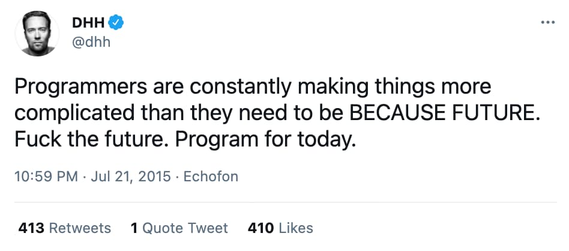
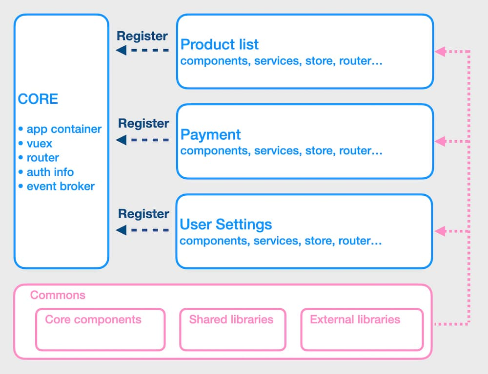

import TableOfContents from '../../../../src/components/TableOfContents'

## How big?

For the last 3y I have been working on a large vue.js application. I've been working on both functionalities but also architectural parts.
If you're curious about the project, here are some numbers:
* +5k vue&js files / +650k lines of codes
* 10 years old codebase. Vue.js landed in December 2016
* we have 2 repos: the app monolith + 1 monorepo (contains ~40 npm packages)
* it's a Single Page Application (SPA)

I don't want to play who got the bigger, as there's nothing shinny here. Our application is not big. It's too big.


## Team communication

### No consistency without standards

I don't think it's posible to have **consistency** without any communication.
If your app is organised in 3 different feature teams you don't want to have 3 different way of doing one things. 
Agree on standard then communicate. Communication is the key.

Don't be affraid to repeat yourself: _"pedagogy is the art of repeating yourself"_.

### Close the door on bikeshedding

It starts by linting your code. No one like comment like "you forgot a semicolon" on pull requests. 
Find a rule and follow it. Blindly. If you start to discuss it, you open a door for bikeshedding.

I also reccomend you to write a "Pull request: do and don't" so everybody knows what is and what's not expected.

### Reward code deletion

Adding new code is easy, deleting is hard. If someone open a pull request and kill some dead code, give to the developer some kudos.
Encourage your colleagues to delete dead code!

### Respect your elders

Working with legacy can be frustrating. But it's not a reason to finger-point your elders. Try to find the rootcause (i.e. code was written by Backend, there were no communication at that time...).
Migrating towards greener pastures is a slow process. If there's no plan to get rid of the debt, it's time to make one.

## Architecture & infrastructure

### "F*** the future. Program for today."

[](https://twitter.com/dhh/status/623598101127897088?lang=en)

We've made a lot of big technical decision based on FUTURE. Guess what? Years after this future never happen.
I don't have a crystal ball so I can't tell how the future will look like. If it's the same for you, don't take big decision based on dreams and hopes. 

Program for today!

### Modularize your monolith

Find an architectural style that matches your style. This is ours:




We adopted a modularised approach for our app. In a nutshell, 1 module = 1 business part of the app. And it's also something that looks like a standalone vue application. We consider modules as self-contained which can potentially be exported. By the way, some are exported as a npm packages ([in a monorepo](/monorepo-pros-and-cons)).

Modules are not allowed to talk to each other... in theory. If 2 modules have to communicate, you can use the [CustomEvent API](https://developer.mozilla.org/en-US/docs/Web/API/CustomEvent/CustomEvent) from the browser and dispatch an event via the window object.

> 🙋‍♀️ How do you register modules?

With the vue-router. Module loosely corresponding to a single top-level URL root. With this trick, module are ["lazy loaded"](https://router.vuejs.org/guide/advanced/lazy-loading.html). So user don't load the entire app when application load.

```js
// if module is a npm package
const ProductList = () => import('@company/product-list')
// or if the module is local
const ProductList = () => import('./path/to/product-list')


const router = new VueRouter({
  routes: [{ path: '/product-list', component: ProductList }]
})
```

### Modules or Micro-frontends?

Our module architecture show some limits. Because we only export one app, big changes are nearly impossible. 
Let say we want to experiment Vue.js 3, we will have to ensure that our few thousand of vue file are compatibles.
And this scenario happens for every major changes we want to do. I tried once to update our testing library. Out of our ~2200 tests, 700 were failing.

[Microfrontends](/3-tips-scaling-vue-application#tip-2-consider-micro-frontends) appears to be a good alternatives for these problems. But nothing in life comes free.
The biggest downside I see is the potential inconsistencies in the app. If the payment part of the app is using a component in version 1 and another page is using the same component in version 2, it can hurt the user experience. 
And the performances too because the same librarie can be loaded a 2nd time when we change the page.
At the moment, the granularity of our modules make the microfrontends transition a too hard as we probably have too many modules (~30).

### What about TypeScript?

A few years ago, a developer thought it could be a good idea to add RxJS to our codebase. The technical reason behind this choice was probably correct, but no one in the team wanted it. He ended up being the only person able to maintain this part of the app.

Later, another person wanted to introduce TypeScript. After many debate, we ended up with a decision I still support: "TS is cool and static type checking can be beneficial for such a big codebase. However, adding it would require too much effort. The return of investment isn't worthy".

When we took this decision, we had the RxJS story in mind. 
But, I think it might change with Vue 3.


### Dependencies: we should have been stricter

Everytime I open the package.json file of the main, I keep thinking the same thing: _"we should have been stricter"_.
We have a list of 95 dependencies and 90 dev-dependencies.

Why?

I think the **fear of being a gateblocker** played a big part. 
A second factor was probably letting the pull request merge without the approval from a frontend developer.
The result is not satisfying and our user pay the price.

### Keep your audits

Unfortunatelly, I never kept any Google Lighthouse audits. It's such a pitty because if today someone ask me what 
progress we've made over the last 3 months, I can't give any numbers.

By the way, it's can also provide some interesting metrics for your CV ;)

### Mimic your users

If you work on your app locally, with a 1500€ laptop and a fiber-optic internet connection, you might never experience a performance issue!
Same thing apply with devices/screen size/... When I left the office and become a nomad, I realized that a few pages we own were not working
on a small screen. My colleagues were all using fancy 26" curved screens and I was working with a 13".

If your webanalytics said that 20% of your users use Safari mobile, you should also test your app in these conditions.

### `// TODO: refactor`

**TODOs are the graveyard of important but not urgent tasks.** If you can't complete the todo, no one will. 
If you're not very proud about the code you wrote, it's fine. No worries, it happens to the best of us ;)
But please don't pollute the code with a TODO.

### Vuex is not necessary

I won't be very talkative as [I already explained why](/3-tips-scaling-vue-application#tip-3-be-kind-with-your-store-vuex), in my opinion,
putting everything in the store is a bad idea.

To be short:
* because of it's nature, a vuex store make your app [harder to test (integration/unit)](/vue-js-testing-library#testing-the-store-with-vuex);
* scoped stores are hard to unregister. Unnecessary datas can be kept in memory, sometimes causing state-sync issues;
* if you have +10 mutation when page load, time travel (via devtools) does not works well;
* dead code in state/mutation/actions is hard to identify.

I mentioned earlier the module approach we have. Our modules are like a small vue-cli app with a few pages only. Controlling the components's store with Vuex doesn't make a lot of sense.

Don't get me wrong. I'm not saying you shouldn't use Vuex. But, I don't think it should be used to store everything! 
For those who want to have the view from the logic, [composition-api](https://github.com/vuejs/composition-api) is a great library!


## Component Library

### Don't create your core components from scratch!


We started building our component system ~2.5y ago. A lot of components we created, ended up being surprisingly complex. 
When we couldn't refactored them, we created a new one (and deprecated the other).  
Today, we have ~30 deprecated components and some of them are used a hundred time.
Looking backward, we wasted so much time creating the components, writing the documentation, making the component accessible (a11y). 
By using a existing one, we could have spend more time focusing on the business or the architectural part instead.

No one cares if the button component you're using doesn't have "the perfect border-radius"!

### Put all core-components, icons, fonts and colors in one place


*Storybook is a great bridge between the frontend and the UX team. We heavily rely on this tool and so far, we're very happy to use it.*

Even if you start from an existing component library, you might have to build your reusable components.
In one place we put all our components, including very specific component to our application.
I tend to consider this package as an "open source package", something that anybody could reuse.

When we have to build a new screen it's pretty much like doing a lego construction. There's a kind of component box and developers pick what they need. Most of the time, writing CSS is not needed.


## The CI must be fast and reliable

Having a good Continuous Integration (CI) is a key point

Not later than last week, one of our tests helped me to identify a regression before my pull request went to the QA stage.
Talking about test,

* unit test business part or tricky functions
* integration test for the rest!
* keep code coverage for dashboard-oriented-manager. Consider uncovered code untested and covered code potentially tested.
* it must be automated (1 build / merge request)


## Closing

Making simple is often harder than making complicated.
Also, your app will never be perfect, and it's fine.