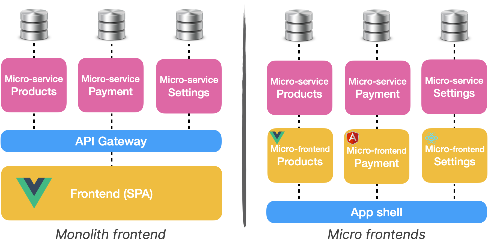

Just like React, Vue.js is a great tool to build web applications. In this article, I will share a
project I have been working on over the last 3 years. I will go trew different technical points such
as the modular architecture we use, micro-frontends, component's state management, TypeScript, Vue 3
and more. Keep it mind that there is not one but many way to scaffold a Vue app. This is one of
them.

## How big?

For the last 3 years, I have been working on a large vue.js application. I've been working on both
functionalities but also architectural parts. If you're curious about the project, here are some
numbers:

- +5k vue&js files / +650k lines of codes
- 10 years old codebase. Vue.js landed in December 2016
- we have 2 repos: the app monolith + 1 monorepo (contains ~40 npm packages)
- it's a Single Page Application (SPA)

Our application is not big. It's too big.

## Modules everywhere


We adopted a modularised approach for our app. In a nutshell, 1 module = 1 business part of the app.
And it's also something that looks like a standalone vue application. We consider modules as
self-contained which can potentially be exported. By the way, some are exported as a npm packages
([in a monorepo](/monorepo-pros-and-cons)).

Modules are not allowed to talk to each other... in theory. If 2 modules have to communicate, we can
use the [CustomEvent API](https://developer.mozilla.org/en-US/docs/Web/API/CustomEvent/CustomEvent)
from the browser and dispatch an event via the window object.

> 🙋‍♀️ How do you register modules?

With the vue-router. A module loosely correspond to a single top-level URL root. With this trick,
module are ["lazy loaded"](https://router.vuejs.org/guide/advanced/lazy-loading.html). So user don't
load the entire app when application load.

```js
// if module is a npm package
const ProductList = () => import('@company/product-list')
// or if the module is local
const ProductList = () => import('./path/to/product-list')


const router = new VueRouter({
  routes: [
    { path: '/product-list', component: ProductList }
    { path: '/payments', component: Payments }
    { path: '/user-settings', component: UserSettings }
    // ... other modules goes here!
  ],
})
```

## Micro-frontends?



Our module architecture show some limits. Because we only export one app, big changes are nearly
impossible. Let say we want to experiment Vue.js 3, we will have to ensure that our few thousand of
vue file are compatibles. And this scenario happens for every major changes we want to do. I tried
once to update our testing library. Out of our ~2200 tests, 700 were failing.

[Microfrontends](/3-tips-scaling-vue-application#tip-2-consider-micro-frontends) appears to be a
good alternatives for these problems. Because we could gradually update our dependencies. But
nothing in life comes free. The biggest downside I see is the potential inconsistencies in the app.
If the payment part of the app is using a component in version 1 and another page is using the same
component in version 2, it can hurt the user experience. And the performances too because the same
librarie could potentially be loaded multiple time. At the moment, the granularity of our modules
make the microfrontends transition a too hard as we probably have too many modules (~30).

## Managing state (Vuex)

Vuex provides a handy way to manage the state between component. At the beginning I really liked it
but over time I started to dislike it. For a few reasons:

- devs tends to put
  [everything in the store](/3-tips-scaling-vue-application#tip-3-be-kind-with-your-store-vuex);
- store makes your app
  [harder to test (integration/unit)](/vue-js-testing-library#testing-the-store-with-vuex);
- scoped stores are hard to unregister. Unnecessary datas can be kept in memory, sometimes causing
  state-sync issues;
- if you have +10 mutation when page load, time travel (via devtools) does not works well;
- dead code in state/mutation/actions is hard to identify.

I mentioned earlier, we splitted our app in small module. Since our modules are like a small
_vue-cli_ app with a few pages only, **controlling the pages with a Vuex store doesn't make a lot of
sense at the end**.

I stopped using Vuex in modules something like 2y ago. So far, so good. I found the code more
readable and maintainable. It's only being used for high level stuff like i18n and user settings.

## What about TypeScript?

A few years ago, a developer thought it could be a good idea to add RxJS to our codebase. The
technical reason behind this choice was probably correct, but no one in the team wanted it. He ended
up being the only person able to maintain this part of the app.

Later, another person wanted to introduce TypeScript. After many debate, we ended up with this
decision: "TS is cool and static type checking can be beneficial for such a big codebase. However,
**adding it would require too much effort**. The return of investment isn't worthy".

When we took this decision, we had the RxJS story in mind. But, I think it might change with Vue 3.

## What about Vue 3?

I see two main reasons to think about Vue.js 3: Performances improvements and Composition API.

- **Performances improvements**: it's (almost) always a good thing to thrive for performances. But
  in this case, I don't think it will solve our problems. It's like if you replace your car with a
  Ferrari to get your coffe at the end of the road. But the thing is, we live in the 6th floor with
  no elevator.  
  Our bottleneck is not in the component rendering but in the amount of code the browser have to
  parse before rendering the page. Deleting code is not as fancy as bumping a framework version.

- **Composition API** (Hooks made in Vue): The feature we were all looking for, when React added
  hooks ~2y ago. In a nutshell, the Composition API provides a lot of value when you want to reuse
  some logic or when you struggle to read large components. Much like with Mixins, you can extract
  component logic into a file. Then you can _compose_ your component with this logic. If like me,
  you can't wait to use it, there's a [plugin for Vue 2.x](https://github.com/vuejs/composition-api)
  which seems to be stable enough to go to
  [production](https://github.com/vuejs/composition-api/issues/527).

For these reasons, I don't think we will see Vue.js 3 in 2021. But the Composition API will probably
arrive soon in the codebase.

Edit: Vue team is working on
[compatibility bridges](https://twitter.com/vuejs/status/1388144585600274433) between versions 2
and 3. It might change!

## Component library and Storybook

 _Storybook is a great bridge between the frontend and the UX
team. We heavily rely on this tool and so far, we're very happy to use it._

Even if you start from an existing component library, you might have to build your reusable
components. In one place we put all our components, including very specific components to our
application. I tend to consider this package as an "open source package", something that anybody
could reuse.

When we have to build a new screen it's pretty much like doing a lego construction. There's a kind
of component box and developers pick what they need. Most of the time, writing CSS is not needed.

## Testing

We have 3 different type of tests:

- **Static code analysis** (with eslint): We created a set of rules on the top of Airbnb's config.
  This configuration is used everywhere in the app. It prevents us from pushing dead or misformatted
  code to the main branch. By the way, having a shareable config is a good way to
  [close the door on bikeshedding](/lesson-learned-maintaining-large-vue-js-codebase#close-the-door-on-bikeshedding)!
- **Unit tests** (with Jest): Less than 10% of our `xxx.test.js` are unit tests. It's mostly used to
  test business part of the app. If I have complex function that compute datas, I usually have tests
  for this one. Because writting integration test would require too many scenarios and make my test
  too verbose (integration tests are also slower than unit tests).
- **Integration tests** (with Vue Testing Library): where the magic happens. We really like this
  library We love this library, because it provides a very easy and straightforward way to test our
  app.

At the moment, we have a total of ~3100 unit&integration tests.
