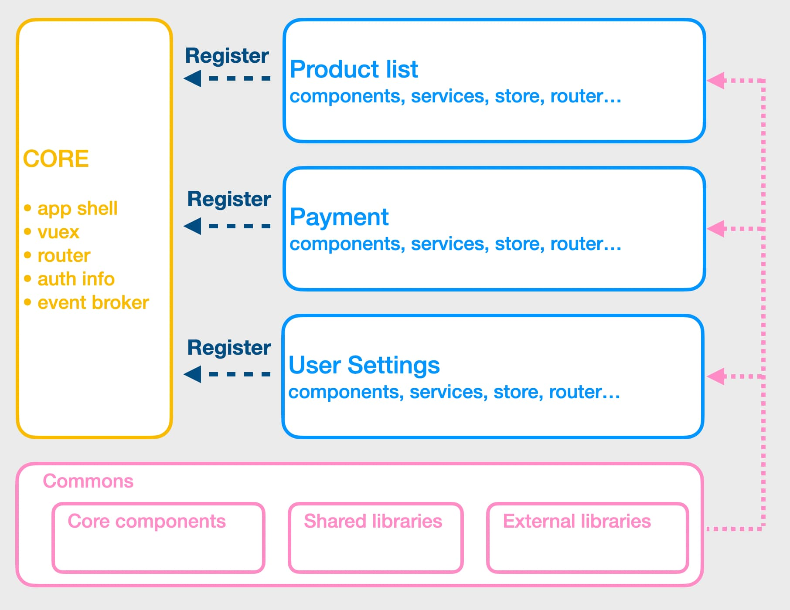

## How big?

For the last 3y I have been working on a large vue.js application. I've been working on both functionalities but also architectural parts.
If you're curious about the project, here are some numbers:
* +5k vue&js files / +650k lines of codes
* 10 years old codebase. Vue.js landed in December 2016
* we have 2 repos: the app monolith + 1 monorepo (contains ~40 npm packages)
* it's a Single Page Application (SPA)

I don't want to play who got the bigger, as there's nothing shinny here. Our application is not big. It's too big.

## Why Vue.js

## 

## Modularize your monolith

Find an architectural style that matches your style. This is ours:




We adopted a modularised approach for our app. In a nutshell, 1 module = 1 business part of the app. And it's also something that looks like a standalone vue application. We consider modules as self-contained which can potentially be exported. By the way, some are exported as a npm packages ([in a monorepo](/monorepo-pros-and-cons)).

Modules are not allowed to talk to each other... in theory. If 2 modules have to communicate, you can use the [CustomEvent API](https://developer.mozilla.org/en-US/docs/Web/API/CustomEvent/CustomEvent) from the browser and dispatch an event via the window object.

> 🙋‍♀️ How do you register modules?

With the vue-router. Module loosely corresponding to a single top-level URL root. With this trick, module are ["lazy loaded"](https://router.vuejs.org/guide/advanced/lazy-loading.html). So user don't load the entire app when application load.

```js
// if module is a npm package
const ProductList = () => import('@company/product-list')
// or if the module is local
const ProductList = () => import('./path/to/product-list')


const router = new VueRouter({
  routes: [{ path: '/product-list', component: ProductList }],
})
```

## Micro-frontends?

Our module architecture show some limits. Because we only export one app, big changes are nearly impossible. 
Let say we want to experiment Vue.js 3, we will have to ensure that our few thousand of vue file are compatibles.
And this scenario happens for every major changes we want to do. I tried once to update our testing library. Out of our ~2200 tests, 700 were failing.

[Microfrontends](/3-tips-scaling-vue-application#tip-2-consider-micro-frontends) appears to be a good alternatives for these problems. Because we could gradually update our dependencies. But nothing in life comes free.
The biggest downside I see is the potential inconsistencies in the app. If the payment part of the app is using a component in version 1 and another page is using the same component in version 2, it can hurt the user experience. 
And the performances too because the same librarie could potentially be loaded multiple time.
At the moment, the granularity of our modules make the microfrontends transition a too hard as we probably have too many modules (~30).


## What about TypeScript?

A few years ago, a developer thought it could be a good idea to add RxJS to our codebase. The technical reason behind this choice was probably correct, but no one in the team wanted it. He ended up being the only person able to maintain this part of the app.

Later, another person wanted to introduce TypeScript. After many debate, we ended up with a decision I still support: "TS is cool and static type checking can be beneficial for such a big codebase. However, adding it would require too much effort. The return of investment isn't worthy".

When we took this decision, we had the RxJS story in mind. 
But, I think it might change with Vue 3.

## Managing state (Vuex)

I won't be very talkative as [I already explained why](/3-tips-scaling-vue-application#tip-3-be-kind-with-your-store-vuex), in my opinion,
putting everything in the store is a bad idea.

To be short:
* because of it's nature, a vuex store make your app [harder to test (integration/unit)](/vue-js-testing-library#testing-the-store-with-vuex);
* scoped stores are hard to unregister. Unnecessary datas can be kept in memory, sometimes causing state-sync issues;
* if you have +10 mutation when page load, time travel (via devtools) does not works well;
* dead code in state/mutation/actions is hard to identify.

I mentioned earlier the module approach we have. Our modules are like a small vue-cli app with a few pages only. Controlling the components's store with Vuex doesn't make a lot of sense.

Don't get me wrong. I'm not saying you shouldn't use Vuex. But, I don't think it should be used to store everything! 
For those who want to have the view from the logic, [composition-api](https://github.com/vuejs/composition-api) is a great library!

### Put all core-components, icons, fonts and colours in one place


*Storybook is a great bridge between the frontend and the UX team. We heavily rely on this tool and so far, we're very happy to use it.*

Even if you start from an existing component library, you might have to build your reusable components.
In one place we put all our components, including very specific components to our application.
I tend to consider this package as an "open source package", something that anybody could reuse.

When we have to build a new screen it's pretty much like doing a lego construction. There's a kind of component box and developers pick what they need. Most of the time, writing CSS is not needed.

## Vue 3?


## Testing