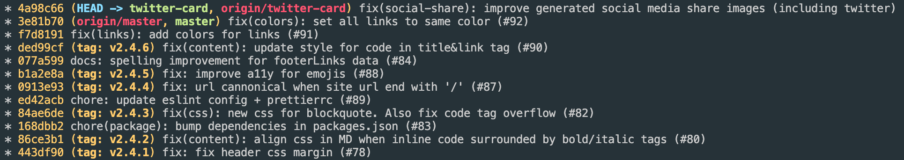
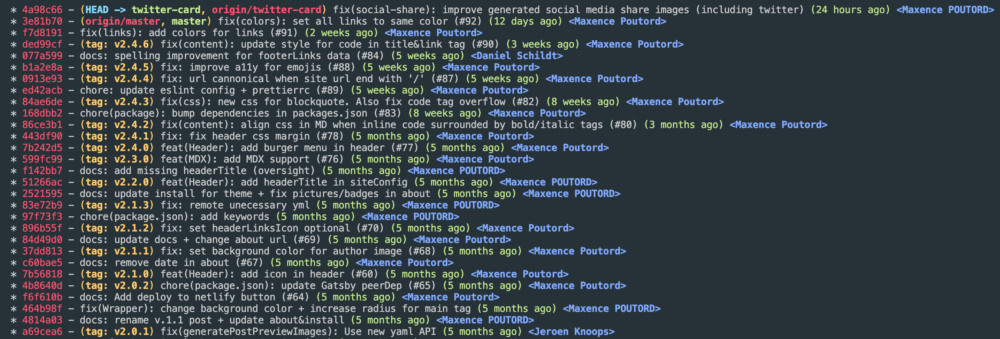
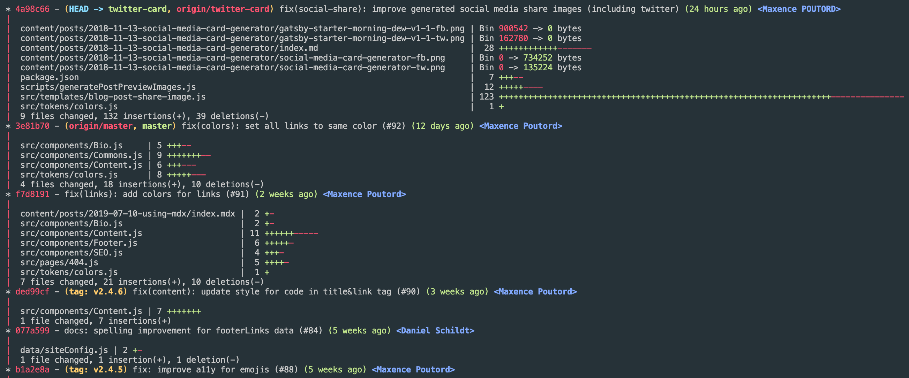

After speaking with some colleagues, I was very surprised to see how many of them use GUI tools for
git.

I used to list my commits with `git log --oneline --decorate --graph`

## The basic: oneline + decorate + graph

```bash
git log --oneline --decorate --graph
# aliased by
alias glog='git log --oneline --decorate --graph'
```



Small and consise: everything I like. I found this command perfect until I found the next one!

## glol: git log on steroids

```bash
glol
# aliased by
alias glol='git log --graph --pretty='\''%Cred%h%Creset -%C(auto)%d%Creset %s %Cgreen(%cr) %C(bold blue)<%an>%Creset'\'
```



## glols: the same but with diff included

glols = Git log + ls

```bash
glols
# aliased by
glols='git log --graph --pretty='\''%Cred%h%Creset -%C(auto)%d%Creset %s %Cgreen(%cr) %C(bold blue)<%an>%Creset'\'' --stat'
```



If you use oh-my-zsh, these commands should be here by default
