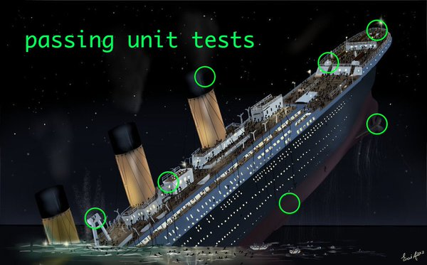
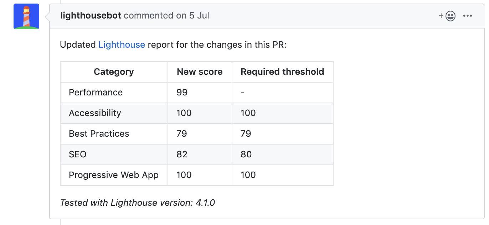

## Table of contents

1. Why dev don't test?
2. Why you should test?
3. How to test? Testing pyramid vs. Testing trophy
4. Definition of a good test
5. A testing strategy that works.
    1. Static analysis
    2. Unit test components
    3. Integration test
    4. E2E
6. About: the importance of automation
7. About: snapshot testing
8. About: mocking
9. About: code coverage
10. About mount vs. shallow mount
11. Final thoughs


## Why dev don't test their app?

When I speak to developper and I ask them why they don't test their app, I usually receive 3 different type of answers:

* "We don't have time to test!"
* "Writting and maintaining tests slow me down!"
* "We don't know how to test and what to test!"

The first two answers can be true...for small project. The return on investment is feeble for small projects. But, it's another story if multiple dev are working on this project fulltime and for a few months or more!
If you are in the third category, this post is also for you :)

## Why you should test?

Apart from catching bugs, writing test provide several pros:

* **Confidence**: that software works as expected. So, it's easier to remove/refactor code.
* **Document codebase**: JSDoc can be outdated... tests are never outdated.
  ```js
  // calendar.spec.js
  it('should set today as default date', () => { /* ... */ })
  it('should select next week when I press ">>"', () => { /* ... */ })
  it('should create a an event on the selected date', () => { /* ... */ })
  ```
  *Writing good description in your test is a non-negligeable asset!*

* **Help to write better code**: Writing test help you to read the code you written with a different prism. How many times I said: "wtf I did when I wrote this function?" 😅
* **Reduce maintainance cost**: Studies shown that the cost of a bug grow bigger an bigger over time. If your test can catch a potential bug at a early stage, then you're earning time... and money!
* **Deploy to prod on Friday..? why not!** When I read tweet like this I always think: "oh gosh, you must spend the most of your time fixing bug". Companies like GitHub/Amazon/... deploy hundreds time a week. What do you think, they stop deploying on Friday?

*I hope you're now convinced to write test for you app. Now let's see how to test it!*


## How to test your frontend app?

When it comes to software testing, usually, a "Testing Pyramid" pop-up somewhere.


In a nutshell, this pyramid said that we shoud write a lot of unit test (because they're cheap and fast), some integration test and a few E2E tests. I don't know about you but I don't like this pyramid.

I have been working with component oriented franework/lib (React/Vue). 

**Most of the bug don't come from the component, but, how compenents interact together.**



That's why I think the Pyramid is not relevant for frontend world. Let me introduce you something else: the Testing Trophy!


## A testing strategy that works!

A typical component oriented application usually follow a similar structure:

```
├── components/ (aka "dumb" components)
├── pages/      (aka containers)
├── routes/
├── services/   (api calls, data formaters, validators...)
└── store/
```

*If you're not familiar with the dumb container approach, you can read [this post (by Dan Abramov)](https://medium.com/@dan_abramov/smart-and-dumb-components-7ca2f9a7c7d0).*


**Definition of a good test**

Here's 4 points that makes a great test:

> 🐟 Dead simple ~ No complexity (1 level of indentation maximum)  
> ⚡️ Lightning fast ~ Nobody like to wait!  
> 🤯 Doesn't test an external library  
> 🛌 Cover the most common usages. It's "ok" not to cover everything.  

Some clarification about the 3rd point. If a component redirect to another page threw router, don't test if the URL had changed. Instead, test that `$router.push()` have been called.

## Static analysis: lightning fast and ludicrously cheap

*I remember when I joined my current company ~1.5 year ago. I couldn't install the application. After investigations, it turns out someone forgot a `;` in an SQL file. `master` was broken for a god damm semicolon.*

That's one of the reason why we need static analysis tool is a must have. But I also see others pros:
* **Code unification**. If a team have one shared style guide, we can say goodbye to "This code is like this... so it's probably written by xxx.".
* **Bikeshedding**: avoid steril debates. Yes, I'm talking about these stupid debates: tab vs space, semicolons or not...
* **Catch dead code/unused variables**: if we reduce surface of code, we also reduce potential bugs!
* **Avoid dumbs errors** good example is the `==` instead of `===`...
* **Catch oversight**: say goodbye to annoying: "Please remove this `console.log()`" on your pull request.


In a nutshell, static analysis help us to focus on what really matter ❤️

💡*Reccomended tool: eslint (with a AirBnB/Standard preset).*


## Unit testing

### how to unit test a function?

I found unit test relevant for: **formatter**, **helpers** and **reusable components**. By reusable components, I mean components that are reused accross your application or multiple applications.

If you don't know how to write an unit test, you can follow the AAA Method which stand for: **Arrange-Act-Assert**.

```js
const vatCalculator = require('../path/to/vatCalculator')

it('should return the expected VAT', () => {
  // Arrange
  const menu = [
    { item: '🍺', price: 3, quantity: 1 },
    { item: '🍔', price: 5, quantity: 1 },
  ]

  // Act
  const vat = vatCalculator(menu)

  // Assert
  expect(vat).toBe(1.3)
})
```


### how to unit test a component?

When it comes to unit testing, **you should treat your component like a black box**. A black box that have several contracts (public interface):

* properties;
* interaction events (onClick, onSelect...);
* lifecycle events (component mounted, destroyed...);
* event emitted;
* output (DOM);
* interaction with child components.

That's all you need to test. Forget about the rest (component internal state, computed properties...), it's implementation detail. For example, if you have a `<Button-counter />` component that shown the number of time you've clicked on it, you should not have the variable name used in the component in your test. You should be able to rename this variable without changing the test.


> Should you write tests before coding? Only if you have a clear idea of what you're doing. Otherwise you're wasting your time!

💡*Reccomended tool: Jest.*


## Integration testing

I've been using unit testing for years... and one day I realised that I couldn't only rely on them anymore. 
Many times I faced issues like this:

  
*Unit testers be like: “Looks like it’s working”*

Integration tests provides a way to test the application with a higher scope. That's why, they are by far my favourite tests.

[difference unit vs. integration test]

> Write tests. Not too many. Mostly integration.  
> − [Guillermo Rauch](https://twitter.com/rauchg/status/807626710350839808)

💡*Reccomended tool: Jest & Testing library.*


## End-to-end testing (E2E)

When you write e2e tests, keep in mind that this tests will probably slow down your build time. Use them with parcimony and where you think it's relevant. For instance, you can use end-to-end tests to test a login flow.

I also like to deploy my app on a static version of my app on a platform like Netlify/now.sh. Once my app is deployed, I use tool like Lighthouse to perform an audit on different pages. So you can easily spot accessibility/SEO/... regression.



You can also, do some smoke test with this environment. Like a `curl` request on a page and then ensure result is an HTTP 200 and the HTML body contain a specific words...

In [this github repository (maxpou/gatsby-starter-morning-dew)](https://github.com/maxpou/gatsby-starter-morning-dew/pull/87), lighthouse tests are performed on every commit (and a new environment is also deployed).

💡*Reccomended tool: Cypress, Lighthouse.*


## About: Performances

You probably saw in the lighthouse screenshot, I volontary disabled performances. This is a very tricky topic that can't be covered in this blog post.

In the most of cases, false positive and false negative are legion when we do an audit performances. Here's a few reasons:
* your localhost is the same as the final server;
* you don't know the traffic variation between 2 tests;
* your network quality probably changed between 2 tests (i.e. a colleague download something);
* your laptop CPU probably changed between 2 tests (i.e. your OS is secretely installing something);
* ...

And maybe you're not testing a [real world usecase](https://twitter.com/dan_abramov/status/1013823489609011200).

Testing your app on an iPhone X (when it's not a 26' screen) + ligthning fast Wifi is not relevant


## About: Mocking

One thing to know is that mocks sucks. 

> Every time we mock, we diverge from the real world scenario.

For this reason, you should avoir them as much as posible. But, sometimes we have no other option but to use it:

* for external API calls (HTTP GET/POST/...);
* for browsers API (local/session storage, navigator...);
* ... and for time. 

If you're testing a "calendar"  

```js
const RealDate = Date;

beforeEach(() => {
  Date.now = jest.fn(() => new Date('2019-04-22T10:20:30Z').getTime());
});

afterEach(() => {
  global.Date = RealDate;
});
```


## About: Mount vs. ShallowMount

There are big debates on the testing communities about `Mount()` and `ShallowMount()` and which one people should use.

In a nutshell:
* `mount()` mount the component **with** his child components.
* `shallowMount()` mount the component **without** his child components.


I tend to favor `ShallowMount` over `Mount` for the same reason as I prefer Integration Test over Unit test.
But on the other hand, if you change a component used in a multiple places, things can "potentially" breaks everywhere.


## About: Snapshot testing

*In this section, I'll use examples with Jest in a Vue.js context. But, these concepts are also valid for the React ecosystem.*

Writing tests like the following can be redundant and time consuming:

```js
const wrapper = mount(MyComponent);
const buttons = wrapper.findAll('button')
expect(buttons.at(0).text()).toMatch(/Bim/)
expect(buttons.at(1).text()).toMatch(/Bam/)
expect(buttons.at(2).text()).toMatch(/Bingo/)
```

What if we could test the whole DOM in one unique assertion?
That's the idea behind Snapshot testing. Snapshot testing provides a good way to test component rendering by comparing 2 different output.

```js
const wrapper = mount(MyComponent);
const template = wrapper.html();
expect(template).toMatchSnapshot();
```

With this, Jest is going to create a file (like `MyComponent.spec.js.snap`) under a folder call `__snapshots__`. From now, everytime jest will run, it will compare the output with the one in the snap file.
One file that we will commit in our git repository.

Here iss how Jest is working with Snapshot assertion:


**⚠️ Warning:**
* Snapshot are great. But it tends to be irrelevant on big components.
* The purpose of behind snapshot testing is not to replace existing assertions. It's an **easy and lazy way to provide test where there's not!**
* Snapshot testing & visual regression testing are 2 differents things!
* Never update a snapshot manually. Let the testing framework doing it for you!
* Don’t fall into the temptation of quickly update snapshot without checking the real change!
* When you review a pull request, **always** check the snapshot diff.

If you end up with huge snapshot, remember one thing. Test are also about confidence. And you will not be confident with big snapshot for a simple reason. No one want to review huge snapshots. If you face this problem, use something else :)

## About: Code coverage

On a small library, getting a 100% code coverage can be easy. But, on a real world application, reaching 100% of code coverage is time-consuming. Most of the time, it does not worth the trouble.


Once, I was in a team where Funny stuff I saw when we aimed to reach 100% code coverage:

**#1 Write code for tests**

```js
function foo(a, unitTest = false) {
  // code

  if (weirdAndHardToTestCondition || unitTest) {
    // code
  }

  return bar;
}
```


**#2 low quality of tests**

```js
function divide(a, b = 0) {
  return a / b;
}

describe('divide', () => {
  it('should divide two numbers', () => {
    expect(divide(6, 2)).toBe(3);
  });

  // The "zero" case is missing.
});
```

Code coverage is "just" one metrics. As every metrics, don't focus too much on it!


## About: The importance of automation

> "You forgot a semicolon", "Indendation is wrong", "test is broken"...

I'm sure you already received comment like these on your Pull Request. I see 2 problems here:
* the person who write this is doing a robot job. **If a robot can do your job there's something wrong.**
* this kind of comments are annoying and hurt developpers.

That's why, it's very important to delegate this ungrateful job to a robot.
Then, reviewers will get more time to check the quality of the PR, talk about implementation. And person who submit de PR will feel better.

It's like when you cross the road. We don't feel hurt when the sign say no.
(Thanks Jason Lengstorf for this example!).


## Final thoughts

Testing is not a nice to have. It's a deliverable.

(use CI, Totem, don't comment tests, testing is not a nice to have)

