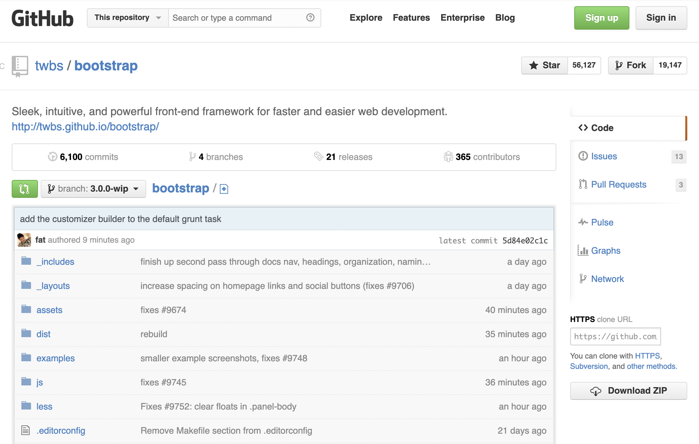

Earlier this year, I wrote a post where I mentioned how inefficient it is to build your own design
system in 2021. As expected, some people had a knee-jerk reaction.

## "It ends up with an unpolished look and feel"

> I love this website, buttons have the perfect border-radius.  
> Nobody.

I'm making app for +10y now and I'm still surprised to see how many companies have their own
definition of a god damn button.

Let's be honest. An application is not a piece of art. User don't go there just for to see the
beauty of what CSS can offer. People use the app because it fixes problems.

## "Yeah but, what happens if we want to do things differently?"

Check this
[2013 archive of GitHub.com](https://web.archive.org/web/20130817235413/https://github.com/twbs/bootstrap).
Don't you recognize anything?

Bootstrap 2.0. Everywhere! And their app was: making tons of money, loved by many developers, ranked
in the top 100 most visited websites. Oh, and they also got acquired by Microsoft for $7.5 billion.

Why do we always end up building our own buttons? For our ego.

Yes, component libraries have limitations. But before building yours, ask yourself: "can I live with
it or not?".

## Custom components are rarely accessible

## Which component library should I use?

maxpou.fr is a blog about web development.

Reach UI - https://reach.tech  
Material UI - https://mui.com  
Tailwind UI - https://tailwindui.com  
RSuite - https://rsuitejs.com  
React Spectrum - https://react-spectrum.adobe.com/react-spectrum/index.html
