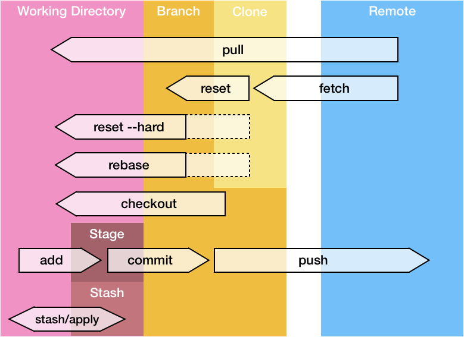

Every now and then, I read [stories on the internets about people loosing code](https://twitter.com/_maxpou/status/1172109270495744001) with git. I am sure you also heard a few... and you probably also loose code!

**Let me tell you one thing: it's -almost- impossible to loose code with git.**

Believe me. I use `git push --force`, `git rebase` and `git reset --hard` on a daily basis and I can't remember the last time I lost something.

Let me explain you why!

## 3 States

Let's start with a small recap. In git, a file can go threw 5 different states:



* **Modified**: you've modified the file locally and it's saved on your IDE/Text editor. This file can now be added.
* **Staging area**: After a `git add`. File is marked as modified, and should be added in the next commit.
* **Stashing area**: After a `git add`. File is marked as modified, and should be added in the next commit.
* **Committed**: The file is saved in your local or distant DB.
* **Committed & pushed**: The file is saved in your local or distant DB.


## Preventing code lost in stashing area

I have been using git for years and I only learn recently that stash was not only `git stash` and `git stash pop`.
Here's a few git stash commands:

```bash
# save (equivalent to git stash but with a message)
git stash save "my stash message"

# list all stash
git stash list

# apply last stash
git stash apply stash@{0}
```

When you retreive the last stash with `git stash pop`, you basically do two operations in one: `git stash apply && git stash drop`.

That's why, my best advice to avoid loosing code with stash, is to *stop using `git stash pop` and only use `git stash apply`.*

From time to time, you can clean-up your stashes with `git stash clear`.

## Git

git is a database which tracks all changes in a file system. All new entries in this database are made with commit. 
A commit basically contain 4 informations:

* when this change was made;
* who changed it (name + email);
* why via the commit message. If you struggle to write commit messages, [I wrote this post](https://www.maxpou.fr/git-conventional-commits);
* what changed: it's a snapshots of all directory trees of files!
* and a checksum (SHA-1) to preserve integrity. 


## Rewriting the past

// ...

## git reflog

reflog = ref log

## Caveat

In some cases, `git reflog` __will not__ help you:

* when you pull someone else code;
* when you remove your repo and clone it again;
* if you're looking for a >90 days change.;
* if you don't know how to use git and 


For the last one, I don't know about you but I personnaly can't remember what I did ~1 month ago. So, 3 months should be ok :)


## Recap

👉Committed code cannot be lost;  
👉Embrace `git reflog`;  
👉Use `git stash apply` instead of `git stash pop`.  

