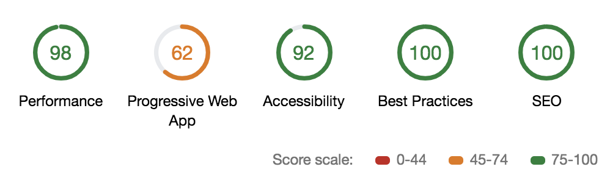
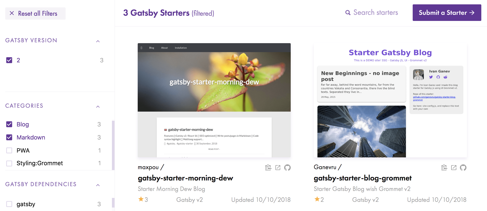
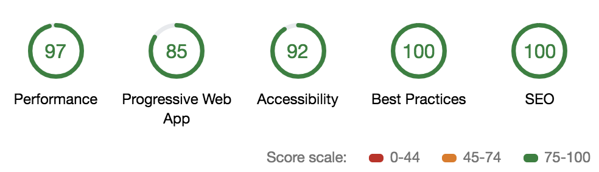

# Hello Gatsby, goodbye Jekyll

Few weeks ago, I was in the DublinJS meetup. As usual, the talk I came for, wasn't the most interesting one! The most interesting one was about [ember-ghost](https://github.com/stonecircle/ember-ghost). A static generation website using Ember (JavaScript).

I ran this blog under Jekyll for 3 years.
During this talk I realised how easier could be my life with my blog! 

## Jenkins pro and cons

What I like:
- hosted on GitHub for free. The only thing I pay is the domain name maxpou.fr (~6€/year)
- **"backend-less"**! Everything is fully static. I don't want to rely on a DB for a blog!
- Simple to use. There's no over complicated administration panel... well, there's no administration at all!
- I write my post in markdown in my IDE. Then, I git commit+push to publish my article!
- ...people can potentially submit PR to fix a typo somewhere (let's be honnest: nobody did 😂).
- The theme I use. I really like what @mmistakes did for the hpstr-jekyll-theme!
- it's easy to pimp a theme withoud any Ruby skills! (see index.html)
- Good perf (lighthouse)
- MIT License

What I don't like:
- I don't want to install ruby locally. But it's mandatory to get it when working on site structure;
- Jekyll watch mode is very slow with docker (2/3 sec to detect a change + 2 sec to recompile everything 😴)
- adding plugins is very complicated. Once, I tried to change the colour plugin (markdown to HTML is handled by Jekyll). I spent something like 4 hours, without success. I finally drop this idea...
- service worker management  => ☠️.

What I want for my next blogging platform:
- ideally, keep all the thing I like an remove the ones I dislike 🎅
- easy to install/configure
- get a static build to deploy on GitHub Pages
- ideally in JS. I'm working on a day to day with Vue. So, it could be nice if it's something different, like React, Ember...
- if possible, keep my Disqus comments!
- ... and something that works beyond the classic "getting started" (i.e. manage pagination, ability to add new feature...). I've ~25 posts

## Candidates

Tools I tried:

* Vuepress. Good to generate documentation... but there's currently no support for blogging. Plus I'm already working with VueJS.
* [Ember-Ghost](https://github.com/stonecircle/ember-ghost): Looks promising! Unfortunately, I had local issues with Ember or Node.
* Gatsby: a tool to generate static websites from different data sources (markdown, API, JSON). Page is built with React and we query the content via GraphQL.

## Winner is... Gastby 🎉!

*(It's not a big surprise, it was in the title)*

Pros:
* I ❤️ GraphQL
* React is cool. Building my website with React will give me "a real professional experience" with this framework. Engineer's hiring process is broken... seriously.
* Pretty similar to VueJS.
* Very fast (also in dev mode)

Cons:
* There is some magic... and I don't like magic. I'm missing a plain old router to match routes with pages.
* The [starter library](http://gatsbyjs.org/starters) is not very consistent. And a lot of starters looks like "hello world" project.
* some small issues with cache invalidation
* ... and that's it!!!

Now let's find the starter:
* [gatsby-starter-casper](https://github.com/haysclark/gatsby-starter-casper): looks very nice but use the v1 of Gatsby. I want to start with something on the cutting edge of technology.
* [gatsby-starter-blog](https://github.com/gatsbyjs/gatsby-starter-blog): a very minimalist blog. Far away from what I want.
* ...start from scratch?!

## Introducing gatsby-starter-morning-dew 

I finally opt with the last 2 solutions. Create my own starter with the minimalist `gatsby-starter-blog`. The main reason is this one:

At the moment, there are only 2 available starters for blogging in markdown (the first one is mine 😎). So, adding an extra one could be a real benefit for the community!

The full list of features is available on the [repository's README](https://github.com/maxpou/gatsby-starter-morning-dew)

* **Markdown:** Write post in markdown. Code syntax color is also enabled. 
* **Configuration:** I don't want people to worry about the internals. That's why, almost everything is configurable through a JS config file!
* **CSS:** Because I don't want to rely on a framwork, I wrote 100% of the CSS! (...I also stole fragments 😇)
* **Mobile friendly&PWA**. I felt guilty. I gave a few conferences about Progressive Web Apps and my own website wasn't PWA compliant... shame! Now this problem is solved!
* ... and many other things!

## What's next?

I have a lot of ideas for the next:

* manage pagination: I think 25 articles to list is a bit too much for a hello page.
* css-in-js: To be honest, I really miss the Vuejs's `<style lang="scss" scoped>` tag. I saw differents React approaches and I like none of them. Maybe if I try one, I'll change my mind?
* RSS;
* MD checker. At the moment, it's really hard to spot a missing header (or a mispelled one).
* clean up the code...

## Show me the code!

Here you go: https://github.com/maxpou/gatsby-starter-morning-dew

