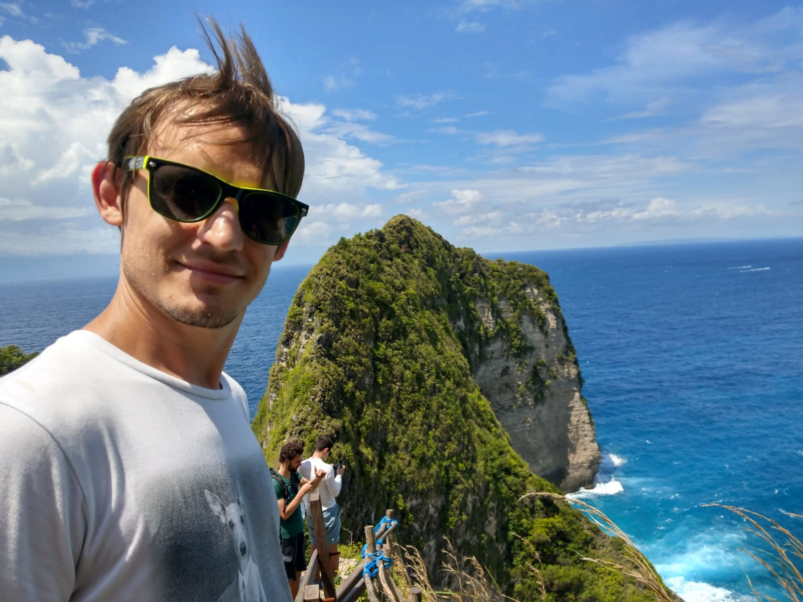

## Hello World!

Hey, I'm **Maxence Poutord**, passionate software engineer, speaker, blogger and
[mentor](https://mentors.codingcoach.io/?name=Maxence+Poutord). I started coding
[in my early age, at 11](https://twitter.com/_maxpou/status/771701472199340032) with the QBasic
language. 19 years later, I'm still coding (I just hope my code is better 😃).

After 2 years as an expat in Dublin, I became a digital nomad. I now live where the WiFi and the sun
are 😎

## What I do for a living

I am currently a Senior Software Engineer at VSware where I am building software for education. I'm
focusing on:

- **🏗 Architecture/Infrastructure** of a massive Vue.js application (~5k vue&js files / ~650k lines
  of codes);
- **🚦 Testing** (mostly with Vue Testing Library);
- **👨‍🦯 Accessibility (a11y)**
- **🏎 Performances**
- **🗣 [Tech trainer](./speaking#trainings--workshop)** and **[public speaker](./speaking)**.

## What I do for fun

- ✈️ **Travel**. Often. 9 countries and 14 cities for 2018.
- 👨‍🍳 **Cook**. "I make the best pizza you ever tasted." -Me
- 🍺 Appreciate a Gin or a **pint of beer** (IPA or Belgian triples).
- 📘 Learn new things. As a **lifelong learner**, I can't imagine one day without learning something
  new!
- 👨🏼‍💻 **Play with code**. Sometimes, it ends up in an open source contribution or a blog post!

## Why this blog?

I started this blog in 2014 because I wanted to keep track of my experiements. At the begining, it
was all private. I learnt a lot on the internets so, I realised I had to give something back to the
community. That's why, I decided to make it public in order to share my knowledge to the world.

**My site has no ads, sponsored content or bullshit. It is my blog, my content and my ideas.**

If you enjoyed it, please let me know :)  
You can also [follow me on Twitter (@\_maxpou)](https://twitter.com/_maxpou).

## Contact

Do you have a question regarding one of my projects? a blog post? ...or something else?  
Don't be shy. **Let's talk**. I do my best to be as accessible as possible.

Here's how you can contact me:

- The best way is to tweet me at [@\_maxpou](https://twitter.com/_maxpou);
- If you're patient, send me an email at [hello@maxpou.fr](mailto:hello@maxpou.fr);
- Connect with me on [LinkedIn](http://fr.linkedin.com/in/maxpou).
