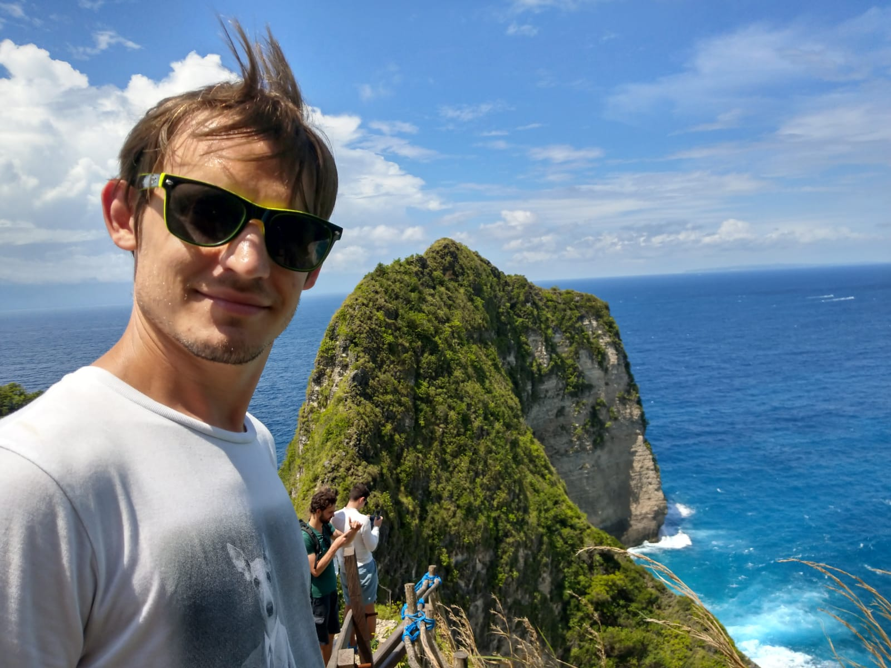

import FollowMe from '../../../src/components/FollowMe'
import Info from '../../../src/components/MDX/Info'

## Hello World!

Hey, I'm **Maxence Poutord**, passionate software engineer, speaker, blogger and
[mentor](https://mentors.codingcoach.io/?name=Maxence+Poutord). I started coding
[in my early age, at 11](https://twitter.com/_maxpou/status/771701472199340032) with the QBasic
language. And, +20 years later, I'm still coding!

After 2 years as an expat in Dublin, I became a digital nomad. I started working and living where
the WiFi and the sun are (mostly in Southeast Asia). I'm now settled in Paris and I still work
remotely.

<Info>
  🙋 Working or planning to work with me?  
  You might be interested in reading my <a href="/readme">Personal User Manual (personal readme)</a>
</Info>

## What I do for a living

I am currently a Senior Software Engineer at Orderfox where I am building software for the CNC
industry. I'm focusing on:

- **🏗 Architecture/Infrastructure** of a React application (working with TS and GraphQL);
- **🚦 Testing** (mostly with Jest, Cypress and Testing Library);
- **👨‍🦯 Accessibility (a11y)**
- **🏎 Performances**.

## What I do for fun

- ✈️ **Travel**. Often.
- 👨‍🍳 **[Cook](/kitchen)**. I love to cook food from all over the world. From Italian Pizza to Indian
  dal.
- 🍺 Appreciate a Gin or a **pint of beer** (IPA/NEIPA).
- 🕹 **Play** video games. Mostly Age of Empires 2, a 20 y.o. game!
- 📘 Learn new things. As a **lifelong learner**, I can't imagine one day without learning something
  new!
- **🗣 [Tech trainer](./speaking#trainings--workshop)** and **[public speaker](./speaking)**.
- 👨🏼‍💻 **Play with code**. Sometimes, it ends up in an open source contribution or a blog post!

## Why this blog?

I started this blog in 2014 because I wanted to keep track of my experiements. At the begining, it
was all private. I learnt a lot on the internets so, I realised I had to give something back to the
community. That's why, I decided to make it public in order to share my knowledge to the world.

**My site has no ads, sponsored content or bullshit. It is my blog, my content and my ideas.**

If you enjoyed it, please let me know :)  
You can also follow me on Twitter (@\_maxpou)

  <FollowMe style={{ boxShadow: 'none' }} />

## Contact

Do you have a question regarding one of my projects? a blog post? ...or something else?  
Don't be shy. **Let's talk**. I do my best to be as accessible as possible.

Here's how you can contact me:

- The best way is to tweet me at [@\_maxpou](https://twitter.com/_maxpou);
- If you're patient, send me an email at [hello@maxpou.fr](mailto:hello@maxpou.fr);
- Connect with me on [LinkedIn](http://fr.linkedin.com/in/maxpou).
