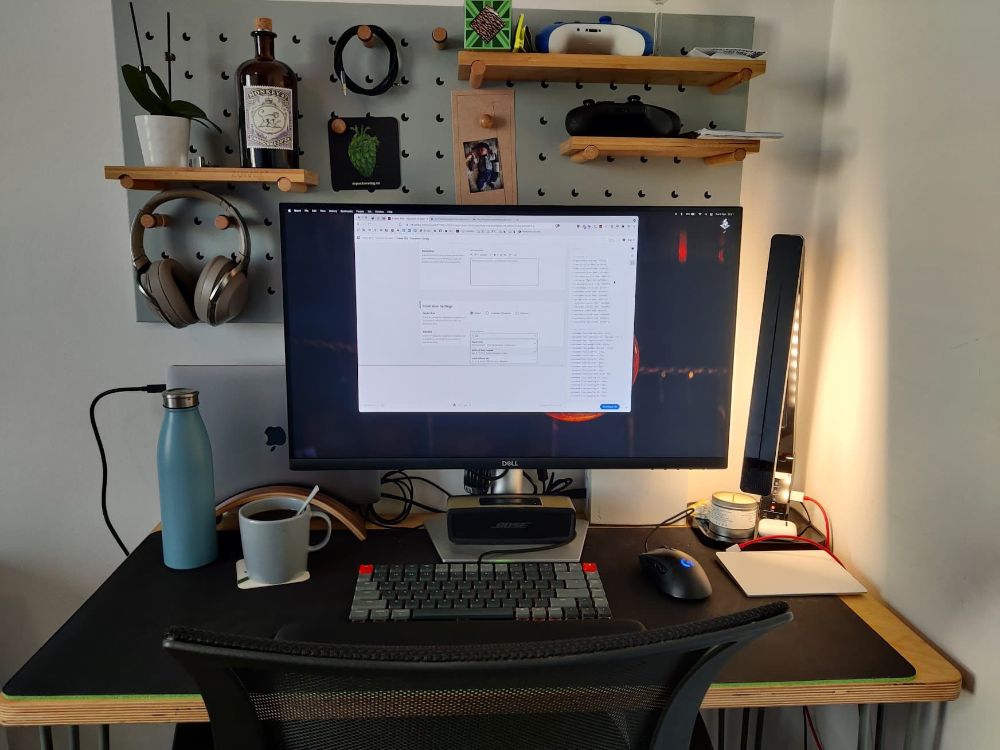
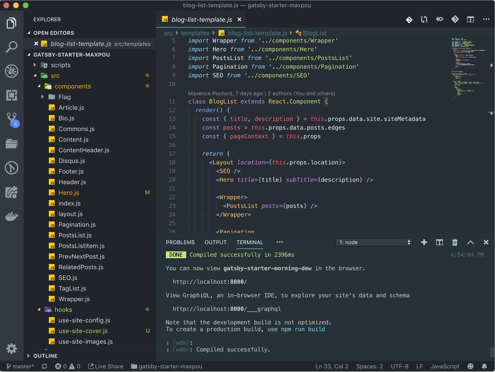
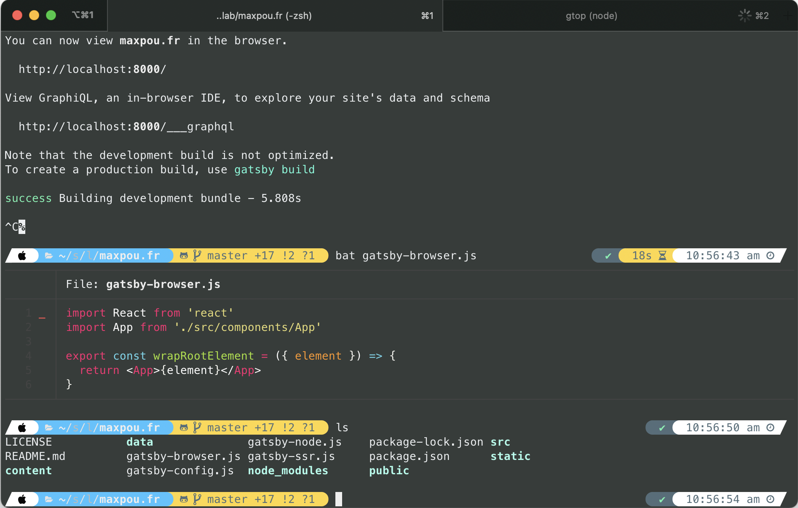
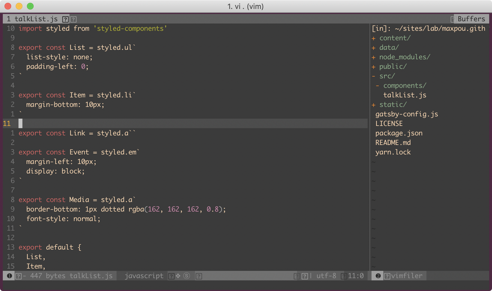
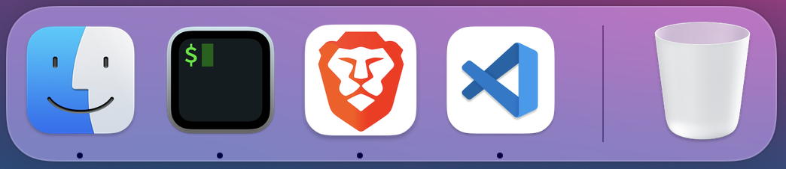

This page is somewhat inspired by [Wes Bos' Uses](https://wesbos.com/uses/) page. Keep in mind that
I'm mostly doing Frontend development and I'm also a nomadic worker. In other words, I'm 100% remote
and I travel often.

## Gear

- MacBook Pro M1 (13-inch)
- 27" screen (QHD). **No dual screen.** I've found myself more focus with only one screen.
- [Keychron K3 Mechanical keyboard](https://twitter.com/_maxpou/status/1436270414544654348)
- [G403 HERO Mouse](https://www.logitechg.com/en-us/products/gaming-mice/g403-hero-gaming-mouse.910-005630.html)
- Herman Miller x Logitech Embody chair
- Jarvis Bamboo Standing Desk
- OnePlus Nord (and an old Huawei as a backup)
- Sony MDR 1000X. A noise-cancelling headphone with 2 modes: wired or wireless (bluetooth). I also
  have some Airpods.

Also: a Xiaomi monitor light bar, a Logitech C920s webcam.

### Nomadic setup

- [Roost Laptop Stand](https://www.therooststand.com/)
- Magic Trackpad 2 & Magic keyboard 2
- Travel&daily bag is a
  [Minaal Carry-on 2.0](https://www.minaal.com/products/minaal-carry-on-bag/?variant=12494163140)
  (with packing cubes). I love it!

## IDE

- VS Code is my favorite text editor so far.
- The theme I use is Material Theme which I customized.
- [Full list of plugins that I Can't Live Without](https://github.com/maxpou/dotfiles/blob/master/vscode/install_plugin.sh).

All of my config files (VS Code settings, bash aliases, git config...) are accessible on
[my dotfiles GitHub repository](https://github.com/maxpou/dotfiles).

## Browser

My main browser is [Brave](https://brave.com/). I also use the following extensions:

- [uBlock Origin](https://chrome.google.com/webstore/detail/ublock-origin/cjpalhdlnbpafiamejdnhcphjbkeiagm)
  and [Privacy Badger](https://privacybadger.org/) to preserve my privacy on the internets
- [Grammarly](https://chrome.google.com/webstore/detail/grammarly-for-chrome/kbfnbcaeplbcioakkpcpgfkobkghlhen)
- [React](https://chrome.google.com/webstore/detail/react-developer-tools/fmkadmapgofadopljbjfkapdkoienihi)
  and
  [Vue.js](https://chrome.google.com/webstore/detail/vuejs-devtools/nhdogjmejiglipccpnnnanhbledajbpd)
  devtool extensions
- [Accessibility Insights](https://accessibilityinsights.io) and [axe](https://www.deque.com/axe/)
  for Accessibility audits
- [LastPass](https://chrome.google.com/webstore/detail/lastpass-free-password-ma/hdokiejnpimakedhajhdlcegeplioahd)
  for password management
- [Pocket (Save to Pocket)](https://chrome.google.com/webstore/detail/save-to-pocket/niloccemoadcdkdjlinkgdfekeahmflj)

## Terminal & Command Line Apps

I mostly use my terminal in VSCode. Otherwise, I use iTerm. My terminal theme is
[powerlevel10k](https://github.com/romkatv/powerlevel10k).

This is the list of plugins/apps I use:

- [Zsh](https://github.com/robbyrussell/oh-my-zsh/wiki/Installing-ZSH) with
  [Oh My Zsh](https://github.com/robbyrussell/oh-my-zsh). Oh My Zsh is a framework for managing zsh
  configuration.
- [Lighthouse (CLI)](https://github.com/GoogleChrome/lighthouse) - Auditing, performance metrics,
  and best practices for Progressive Web Apps.
- [Hub](https://github.com/github/hub) - a wrapper for Git command _(Git+Hub=GitHub)_.
- [gtop](https://github.com/aksakalli/gtop) - an alternative to activity monitor.
- [Tree](https://formulae.brew.sh/formula/tree) - to generate a tree (like the Tree Windows
  command).
- [Bat](https://github.com/sharkdp/bat) - the `cat` command on steroids.
- [n](https://github.com/tj/n) - a super handy tool for node version management.

I also use Vim from time to time.

## Desktop Apps

I have a very minimalistic approach when it comes to my dock. If I don't use an app -at least- once
a day, I remove it from the dock.

I also use these applications:

- [Giphy Capture](https://giphy.com/apps/giphycapture) is my go-to screen recording app when I need
  to share something with my colleagues. I found it simple to use.
- [CrossOver](https://www.codeweavers.com/crossover) - to run Windows App on Mac (it's a paid
  product).

Note: I now use Slack in my browser (so Grammarly can proofread my messages)

## Blogging

This site is made with Gatsby.js. I use these services:

- [Grammarly](https://app.grammarly.com/) - Helps me to remove typos / proofread my posts
- [Google Docs](http://docs.new/) - Helps me to remove typos / proofread my posts
- [Hemingway](http://www.hemingwayapp.com) - "Hemingway App makes your writing bold and clear"
- [Squoosh](https://squoosh.app) - Image compression
- [Remove.bg](https://www.remove.bg) - Remove background on png
- [Keynote (Apple)](https://www.apple.com/keynote/) - To draw schemas
- [Plausible](https://plausible.io/maxpou.fr) - For ethical analytics
- [GitHub](https://github.com/maxpou/maxpou.fr) - Where I host my code and run CI/CD pipelines

## Gaming

- I play mostly Age Of Empire 2 DE on my MacBook (thanks CrossOver)
- For other games, I rely on Cloud Gaming platforms such as Stadia and
  [xCloud](https://www.xbox.com/en-US/play)
- [Xbox Elite Controller Series 2](https://www.xbox.com/en-IE/accessories/controllers/elite-wireless-controller-series-2)
  is my controller. A bit pricey, but very comfortable.
