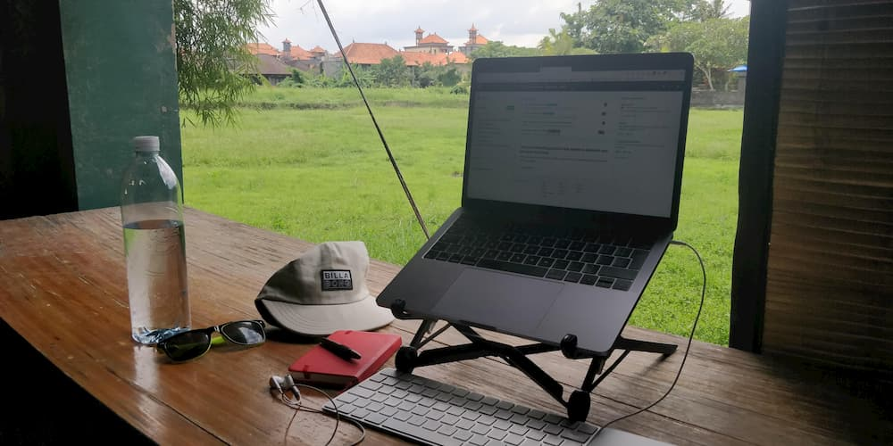
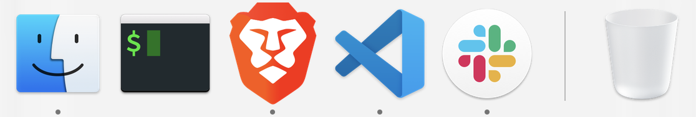

This page is somewhat inspired by [Wes Bos' Uses](https://wesbos.com/uses/) page. Keep in mind that I'm mostly doing Frontend development and I'm also a nomadic worker. In other words, I'm 100% remote and I travel. A lot.

## Hardware

* MacBook Pro (13-inch)
* **No extra screen.** I've found myself more focus with only one screen
* [Roost Laptop Stand](https://www.therooststand.com/) *(note: [I don't use it when I work from a coffee shop!](https://twitter.com/NikkitaFTW/status/1139607268452777984))*. 
* Magic keyboard 2 and the Magic trackpad 2
* Notepad where [I write my daily MIT](https://about.gitlab.com/2018/05/17/eliminating-distractions-and-getting-things-done/#2-write-down-your-mits)
* Xiaomi 9t Pro (and a old Huawei as a back up)
* Sony MDR 1000X. A noise cancelling headphone with 2 modes: wired or wiredless (bluetooth). I also have some [Airpods](https://www.apple.com/fr/airpods-2nd-generation/).
* Travel&daily bag is a [Minaal Carry-on 2.0](https://www.minaal.com/products/minaal-carry-on-bag/?variant=12494163140) (with packing cubes). I love it!

As a digital nomad, I don't have space for a desk on my backpack! ;)

## IDE

* VS Code is my favourite text editor so far.
* The theme I use is Material Theme which I customised.
* [Full list of plugins that I Can't Live Without](https://github.com/maxpou/dotfiles/blob/master/vscode/install_plugin.sh).

All of my config files (VS Code settings, bash aliases, git config...) are accessible on [my dotfiles GitHub repository](https://github.com/maxpou/dotfiles).

## Browser

My main browser is [Brave](https://brave.com/). I also use the following plugins:

* [uBlock Origin](https://chrome.google.com/webstore/detail/ublock-origin/cjpalhdlnbpafiamejdnhcphjbkeiagm)
* [Pocket (Save to Pocket)](https://chrome.google.com/webstore/detail/save-to-pocket/niloccemoadcdkdjlinkgdfekeahmflj)
* [LastPass](https://chrome.google.com/webstore/detail/lastpass-free-password-ma/hdokiejnpimakedhajhdlcegeplioahd)
* Devtool extensions: [Vue.js](https://chrome.google.com/webstore/detail/vuejs-devtools/nhdogjmejiglipccpnnnanhbledajbpd) and [React](https://chrome.google.com/webstore/detail/react-developer-tools/fmkadmapgofadopljbjfkapdkoienihi)
* [Accessibility Insights](https://accessibilityinsights.io) and [axe](https://www.deque.com/axe/) for Accessibility audits

I used to have Wappalyzer... but I've found this extension quite curious so, I removed it!

## Terminal & Command Line Apps

I mostly use my terminal in VSCode. Otherwise, I use iTerm (not a big fan!). My terminal theme is af-magic.

This is the list of plugins/apps I use:

* [Zsh](https://github.com/robbyrussell/oh-my-zsh/wiki/Installing-ZSH) with [Oh My Zsh](https://github.com/robbyrussell/oh-my-zsh). Oh My Zsh is a framework for managing zsh configuration.
* [Lighthouse (CLI)](https://github.com/GoogleChrome/lighthouse) - Auditing, performance metrics, and best practices for Progressive Web Apps.
* [Hub](https://github.com/github/hub) - a wrapper for Git command *(Git+Hub=GitHub)*
* [vtop](https://github.com/MrRio/vtop) - an alternative to activity monitor.
* [Tree](https://formulae.brew.sh/formula/tree) - to generate a tree (like the Tree Windows command).
* [n](https://github.com/tj/n) - a super handy tool for node version management.

I also use Vim from time to time.

## Desktop Apps

I have a very minimalistic approach when it comes to my dock. If I don't use an app -at least- once a day, I remove it from the dock.

I also use these applications:

* [ProtonVPN](https://protonvpn.com) is my VPN and I happily pay for it!
* [Giphy Capture](https://giphy.com/apps/giphycapture) is my go-to screen recording when I need to share something with my colleagues. I found it simple to use.
* OBS - screen recording but for a longer video. I don't use it much...
* [Sequel Pro](https://www.sequelpro.com) - when I need a GUI for MySQL.
* [Transmission](https://transmissionbt.com) - for torrents ;)

## Blogging

This site made with Gatsby.js and [gatsby-starter-morning-dew](https://github.com/maxpou/gatsby-starter-morning-dew). I use these applications to help me write:

* [Grammarly](https://app.grammarly.com/) - Helps me to remove typos / proofread my posts
* [Google Docs](http://docs.new/) - Helps me to remove typos / proofread my posts
* [Hemingway](http://www.hemingwayapp.com) - "Hemingway App makes your writing bold and clear"
* [Squoosh](https://squoosh.app) - Image compression
* [Remove.bg](https://www.remove.bg) - Remove background on png
* [Keynote (by Apple)](https://www.apple.com/keynote/) - To draw schemas

## Gaming

* I play mostly Age Of Empire 2 DE on my MacBook (I've a Windows dual boot)
* For other games, I rely on Cloud Gaming platforms such as [GeForce Now](https://www.nvidia.com/en-us/geforce-now/), Stadia and [XCloud](https://www.xbox.com/en-IE/xbox-game-streaming/project-xcloud)
* [Xbox Elite Controller Series 2](https://www.xbox.com/en-IE/accessories/controllers/elite-wireless-controller-series-2) is my controller. A bit pricey, but very comfortable.
* [G403 HERO Mouse](https://www.logitechg.com/en-us/products/gaming-mice/g403-hero-gaming-mouse.910-005630.html) as a gaming mouse (I use the Magic trackpad 2 for non-gaming stuffs)
* [PowerA Moga](https://www.powera.com/moga/) for mobile gaming clip
