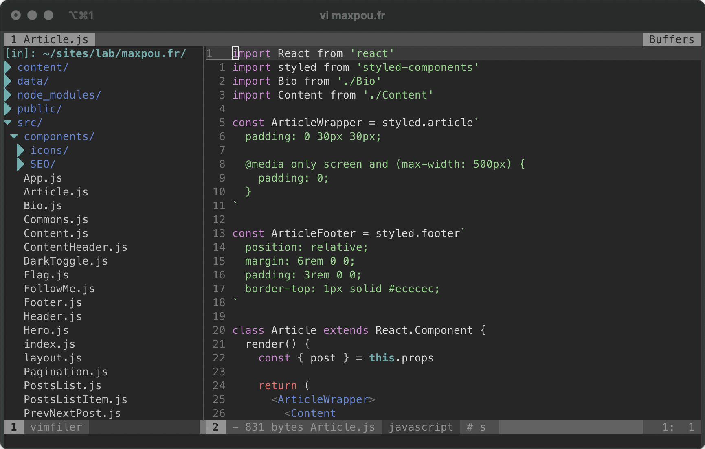

This page is inspired from [Wes Bos' Uses](https://wesbos.com/uses/) page.

## Computer

* MacBook Pro (13-inch)
* **No extra screen.** I've found myself more focus with only one screen
* [Roost Laptop Stand](https://www.therooststand.com/) *(note: [I don't use it when I work from coffee shop !](https://twitter.com/NikkitaFTW/status/1139607268452777984))*. When I use the rooststand, I also use the Magic keyboard 2 with the Magic trackpad 2.

As a digital nomad, I don't have space for a desk on my backpack!

## IDE

* VS Code is my favourite text editor so far.
* The theme I use is Material Theme which I customised.
* [Full list of plugins that I Can't Live Without](https://github.com/maxpou/dotfiles/blob/master/vscode/install_plugin.sh).

All of my config files (VS Code settings, bash aliases, git config...) are accessible on [my dotfiles GitHub repository ](https://github.com/maxpou/dotfiles).

## Browser

My main browser is [Brave](https://brave.com/). I love Brave because this browser is super fast and also keep my privacy 💛

* [uBlock Origin](https://chrome.google.com/webstore/detail/ublock-origin/cjpalhdlnbpafiamejdnhcphjbkeiagm)
* [Pocket (Save to Pocket)](https://chrome.google.com/webstore/detail/save-to-pocket/niloccemoadcdkdjlinkgdfekeahmflj)
* LastPass
* Devtool extensions: vue and react

I used to have Wappalyzer... but I've found this extension quite curious so I removed it!

## Terminal & Command Line Apps

I mostly use my terminal in VSCode. Otherwise, I use iTerm (not a big fan!). My terminal theme is af-magic.

This is the list of plugins I use:

* [Zsh](https://github.com/robbyrussell/oh-my-zsh/wiki/Installing-ZSH) and [Oh My Zsh](https://github.com/robbyrussell/oh-my-zsh): A framework to manage Zsh configuration.
* [Hub](https://github.com/github/hub) - a wrapper for Git command *(Git+Hub=GitHub)*
* [lighthouse (CLI)](https://github.com/GoogleChrome/lighthouse#cli-options) - Auditing, performance metrics, and best practices for Progressive Web Apps
* [vtop](https://github.com/MrRio/vtop) - a good alternative to activity monitor.
* [Tree](https://formulae.brew.sh/formula/tree) - for presentation
* [n](https://github.com/tj/n) - a super handy tool for node version management

I also use Vim from time to time.

## Desktop Apps

I have a very minimalistic approach when it cames to my dock. If I don't use an app -at least- once a day, I remove it from the dock.

I also use this applications:

* [ProtonVPN](https://protonvpn.com) and I pay for it!
* [Giphy Capture](https://giphy.com/apps/giphycapture) is my go-to screen recording when I need to share something with my colleagues. It's very simple to use.
* OBS - screen recording but for longer video. It don't use it much...
* [Sequel Pro](https://www.sequelpro.com/) - when I need a GUI for MySQL.

## Blogging

This site made with Gatsby.js and [gatsby-starter-morning-dew](https://github.com/maxpou/gatsby-starter-morning-dew). 

* [Grammarly](https://app.grammarly.com/) - Helps me to remove typos / proofread my posts.
* [Hemingway](http://www.hemingwayapp.com) - "Hemingway App makes your writing bold and clear."
* [Squoosh](https://squoosh.app) - Image compression
* [Remove.bg](https://www.remove.bg) - Remove background on png

## Other Gear

Having a good backpack is essential when you travel the most of your time. I use the The [Minaal Carry-on 2.0](https://www.minaal.com/products/minaal-carry-on-bag/?variant=12494163140) (with packing cubes). I love it!