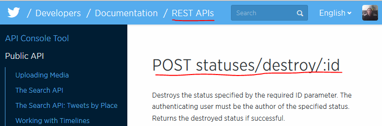
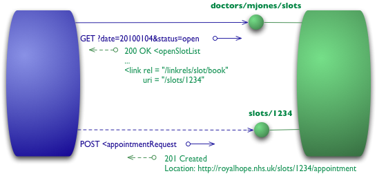

## Etat des lieux

REST (**RE**presentational **S**tate **T**ransfer) est un style d'architecture créé par Roy T. Fielding en 2000 pour sa thèse de doctorat. Roy Fielding est aussi l'un des 8 fondateurs de la fondation Apache, il a travaillé sur le Apache HTTP Server (plus de 55% de parts de marché [selon W3Techs](http://w3techs.com)).

Contrairement à ce que l'on peut lire sur certains sites, REST ne repose pas sur le protocole HTTP... bien que ce dernier soit le meilleur exemple.

Aujourd'hui, on voit des API REST un peu partout :  
<div style="width:540px">
    <a href="http://www.indeed.com/jobtrends?q=soap+api%2C+rest+api" title="soap api, rest api Job Trends">
        
    </a>
    <table width="100%" cellpadding="6" cellspacing="0" border="0" style="font-size:80%"><tr>
        <td><a href="http://www.indeed.com/jobtrends?q=soap+api%2C+rest+api">soap api, rest api Job Trends</a></td>
        <td align="right"><a href="http://www.indeed.com/jobs?q=Soap+API">Soap API jobs</a> - <a href="http://www.indeed.com/jobs?q=Rest+API">Rest API jobs</a></td>
    </tr></table>
</div>

Par contre, en prenant des valeurs relatives, la différence est encore plus marquée :
<div style="width:540px">
    <a href="http://www.indeed.com/jobtrends?q=soap+api%2C+rest+api&relative=1&relative=1" title="soap api, rest api Job Trends">
        
    </a>
    <table width="100%" cellpadding="6" cellspacing="0" border="0" style="font-size:80%"><tr>
        <td><a href="http://www.indeed.com/jobtrends?q=soap+api%2C+rest+api&relative=1&relative=1">soap api, rest api Job Trends</a></td>
        <td align="right"><a href="http://www.indeed.com/jobs?q=Soap+API">Soap API jobs</a> - <a href="http://www.indeed.com/jobs?q=Rest+API">Rest API jobs</a></td>
    </tr></table>
</div>

Il faut dire aussi que son principal concurrent : SOAP n'est pas aussi simple d'approche et peu paraître contraignant (XML, WSDL, ...). Ceci étant, il ne faut pas voir REST comme un marteau doré qui résout tous les problèmes. SOAP a aussi ses avantages.


##Différentes étapes du RMM (Richardson Maturity Model)
*Les images de cette partie proviennent du [Blog de Martin Fowler](http://martinfowler.com/articles/richardsonMaturityModel.html).*

En se basant sur le travail de Roy Fieldling, [Leonard Richardson](http://www.crummy.com/self/) a établi un modèle de maturité des services web REST appelé Richardsson Maturity Model (RMM pour les intimes). Ces 4 niveaux permettent d’évaluer une API par rapport aux contraintes REST. Le niveau 3 est une précondition pour REST.


###Niveau 0 - Bon vieux XML


On est ici au plus bas niveau, le protocole est uniquement utilisé à des fins de transport.
Les bons exemples de ce niveau zéro sont les protocoles SOAP et XML-RPC (l’ancêtre de SOAP). Ces derniers utilisent HTTP uniquement à des fins de transport du message. En tentant d’accéder à un service web auquel l’utilisateur n’a pas le droit, la réponse ne sera pas accompagnée d’un code d’erreur 403 (Forbidden).

Tout circule via un seul et unique point d'entrée.  

Pour illustration, voici ce que pourrait donner un service de livraison de pizzas.
Vous noterez que les informations échangées sont sous la forme XML. Cependant, le format n’est pas figé, il peut aussi se trouver sous la forme JSON, YAML, ... et même des formats moins communs comme du PDF ou images.

Première étape, je souhaite récupérer la carte du restaurant de Nantes :

```xml
POST /pizzaService HTTP/1.1
[various other headers]

<demandeCarteRequest date = "2015-07-15" ville = "Nantes"/>
```

En retour, le serveur me renverra la liste des pizzas pour le magasin de Nantes :

```xml
HTTP/1.1 200 OK
[various headers]

<carteRestaurant>
    <pizzas>
        <pizza id="reine" prix="8.5" />
        <pizza id="calzone" prix="10.5" />
    </pizzas>
</carteRestaurant>
```

Pour commander une pizza, voici la requête qui sera envoyée au serveur :
```xml
POST /pizzaService HTTP/1.1
[various other headers]

<livraisonRequest>
    <client id = "mpoutord"/>
    <commande date="16-07-2015 22:45">
        <pizza id="calzone" />
    </commande>
</livraisonRequest>
```

En cas de réussite, le serveur renverra la réponse suivante :

```xml
HTTP/1.1 200 OK
[various headers]

<reservation>
    <client id = "mpoutord"/>
    <horraireLivraison debut="22:30" fin="23:00" />
</reservation>
```

Et en cas d'échec, cette réponse sera envoyée :

```xml
HTTP/1.1 200 OK
[various headers]

<reservationError>
    <message contenu="Le restaurant ferme à 22h30" />
</reservationError>
```

###Niveau 1 - Ressources


La deuxième étape vers la "gloire de REST" (Glory of REST), est l’introduction d’un élément fondamental de REST : la notion de ressources.
Pour continuer dans l’exemple précédent, il n’y a plus d’URI du type : "/pizzaService" qui contient tous les services du restaurant mais bien **une URI par ressource**.

Ainsi pour demander la carte du restaurant, voici la requête qui sera envoyée :

```xml
POST /pizzas HTTP/1.1
[various other headers]

<demandeCarteRequest date = "2015-07-15" ville = "Nantes"/>
```

A part l'URI, rien ne change. Côté réponse le résultat sera le même qu'au niveau 0.

```xml
HTTP/1.1 200 OK
[various headers]

<carteRestaurant>
    <pizzas>
        <pizza id="reine" prix="8.5" />
        <pizza id="calzone" prix="10.5" />
    </pizzas>
</carteRestaurant>
```

Pour réserver, il faudra pointer vers la *ressource réservation*.

```xml
POST /reservation HTTP/1.1
[various other headers]

<livraisonRequest>
    <client id = "mpoutord"/>
    <commande date="16-07-2015 22:45">
        <pizza id="calzone" />
    </commande>
</livraisonRequest>
```


Vous noterez que je mets un "s" à mes collections de ressources comme ceci :  
http://example.org/articles/1
Mais rien ne vous empêche de ne pas en mettre :
http://example.org/article/1

Essayez cependant de garder une certaine cohérence dans l'ensemble de votre application.

Comme expliqué plus haut, il y a une URI par ressource.  
Donc, si vous souhaitez fournir votre ressource sur différents formats, vous ne **devez pas** utiliser des URI de la sorte : /pizzas/id.{format}  

* /pizzas/123.json
* /pizzas/123.xml
* /pizzas/123.whatever

Qui dit 3 URI différentes, dit 3 ressources différentes.
A la place, utilisez la [spécification HTTP : négociation de contenu](https://fr.wikipedia.org/wiki/N%C3%A9gociation_de_contenu).

###Niveau 2 - Verbes HTTP


La 3e étape inclut la notion d'action et d'état. D'un point de vue HTTP, cela se matérialise par l'introduction des :

* verbes HTTP tels que GET, POST, PUT, DELETE ... pour exprimer l'action à réaliser sur la ressource.
Ces 4 méthodes représentent le modèle CRUD (Obtention, Création, Modification et suppression).
* codes HTTP (200, 404, ...) pour indiquer l'état de la ressource.
Ces codes sont régis par la [RFC 7231](http://tools.ietf.org/html/rfc7231). Vous trouverez aussi la liste sur la [page Wikipédia](https://fr.wikipedia.org/wiki/Liste_des_codes_HTTP).


Toujours en reprenant le même exemple, pour demander la carte voici ce que nous obtiendrons :
```xml
GET /pizzas HTTP/1.1
[various other headers]

<demandeCarteRequest date = "2015-07-15" ville = "Nantes"/>
```

Une fois de plus, la réponse sera la même :
```xml
HTTP/1.1 200 OK
[various headers]

<carteRestaurant>
    <pizzas>
        <pizza id="reine" prix="8.5" />
        <pizza id="calzone" prix="10.5" />
    </pizzas>
</carteRestaurant>
```

Pour réserver, la méthode POST sera appelée. En effet, nous souhaitons bien ajouter une nouvelle livraison :

```xml
POST /reservation HTTP/1.1
[various other headers]

<livraisonRequest>
    <client id = "mpoutord"/>
    <commande date="16-07-2015 22:45">
        <pizza id="calzone" />
    </commande>
</livraisonRequest>
```

En cas de succès, la réponse suivante sera retournée par le serveur :
```xml
HTTP/1.1 201 Created
[various headers]
<livraison>
    <client id = "mpoutord"/>
    <commande date="16-07-2015 22:45">
        <pizza id="calzone" />
    </commande>
</livraison>

```

Vous noterez le code (201 - Created) indiquant que le traitement a été effectué avec succès et qu'une ressource a été créée.  
En cas d'échec, une réponse de ce type sera renvoyée :
```xml
HTTP/1.1 409 Conflict
[various headers]

<livraison>
    <client id = "mpoutord"/>
    <commande date="16-07-2015 22:45">
        <pizza id="calzone" />
    </commande>
</livraison>
```

En cas de conflit, le serveur renvoie un code 409 : conflit. Ce code signifie que la requête ne peut être traitée dans l’état actuel.

Pensez bien à utiliser les verbes à bon escient ! Regardez la doc de Twitter :


*[Source](https://dev.twitter.com/rest/reference/post/statuses/destroy/%3Aid)*

Twitter est un mauvais élève. On ne supprime pas les données avec un POST mais bien avec un DELETE.  
Il en va de même pour ceux qui confondent PATCH et GET. PATCH sert à envoyer un différentiel (en bas de l'article se trouve un lien qui détaille un peu plus l'utilisation de PATCH).

###Niveau 3 - Contrôle hypermedia (HATEOAS)




Ce dernier niveau introduit la notion ultime de REST : **HATEOAS** (<b>H</b>ypertext <b>A</b>s <b>T</b>he <b>E</b>ngine <b>O</b>f <b>A</b>pplication <b>S</b>tate). HATEOAS ou contrôles hypermedias rendent votre API auto-documentée. Ainsi vous pouvez passer d'un état à un autre via des URL transmises par l'API.  
Quand vous êtes sur un site marchand et que vous souhaitez accéder à la fiche d'un produit, vous n'entrez pas l'url à la main. Vous cliquez sur un lien qui vous enverra vers cette dernière.  
Dans une API REST, c'est pareil !

Voici à quoi tout cela peut ressembler :

```xml
HTTP/1.1 200 OK
[various headers]

<carteRestaurant>
    <pizzas>
        <pizza id="reine" prix="8.5">
            <link rel="Ajouter au panier" href="/basket/reine" />
            <link rel="Composition" href="/pizzas/reine/composition" />
        </pizza>
        <pizza id="calzone" prix="10.5">
            <link rel="Ajouter au panier" href="/basket/calzone" />
            <link rel="Composition" href="/pizzas/reine/calzone" />
        </pizza>
    </pizzas>
    <links>
        <link rel="Passer commande" href="/reservation" />
        <link rel="Contact" href="/contact" />
    </links>
</carteRestaurant>
```


##Conclusion

On vient de voir au travers du RMM, les différents niveaux de maturité des services web REST.

* Le niveau 0 : L'état basique avec des XML dans tous les sens
* Le niveau 1 : ajout de la notion de ressources (http://example.org/objects/1)
* Le niveau 2 : ajout de verbes de statut et de codes d'état
* Le niveau 3 : contrôle hypermedia (HATEOAS)


Bon alors REST/RESTful, c'est quoi ? En ce qui me concerne, je pense que REST est une sorte de buzzword, un mot marketing que un mot qui fait "cool". **Si votre API n'est pas de niveau 3, ne prétendez pas faire du REST car c'est faux.**  
Si votre API se contente de renvoyer juste des objets sérialisés au format JSON/XML/... parlez simplement d'API ou d' *API HTTP* !

> I am getting frustrated by the number of people calling any HTTP-based interface a REST API [...] Please try to adhere to them or choose some other buzzword for your API.  
— **[Roy T. Fielding - REST APIs must be hypertext-driven](http://roy.gbiv.com/untangled/2008/rest-apis-must-be-hypertext-driven)**


Bon alors, votre API est-elle toujours REST ? ;-)


##Pour aller plus loin...

* [Thèse de Roy T. Fielding : Architectural Styles and the Design of Network-based Software Architectures](http://www.ics.uci.edu/~fielding/pubs/dissertation/top.htm)
* [Comment bien utiliser PATCH (par William Durand)](http://williamdurand.fr/2014/02/14/please-do-not-patch-like-an-idiot/)
* [Pour terminer, ma section préférée de la thèse de Roy T. Fielding : Code-On-demand (COD)](http://www.ics.uci.edu/~fielding/pubs/dissertation/rest_arch_style.htm#sec_5_1_7)


##Sources

* [Blog de Leonard Richardson](http://www.crummy.com/writing/speaking/2008-QCon/act3.html)
* [Blog de Martin Fowler sur le RMM](http://martinfowler.com/articles/richardsonMaturityModel.html)
* [Blog de Roy T. Fielding](http://roy.gbiv.com/untangled/2008/rest-apis-must-be-hypertext-driven)
* [Restcookbook](http://restcookbook.com/)
