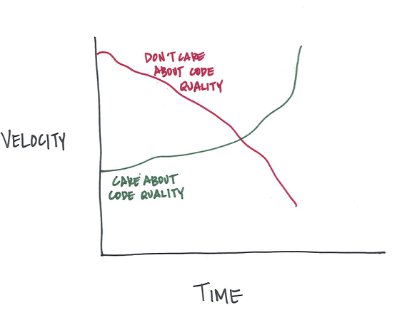
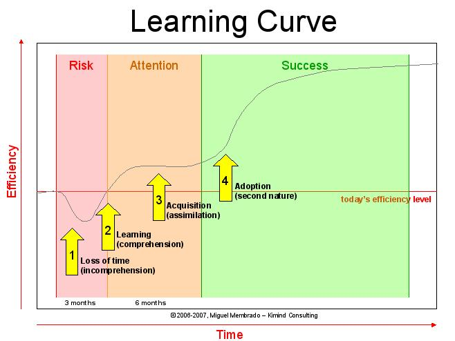

# Utilisez un framework PHP

Aujourd'hui je vais vous parler de framework dans l'écosystème PHP.  
L'idée de cet article m'est venue suite à la suite d'une mission de plus chez un client qui préférait utiliser son framework maison plutôt qu'un framework open source. Je n'adhère pas vraiment à cette philosophie et l'objectif de cet article est de vous présenter pourquoi.  

## Framework, kezako ?

Tout d’abord, qu’est-ce qu’un framework ?  

> Un framework est un ensemble cohérent de composants logiciels structurels, qui sert à créer les fondations ainsi que les grandes lignes de tout ou d’une partie d'un logiciel.  
— **Wikipedia**

Il faut donc voir le framework comme une sorte de boîte à outil qui évite au développeur de *réinventer la roue* à chaque projet. Les premières fondations de l'application sont déjà posées et les fonctionnalités de base (routeur, gestion du cache, gestion des droits des utilisateurs, ...) sont déjà développées, testées et approuvées !  
Je ne vais pas m'étendre plus sur la définition d'un framework. J'imagine que si vous êtes ici, c'est que vous savez ce que c'est ;-)

## Pourquoi vous devez utiliser un framework

### Capitalisation
Si vous développez, vous le savez forcément : copier/coller du code, c'est mal !
L'objectif d'un framework est clair : se concentrer sur la partie métier du projet, et s'assurer que chaque fonctionnalité codée soit unique. Si, à chaque fois que vous commencez un projet, vous redéveloppez la même fonctionnalité d'authentification, c'est qu'il y a un problème. Vous ne capitalisez rien et vous perdez votre temps.  

### Vélocité
L'avantage d'un framework, c'est qu'il va vous permettre de réaliser du bon code répondant à une architecture bien définie. Le code est ainsi plus maintenable et évolutif. Par exemple, avec le framework Symfony2, tous les formulaires se trouvent dans un répertoire appelé Form. Si on a besoin de modifier un formulaire, on devine l'emplacement intuitivement.

  
*[Source : Quora - Moving Fast With High Code Quality](http://engineering.quora.com/Moving-Fast-With-High-Code-Quality)*

Ne pas se soucier de la qualité du code peut-être pertinent pour un petit projet (et encore). Pour un projet un petit peu plus conséquent, la vélocité en prend un coup. Attention, la qualité du code ne passe pas que sur l'utilisation d'un framework.  
Vous devrez aussi respecter :

* coder proprement (commenter, supprimer les codes morts, ne pas avoir trop de niveaux d'indentation, ...),
* les standards du langage ([PSR-1](http://www.php-fig.org/psr/psr-1) et pourquoi pas [PSR-2](http://www.php-fig.org/psr/psr-2)),
* les bonnes pratiques du framework en question.

### Performances ?

Un autre élément que j'ai déjà entendu :

> Les frameworks produisent du code lourd et peu performant.

C'est sûr que si le cache n'est pas réglé, si le *lazy loading* est toujours activé, s'il y a toujours des joker (&#42;) dans vos SELECT SQL... pas étonnant que le sysadmin fasse la grimace !

Mais dites-vous qu'un framework comme Symfony2 peut supporter de grosses charges comme le montre ce tweet de la société [Octivi](http://labs.octivi.com/handling-1-billion-requests-a-week-with-symfony2/) :

<blockquote class="twitter-tweet" lang="fr">
Symfony2 performance&#39;s bad? 30ms response time of app_dev with 300 req/s total traffic makes us happy ;-) cc <a href="https://twitter.com/fabpot">@fabpot</a> <a href="http://t.co/I6jRsgQU5e">pic.twitter.com/I6jRsgQU5e</a>
&mdash; Octivi (@octivi) <a href="https://twitter.com/octivi/status/448147269338947584">24 Mars 2014</a></blockquote>

En complément, je vous invite à regarder cette conférence d'Eric Pickup qui explique comment ils ont géré la scalabilité d'un site à très fort trafic (YouPorn) avec le framework Symfony2.

<iframe width="560" height="315" src="https://www.youtube.com/embed/RlkCdM_f3p4" frameborder="0" allowfullscreen></iframe>

## Utiliser mon framework maison VS. framework open source

Il vrai que c'est plutôt plaisant d'utiliser son propre framework. J'ai également créé mon propre framework à une époque. C'est vraiment plaisant ! On sait comment il fonctionne de A -> Z. Normal, on l'a concu ! On est en plein dans ce que nos amis d'outre-atlantique appellent le [dogfooding](https://fr.wikipedia.org/wiki/Dogfooding).  
En plus au fil du temps, on le voit évoluer... on le considère un peu comme son propre bébé.

Mais, pour ma part, je me suis rapidement rendu compte que je passais beaucoup trop de temps à ajouter des nouvelles fonctionnalités/corriger des bugs qu'à développer pour l'entreprise qui m'employait. Je savais que je n'empruntais pas la bonne voie en continuant ainsi mais je n'arrivais pas à m'en séparer.

C'est ce que l'on appelle en psychologie sociale : **la théorie de l'engagement**. Sans rentrer dans les arcanes de cette théorie, sachez que c'est exactement la même chose qui se produit lorsque vous attendez le tramway pour éviter un trajet à pieds de 10 minutes. Vous patientez 5, 6, 7, 9, puis 10 minutes votre tram. Si vous partez, vous réduisez à néant tous vos efforts (et vous prenez le risque de voir passer le tram sous votre nez). Vous ne voulez donc pas abandonner cette somme de petits efforts.

J'ai donc pris une décision difficile ce jour-là en décidant de *couper le cordon* et d'arrêter le développement de mon framework. Aujourd'hui, je ne regrette pas cette décision.

* **Communauté** : il y a une phrase que je me dis souvent : "Si je me pose cette question, c'est que quelqu'un se l'est déjà posé auparavant. Sinon c'est que je me pose pas la bonne question" (on est pas très loin de la règle 34). En utilisant un framework reconnu de tous vous trouverez rapidement une réponse à une question que vous vous posez.  
Certains frameworks comme Symfony2 sont très modulaires. Ainsi vous pouvez réutiliser un module fait par un autre, l'améliorer au passage... et pourquoi pas proposer un [pull request](https://help.github.com/articles/using-pull-requests/) !

* **Sécurité** : en ce qui me concerne, je pense que la sécurité est presque un métier à part (ce n'est pas pour autant qu'il faut la négliger !). Le b.a.-ba de la sécurité que vous ne pouvez ignorer sont les 10 failles les plus courantes dans les applications web : l'[OWASP top 10](https://www.owasp.org/index.php/Top_10_2013-Top_10). Des framework comme Laravel et Symfony2 sont nativement protégé contre les failles CRSF, XSS, injection SQL... Mais ce n'est pas parce qu'un framework est nativement protégé que tout est joué pour autant ! Vous pouvez aussi laisser des failles dans votre code.  
Autre élément intéressant, les constituantes de l'outils auront été testé par énormément de personnes avant vous. Avec du *fait maison*, il est plus difficile de tester la sécurité (car c'est plus simple de trouver des erreurs dans le travail des autres).

* **Documentation** : si vous utilisez un framework maison, n'allez pas me faire croire que tout est documenté aux petits oignons ! Par contre avec les frameworks open source, c'est tout l'inverse. Il faut dire que si la documentation est mal conçue de base, peu de personnes utiliseront cet outil.

* **Rapidité d'exécution** : si vous avez un recrutement à faire dans une équipe de développeurs, la montée en compétence du développeur sur le projet sera plus rapide car il connait déjà les outils. Avez un outil *home made*, il faudra libérer une ressource d'un projet pour le former et l'encadrer.

## Pourquoi ne pas utiliser de Framework

### Courbe d'apprentissage

En fait, depuis le début de cet article, je prône l'utilisation d'un framework dans l'écosystème PHP. Mais il ne faut pas voir le framework comme une arme de destruction massive, qui résout tous les problème à coups de baguette magique.

En plus de ses prérequis (bien connaître le langage PHP et le PHP OOP, namespaces, ...), la courbe d'apprentissage d'un framework est importante. Ne la négligez pas.  
Si vous souhaitez passer sur un framework pour un projet et que les deadlines sont courtes, oubliez l'idée car vous courrez vers l'échec. Commencez par un projet simple avec des deadlines larges (oui je sais c'est rare !).

### Utiliser le bon outil

Deuxième cas où vous pouvez vous sentir exempté d'utiliser un framework : si vous êtes dans un marché de niche ou si vous gérez un très gros site (Amazon, Facebook, ...).
Si aucun framework ne remplit vos besoins initiaux ou si vous avez un besoin assez important côté performances, n'hésitez pas à créer votre propre framework.

Il en va de même pour l'utilisation de Symfony2 (ou autre framework assez conséquent) pour une application minuscule qui doit se charger d'envoyer des mail après soumission d'un formulaire n'est pas pertinent du tout.  

  

Utilisez un framework plus approprié comme un **micro framework** ([Silex](http://silex.sensiolabs.org), [Slim](http://www.slimframework.com), ...). Ils sont beaucoup plus légers et plus rapides à mettre en place (il en va de même pour la courbe d'apprentissage).

### Développeur PHP ou développeur Symfony2/Laravel/... ?

Un des dangers quand on utilise un framework, c'est de brûler les étapes. **C'est bien d'éviter de réinventer la roue, mais encore faut-il savoir comment elle est faite**.
De même, il n'y a -à mon sens- pas beaucoup de mérite à réutiliser un ensemble de fonctions créées par d'autres. Ça, presque tout le monde peut le faire.  
Si vous sentez qu'il est trop tôt pour utiliser un framework, continuez l'apprentissage du langage avant de griller les étapes.

## A vous de jouer !

Je n'ai pas envie de vous guider vers un framework plutôt qu'un autre, pour la bonne et simple raison que chaque framework a sa spécificité, ses avantages et inconvénients. C'est avant tout une question de goûts.  
Pour ma part, j'ai directement adhéré à Symfony2 et son petit frère Silex (pour les plus petits projets). Mais ce n'est pas le cas de tout le monde.  

Néanmoins lorsque vous ferez votre benchmark, prenez en compte ces éléments :

* **Qualité de la documentation** : vous allez passer beaucoup de temps dessus au départ. Ne négligez pas pas ce point.
* **Fréquence de mises à jour** : Si vous travaillez sur un projet et que vous devez tout casser et tout réécrire tous les 2 mois pour être à jour sur la nouvelle version, vous n'allez pas avancer. De même, si les mises à jour sont quasi inexistantes c'est peut-être que peu de personnes l'utilisent.  
Je vous conseille de couper la poire en deux et d'opter pour les version **LTS (Long Term Support)**.
* **Facilité à produire des API** : C'est de plus en plus demandées dans les projets et ce n'est pas prêt de s'arrêter.
* **Popularité du framework** : il ne faut pas non plus que vous soyez tout seul au moindre problème. Testez la popularité de l'outil sur la toile (avec des sites comme [Stack Overflow](http://stackoverflow.com/)) ET sur le marché de l'emploi du lieu où vous travaillez (via des sites d'emploi).

Bref, entre Symfony2, Silex, Laravel, Codeigniter, CakePHP, Zend Framework, YII... vous avez le choix !
