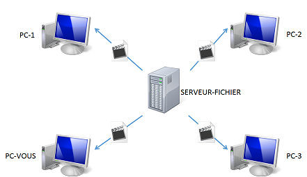
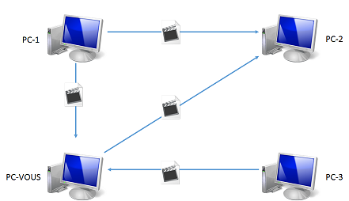
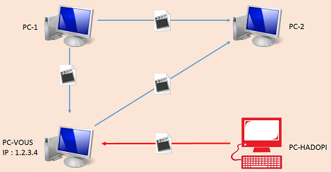
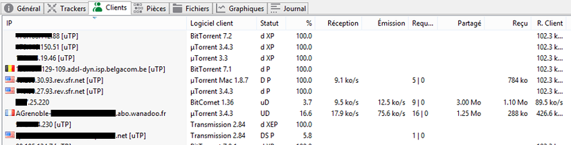
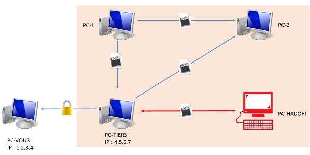

_Ca y est, vous venez de recevoir votre premier courrier HADOPI et c'est la panique. Vous avez
Googlelé "contourner HADOPI" et vous voici arrivé ici._

Pas de panique, il existe des solutions. Avant toutes choses, il est nécessaire de comprendre
comment tout fonctionne.

##1 - Différents méthodes de téléchargement

### Mode centralisé

C'est le mode de fonctionnement le plus utilisé. Quand vous avez besoin de récupérer un logiciel,
des photos... C'est le mode de fonctionnement d'outils comme Megaupload, Rapid Share, Google Drive,
...  
Ceci pose le problème suivant : plus le fichier est populaire, plus le serveur peinera à répondre à
toutes les demandes.

###Mode décentralisé : P2P (peer-to-peer)  Comme son nom l'indique, tous les
ordinateurs sont égaux avec ce mode de fonctionnement. Un ordinateur peut aussi bien partager un
fichier qu'en télécharger un autre. Nota: Pour des soucis de simplification, j'ai ôté le serveur du
schéma. Mais il y a souvent un serveur

##2 - Fonctionnement d'HADOPI Malheureusement, le P2P est, de par sa nature, assez bavard. Quand on
regarde les clients qui partagent un torrent, on voit beaucoup d'informations sur eux... notamment
l'adresse IP.  
En guise d'exemple, voici le contenu de l'onglet Client du logiciel µTorrent : 

> Et Hadopi dans tout ça ?

Si on regarde bien la première colonne, on peut y voir des informations intéressantes : les adresses
IP. Une fois récupérées, une demande est envoyée aux FAI pour obtenir l'identité du détenteur de
cette IP.

## 3 - Contournement

Vu que dans cette typologie de partage, tout le monde voit tout le monde, la solution est donc de
faire croire que nous habitons dans un autre pays.  
Nous pourrions alors avoir quelque chose de la sorte : 

Hadopi verra alors dans la liste des personnes qui téléchargent le film, l'adresse IP 4.5.6.7. La
récupération du film se fera alors via une connexion **chiffrée**.

> Comment cela se concrétise ?

Il y a deux solutions à celà : utiliser un **VPN** et/ou une **seedbox**. Le VPN vous cachera
derrière un PC situé dans un autre pays. Une fois installé et paramétré,
[ce site](http://www.ip-adress.com/) devrait vous indiquer une adresse autre que la vôtre.

La seedbox est un serveur qui téléchargera 24h/24. Soit vous mettez ce serveur derrière un VPN, soit
vous prenez une seedbox dans un autre pays.
