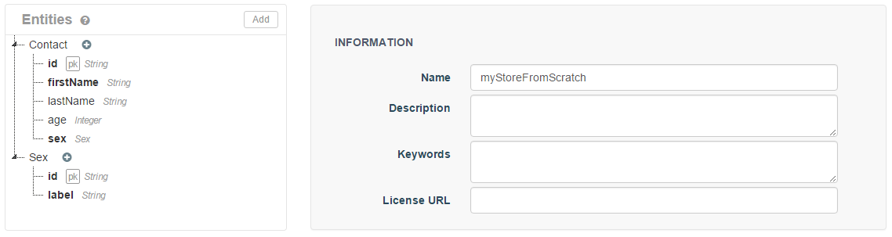
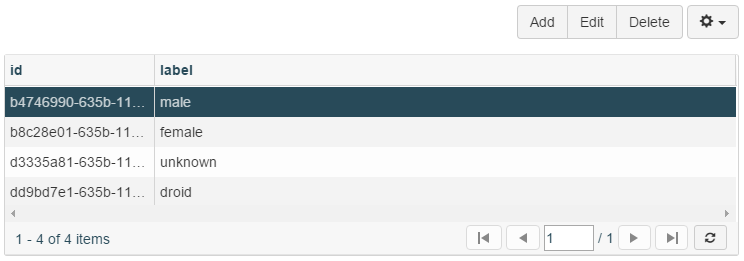
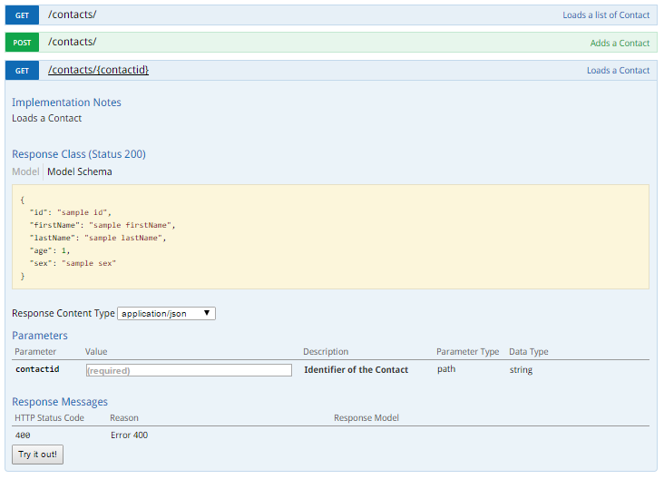
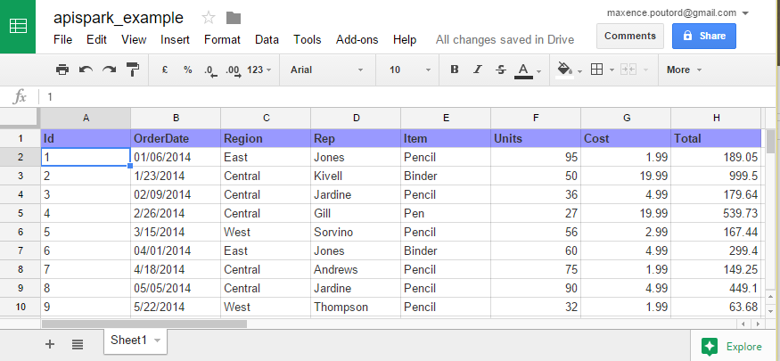
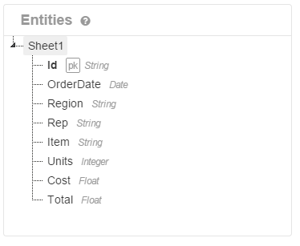

[TL;DR](#points-forts)

J'ai découvert cet outil suite à la présentation de [@jplegoff](https://twitter.com/jplegoff) lors
d'un instant technique chez Conserto. [APISpark](http://restlet.com/products/apispark/) est une
plateforme _as a service_ créé par Restlet, permettant à n'importe qui de fournir en toute
simplicité une Web API. En plus de fournir des Web API APISpark vous propose de la consommer et de
la documenter.

Maintenant, je vous vois venir : qui dit produit _as a service_, dit monétisation. Avec un compte
FREE, [voici ce que vous avez](http://restlet.com/products/apispark/#pricing).

Personnellement, je trouve ça amplement suffisant pour un projet perso ou un petit projet.

> Comment tout cela fonctionne ?

Il faudra tout d'abord passer par l'interface web. Connectez-vous avec votre compte Github,
Google,...  
Une fois connecté, on vous propose trois types de cellules :

- **File Store** : Permet de créer un système de stockage de fichier pour y stocker vos données (je
  n'ai pas testé cette partie) ;
- **Entity Store** : Permet de stocker des données structurées ;
- **Web Api** : Permet de manager son api (exposer les données, documenter).

## Créer une Web API from scratch avec un Entity Store

Pour bien commencer, il faut créer un Entity Store (avec des entités et des propriétés).  
Après quelques minutes de bidouillage, voici ce que j'obtiens :



Rien de bien compliqué, je voulais juste créer deux entités reliées par une relation de type 1-1.
Une fois que tout semble bon, il faut à déployer le tout. Et si par malheur vous voulez revenir à un
état précédent, vous pouvez le faire via l'onglet Backups.  
Il est possible de consulter et d'ajouter des ressources via l'écran Browser (il faut préalablement
avoir cliqué sur une entité).



Constat rapide : l'interface est vraiment simple d'utilisation, on est bien guidé. Par contre dès
que l'on fait une modification, il faut bien penser à cliquer sur le bouton Deploy. Sinon les
propriétés ajoutées n'apparaitront pas dans l'écran browser.

Maintenant, il ne reste plus qu'à construire la Web API ! Après avoir donné un petit nom à votre Web
API, déterminé le point d'entrée et bien... presque tout est terminé !  
Si vous voulez PIMPER l'API, sachez qu'il est possible de gérer les permissions (qui a le droit de
faire un POST, PUT, ...), le <abbr title="Time To Live">TTL</abbr> du cache, le filtre d'IP (liste
blanche/noire), la révision...

Tout est prêt, vous pouvez maintenant requêter votre API !

Dans Overview > Ressources > [la méthode de votre choix], vous aurez quelques exemples de requêtes
dans différents langages (Shell, Node, Java, Python, PHP, ...).  
Voici un exemple avec cURL :

```bash
curl --request POST \
  --url https://maxpou-test1.apispark.net/v1/contacts/ \
  --header 'accept: application/json' \
  --header 'authorization: Basic <yourAuthenticationKey>' \
  --header 'content-type: application/json' \
  --header 'host: maxpou-test1.apispark.net' \
  --data '{"firstName":"R2-D2","lastName":"","sex":"dd9bd7e1-635b-11e5-8997-49a8ffa9b046"}'
```

Cerise sur le gâteau, l'API est auto-documentée avec [SwaggerUI](http://swagger.io/) !


## Déployez votre API à partir d'un entity store de type Google Spreadsheet !

Une autre feature assez intéressante est la possibilité de créer une WebAPI à partir d'un document
Google Spreadsheet (équivalent Google de Microsoft Excel).  
Cette fonctionnalité a été rendue possible, car le tableur de chez Google dispose d'une
[API](https://developers.google.com/google-apps/spreadsheets/index). Il faut toutefois disposer des
droits nécessaires (_i.e._ donner à APISpark un accès _hors connexion_ à vos documents).  
Pour tester cette fonctionnalité, je me suis créé un tableur sur mon drive que j'ai rempli avec des
données factices _(Pardonnez mon manque d'originalité pour cet exemple !)_.



Ensuite, je l'ai relié à mon entity store et j'ai adapté les champs en fonction de mes besoins. Par
défaut, tous les champs sont des String et la première colonne est considérée comme l'identifiant de
l'entité.



Pour accéder à ces données, il faudra ensuite retourner dans le dashboard de l'application pour
créer une WebAPI utilisant cet entity store (comme vu précédemment).

Et voilà, quelques minutes, je viens de transformer mon tableur en une source de données pour une
WebAPI :-)

## Points forts

- Créer une WebAPI en **quelques minutes** via une interface simple et intuitive
- Possibilités offertes par l'offre free
- Quantité et qualité de la documentation du produit (tutoriels, guide utilisateur, screencasts...)
- API auto-documentée avec Swagger
- La possibilité de filtrer nativement sur une propriété d'une ressource (ex : GET
  https://maxpou-test1.apispark.net:443/v1/contacts/?firstName=luke)
- Partie Analytics (temps de réponse moyen, répartition des réponses, répartition des méthodes)

## Limites

### Méthodes PATCH absente

La modification partielle d'une ressource via la méthode PATCH n'est pas gérée. Si vous souhaitez
modifier une ressource existante, il faudra passer par méthode PUT et lui passer la ressource
entière, conformément aux [bonnes pratiques REST](https://www.maxpou.fr/rest-crud/).

### HATEOAS

> "REST API's must be hypertext driven" - Roy T. Fieldling

Il faudra attendre une version future de la plateforme pour atteindre le saint graal d'une API REST
et faire plaisir au papa de REST :'-(

## Conclusion

APISpark est une plateforme très intéressante qui mérite le détour. Quelques fonctionnalités sont
(ou semblent) absentes, mais les principales sont là.

Je suis actuellement en train d'apprendre la <abbr title="MongoDB ExpressJS AngularJS NodeJS">stack
MEAN</abbr>. J'ai choisi d'utiliser APISpark comme source de données et le résultat est plutôt
satisfaisant. Le code source se trouve
[sur mon répo Github (voir Step 2)](https://github.com/maxpou/mean-apispark-beer).


