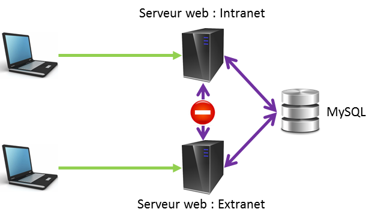

> La meilleur requête est celle que l'on a pas à faire
— **un inconnu**

Dans mon actuelle mission, nous développons une application sous Symfony2 avec Doctrine comme ORM.
Voici grossièrement à quoi ressemble l'architecture globale :



Comme vous le voyez, l'application est dédoublée sur deux serveurs distincts qui ont interdiction de se parler, en dehors de la base de données. Nous avons été confrontés à des problématiques de performances qui nous a contraint d'utiliser le **cache de Doctrine**.

Il faut savoir qu'il y a [3 types de cache pour Doctrine](http://doctrine-orm.readthedocs.org/en/latest/reference/caching.html) :

* Query Cache : transformation DQL -> SQL;
* Result Cache : résultat de la requête;
* Metadata Cache : annotation des entities.

Si on regarde [la liste des drivers](http://doctrine-orm.readthedocs.org/en/latest/reference/caching.html#cache-drivers), on s'aperçoit qu'il n'est pas évident de mutualiser du cache entre plusieurs serveur (qui ne peuvent pas communiquer directement ensemble).

C'est là que Redis arrive ♥

En quelques mots, Redis (pour *REmote DIctionary Server*) est un SGBD **clé-valeur** qui s'inscrit dans la mouvance NoSQL. En plus d'être simple d'utilisation, sa performance qui ferait pâlir Usain Bolt. Cela est principalement dû au fait que tout est persisté dans le cache du serveur. Si vous doutez encore de cette dernière phrase, sachez que [YouPorn](http://highscalability.com/blog/2012/4/2/youporn-targeting-200-million-views-a-day-and-beyond.html), [Stack Overflow](http://nickcraver.com/blog/2016/02/17/stack-overflow-the-architecture-2016-edition/), [Github](https://github.com/blog/530-how-we-made-github-fast)... l'utilisent ;-)

Voici un exemple de fonctionnement :

```bash
> SET name "maxence"
OK
> GET name
"maxence"
> KEYS *
1) "name"
# Assigner un TTL sur une variable
> SETEX mission 10 "votre mission si vous l'acceptez... ce message s'autodétruira dans 10s"
OK
# 10' après, le couple clef/valeur a disparu
> GET mission
(nil)
```

## Installation

L'installation de Redis est plutôt simple et se fait en quelques lignes de commande :

```bash
# download
wget http://download.redis.io/redis-stable.tar.gz
tar xvzf redis-stable.tar.gz
cd redis-stable
make
# install
sudo make install
# start
redis-server
```

Il va ensuite falloir installer les bundles qui vont bien :

```bash
composer require snc/redis-bundle 2.x-dev
composer require predis/predis ^1.0
```

Et on modifie le app/AppKernel.php:

```php
<?php
public function registerBundles()
{
    $bundles = array(
        // ...
        new Snc\RedisBundle\SncRedisBundle(),
        // ...
    );
    //...
}
```

Dans le config.yml :

```yaml
imports:
    - { resource: redis.yml }

# Doctrine Configuration
doctrine:
    dbal:
        #...
    orm:
        auto_generate_proxy_classes: "%kernel.debug%"
        naming_strategy: doctrine.orm.naming_strategy.underscore
        # IMPORTANT!
        auto_mapping: true
        metadata_cache_driver: redis
        query_cache_driver: redis

# redis.yml
snc_redis:
    clients:
        default:
            type: predis
            alias: default
            dsn: redis://1.2.3.4
        doctrine:
            type: predis
            alias: doctrine
            dsn: redis://1.2.3.4
    doctrine:
        metadata_cache:
            client: doctrine
            entity_manager: default
            document_manager: default
        result_cache:
            client: doctrine
            entity_manager: default
        query_cache:
            client: doctrine
            entity_manager: default
```

Et voilà pour l'installation.  
A ce stade, seuls les caches de metadata et de query sont opérationnels. Pour la mise en cache du résultat, il faudra le faire **manuellement sur chaque requête**.

## Mettre en cache le résultat

Terminé les requêtes *inlines* dans les controllers ! Vous allez désormais devoir utiliser le <abbr title="Doctrine Query Language">DQL</abbr> ou le QueryBuilder.

```php
<?php
public function findBeers()
{
    $query = $this->getEntityManager()
        ->createQuery(
            'select beers from MaxpouBeerBundle:Beers b'
        )
    ;

    $query->useResultCache(true);
    $query->setResultCacheLifetime(3600); //3600sec = 1 hour

    return $query->getResult();
}
```

Maintenant, si l'on recharge la page, cette requête ne se fera plus via MySQL mais bien via Redis.
On peut vérifier tout cela en allant sur Redis et en rentrant la commande suivante : `KEYS *`.
Voici ce que l'on va avoir :

```bash
> KEYS *
1) "[Maxpou\\BeerBundle\\Entity\\Beer$CLASSMETADATA][1]"
2) "[809cd863587594a754a7ffda5c2c06ee4640ebe3][1]"
```

La première ligne va contenir les métadonnées de la classe Beer. La seconde, contiendra la requête **et** son résultat.
Si vous voulez avoir une clé un peu plus digeste, vous pouvez utiliser cette méthode `$query->setResultCacheId('my_wonderful_key');` ou même faire **1 pierre 3 coups** : `$query->useResultCache(true, 3600, 'my_wonderful_key');`.

Voici ce que nous aurons : (je n'ai pas réussi à supprimer le `[1]`)

```bash
> KEYS *
1) "[Maxpou\\BeerBundle\\Entity\\Beer$CLASSMETADATA][1]"
2) "[my_wonderful_key][1]"
```

Pour nettoyer le cache, voici quelques commandes :

```bash
# Nettoyer cache des queries
php app/console doctrine:cache:clear-query
# Nettoyer cache des metadatas
php app/console doctrine:cache:clear-metadata
# Nettoyer cache des résultats
php app/console doctrine:cache:clear-result
# Vider la base redis
php app/console redis:flushdb
```

## Invalider le cache des requêtes

C'est bien de mettre en place un système de cache, mais vous n'allez pas demander à vos utilisateurs de lancer la commande après chaque opération. Il va donc falloir utiliser les événements de Doctrine, et plus particulièrement l'[entity listeners](http://doctrine-orm.readthedocs.org/projects/doctrine-orm/en/latest/reference/events.html#entity-listeners)
Si vous faites des tests, pensez à commenter le cache des métadonnées ;-)


Définissez le service :

```php
<?php

namespace Maxpou\BeerBundle\Service;

use Doctrine\ORM\Event\LifecycleEventArgs;
use Maxpou\BeerBundle\Entity\Beer;

class BeerListener
{
    private $cacheDriver;

    public function __construct($cacheDriver)
    {
        $this->cacheDriver = $cacheDriver;
    }

    public function postPersist(Beer $beer, LifecycleEventArgs $args)
    {
        $this->cacheDriver->expire('[beers_all][1]', 0);
    }

    public function postUpdate(Beer $beer, LifecycleEventArgs $args)
    {
        $this->cacheDriver->expire('[beers_all][1]', 0);
    }

    public function postRemove(Beer $beer, LifecycleEventArgs $args)
    {
        $this->cacheDriver->expire('[beers_all][1]', 0);
    }
}
```

Ici, `beer_all` est le nom de l'id assigné au cache.

Le service.yml :

```yaml
beer_listener:
    class: Maxpou\BeerBundle\Service\BeerListener
    arguments:
        - "@snc_redis.doctrine"
    tags:
        - { name: doctrine.orm.entity_listener }
```

Et enfin l'annotation sur l'entity :

```php
<?php
/**
 * Beer
 *
 * @ORM\Table(name="beers")
 * @ORM\Entity(repositoryClass="Maxpou\BeerBundle\Repository\BeerRepository")
 * @ORM\EntityListeners({"Maxpou\BeerBundle\Service\BeerListener"})
 */
class Beer implements BeerInterface
{
//...
```

Les plus pointilleux d'entre vous auront remarqués que je redéfini le TTL de ma clef au lieu de la supprimer. En effet, si je supprime ma clef, la nouvelle clef créée sera `[beers_all][2]`. Et le compteur augmentera ainsi de suite...  
Avec cette technique <s>de fainéant</s>, on garde la main sur le nom de la clef qui sera toujours `[beers_all][1]`.

## Pour aller plus loin

* Tutoriel/Sandbox Redis : [http://try.redis.io](http://try.redis.io)
* [2e niveau de cache de Doctrine (encore à l'état expérimental)](http://doctrine-orm.readthedocs.org/projects/doctrine-orm/en/latest/reference/second-level-cache.html)

## Tips

Utiliser les pipes unix avec le redis-cli : `echo  "KEYS *" | ./path/to/redis-cli | grep beer`  
Vérifier le <abbr title="Time To Live">TTL</abbr> d'une clef: `TTL [beer-id-42][1]`
