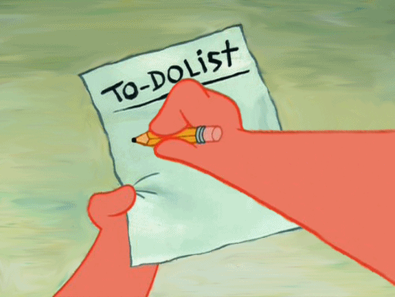
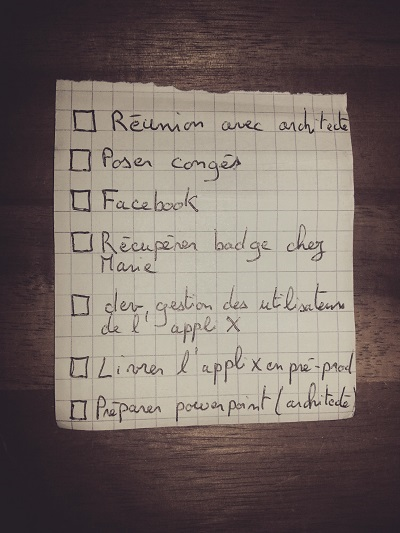
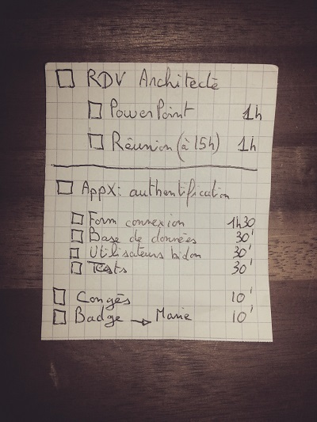
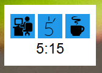
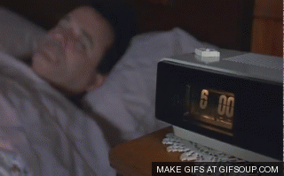
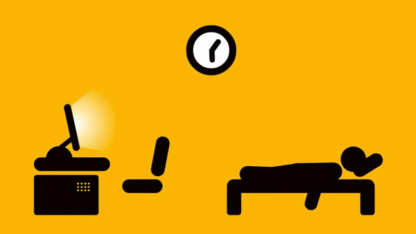

Entre le [multitasking](https://fr.wikipedia.org/wiki/Multitasking), les mails pro, les notifications push sur votre téléphone (SMS, mail perso, Facebook, Twitter...), un collègue qui vient vous voir...on a vite fait de procrastiner au bureau.

L'objectif de cet article est donc de faire un retour d'expérience sur la mise en œuvre de certaines techniques, qui m'ont permis d'être plus productif dans la vie de tous les jours.

## Todo list

En ce moment, je commence toutes mes journées par le *stand-up*. Une réunion de 15' dans laquelle chacun dit ce qu'il a fait la veille, ce qu'il va faire dans la journée et évoque éventuellement ses points de blocage. Chaque matin pendant cette période, je note ce que je dis sur mon calepin. Enfin ce que je vais faire dans la journée. Car on a vite fait de s'éparpiller et d'oublier ses objectifs. Là, tout est écrit.

**TODO papier Vs. e-TODO :**
Au début, j'ai essayé de réunir mes tâches dans un outil, développé par mes soins pour l'occasion. Puis, après avoir perdu le code source de cette petite application (si si...), j'ai utilisé des outils assez connus comme [Wunderlist](https://www.wunderlist.com/fr/) et [Todoist](https://todoist.com/android). Aucuns de ces outils ne m'a apporté satisfaction. Je suis donc passé à quelque chose d'encore plus basique, le combo magique : papier/crayon. C'est peut-être bête, mais le simple fait de rayer une tâche m'apporte une certaine satisfaction.  
Et puis, le problème avec les outils web, c'est qu'on a tendance à en rajouter...

**Comment faire une bonne todo list ?**

Pour bien commencer, voici l'exemple d'une mauvaise todo list :

Pourquoi cette todo list est mauvaise :

* **Irréaliste** : 1 todo list = 1 journée. Là, il n'y a pas de doutes, une journée ne suffira pas. Vous terminerez votre journée déçu de ne pas avoir accompli toutes vos *missions*.
* **Découpage des tâches** : La tâche qui consiste à développer la gestion des utilisateurs est beaucoup trop grande. Ne pas hésiter à la découper en sous-tâches. Vous aurez l'impression d'aller plus vite.
* **Pas d'indications sur la durée des tâches** : Pour voir si votre liste est pertinente, il est primordial d'indiquer le temps passé pour chaque tâche. Pensez aussi à laisser de la place pour l'**imprévu**, en occupant votre journée à hauteur de 70% maximum.
* **Gestion des priorités** : il est très important de séparer vos tâches en deux parties. Les tâches prioritaires et les secondaires. Mettez la vraie priorité de la journée tout en haut. C'est souvent ce genre de tâches que l'on a tendance à fuir. Si cette tâche est noyée dans plein d'autres, c'est un prétexte de plus pour ne pas la faire. En général, il faut garder les tâches les plus ardues pour le matin.  
Un bon outil est la [matrice d'Eisenhower](https://fr.wikipedia.org/wiki/Matrice_d%27Eisenhower). Cette matrice va vous aider à prioriser vos tâches en fonction de son caractère urgent et/ou important.
* **Tâches inutiles** : Twitter/Facebook, c'est du divertissement. Pas besoin de le noter pour y aller. Ça n'a rien à faire sur une todo list (à moins d'être community manager !).
* **Wording** : En un coup d'œil, vous devrez savoir où vous en êtes dans votre journée. Il faut donc être le plus bref possible et donc éviter les verbes d'action qui sont induits.

Voici maintenant un 2e jet beaucoup plus pertinent :

N'oubliez pas, c'est VOTRE liste. L'objectif est qu'elle soit compréhensible par vous (et pas forcément par les autres !).
Si quelque chose ne vous va pas dans ce que j'ai écrit plus haut, adaptez à votre besoin et expérimentez !

## La technique du Pomodoro

Maintenant que l'on sait comment planifier sa journée, voyons comment la découper.
J'ai découvert la [technique du Pomodoro](http://pomodorotechnique.com/), il y a quelques mois. Et pour tout vous dire, ça m'a presque changé la vie (au travail).

Cette technique consiste à découper sa journée en *sprint* de 25 minutes séparés par des pauses courtes (de 5 minutes) ou longues (15 minutes). Le fait de découper sa journée favorise l'agilité intellectuelle.

Voici le schéma :

1. Choisir une tâche
2. Travaillez sur cette tâche pendant 25 minutes sans interruption.
3. Prendre une courte pause (5 minutes)
4. Tous les 4 *pomodori*, faire une longue pause (15 minutes)

>“Qui fait, en se hâtant, deux choses à la fois ne fait bien ni l'une ni l'autre.”  
— **Publius Syrus**

**Pomodori :** Pendant ces 25 minutes, il faut garder le focus sur une seule et unique tâche et s'interdire toute distraction (Facebook, SMS, spi0n...). Il en va de même pour les requêtes de votre chef. Essayez (si possible) de le faire patienter jusqu'au prochain pomodori.

**Pauses :** l'objectif est d'éliminer le stress et de se régénérer pour réattaquer la prochaine session dans les meilleures conditions. N'hésitez donc pas à vous lever pour aller aérer le bureau, aller boire un verre d'eau, bouger, faire couler un café, répondre au SMS arrivé pendant le pomodori...  

Encore une fois : il n'y a rien de figé. N'hésitez pas à adapter la durée des *pomodori* à votre durée de concentration.

Si vous le souhaitez, j'ai développé un Gadget pour Windows Vista et 7 permettant de gérer votre temps. Le code source (et donc l'application) est open source et donc disponible sur mon [répo GitHub](https://github.com/maxpou/pomodoro-ninja.gadget) :)  

## Gérer les perturbations

C'est très difficile de garder le focus sur une tâche quand on est sans arrêt perturbé. Je vois deux types de perturbations, les perturbations technologiques et humaines.

Perturbations technologiques : notifications push sur votre smartphone (email, Facebook, Twitter, votre château qui vient de passer au niveau 5...). J'ai donc décidé de ne pas me laisser faire contre cet *esclavagisme technologique*, en passant [d'une approche push à une approche pull](http://williamdurand.fr/2015/01/16/rethinking-my-life-on-the-internets/#fighting-technology-enslavement).
Concrètement, j'ai **désactivé toutes les notifications sur mon téléphone**. Être informé en temps réel que l'on m'a notifié sur Facebook ne m'apporte aucun intérêt.
Pourquoi ? Tout simplement parce que ce n'est pas à mon téléphone me dire d'aller sur tel ou tel site.

Perturbations humaines : j'entends par là les *"Salut, tu peux me faire ça là maintenant ?"*... Là, c'est très délicat. Le plus simple est de faire comprendre gentiment à vos collègues que ces perturbations vous dérangent et que vous n'êtes pas une hotline. Proposez plutôt des moments pour se voir *(ex : entre deux pomodori)*.

## Gestion des mails

Mettons, nous d'accord. Un mail est **asynchrone**. Si vous voulez avertir d'un éventuel retard en réunion, si vous voulez une réponse dans la minute... et que vous utilisez le mail, c'est que vous vous trompez de canal de diffusion.

> “L'email est à l'origine d'une crise de la productivité dans les entreprises... il est le cancer silencieux des entreprise”  
— **Nancy FLYNN**

Dans mon ancien boulot, ma boîte mail était ouverte en permanence en arrière-plan. Dès que je recevais un mail, j'arrêtais mon travail pour répondre presque au tac-o-tac. C'est bien, on se sent utile, mais côté productivité on est à la rue, car sans arrêt interrompu.

La technique du pomodoro requière que l'on ne fasse qu'une activité en même temps. Il a donc fallu que je me planifie des *emails sessions*. Je consulte donc mes mails 3 fois par jour :

* En fin de matinée sur le coup de 11H ;
* En début d'après-midi ;
* Avant de partir du boulot.

A chaque fin de journée, mon objectif est d'atteindre le "[zéro inbox](https://www.linkedin.com/pulse/20130509153704-8628736-getting-to-inbox-zero)". Sinon ça s'accumule et pèse presque sur la conscience.
Si vous avez vraiment, mais vraiment trop de mails à gérer, passez au plan B : désinscrivez-vous des newsletters/pubs/notifications/... et ajoutez des filtres pour que les mails tombent dans les bons dossiers. Planifiez-vous du temps pour faire un grand nettoyage et repartir à zéro.

## Miracle Morning

Véritable Saint Graal du développement personnel, le Miracle Morning est une technique du livre éponyme d'Hal Elrod. Cette technique consiste à prendre du temps le matin pour soi pour faire diverses activités (méditation, sport, lecture, écriture...). Ainsi fini les matins où on arrive au travail avec un demi café dans le ventre et le cerveau complètement à côté de la plaque.

Bon je ne vais pas trop détailler cette technique. J'ai tenté de mettre en place cette technique en me levant à 5h30 le matin. Ça a duré... 3 jours ! Dès le 4e jour, j'ai re-réglé mon réveil comme avant.  
Pourquoi ? Parce que le temps de sommeil est incompressible. Se lever plus tôt, implique de se coucher plus tôt. A mon jeune âge, je me vois mal me coucher à l'heure des poules et ne pas pouvoir profiter d'une soirée un vendredi soir parce que je suis trop fatigué.  

Qui sait, c'est peut-être comme le café et le vin rouge... une histoire de temps ;-)

## Stop au présentéisme. Reposez-vous !

>“Je ne suis pas né pour augmenter le produit national brut.”  
— **Pierre RABHI**

Et il ne faut pas oublier le plus important : avoir une vie en dehors du travail. Je ne vois pas comment on peut être efficace, si on ne prend pas le temps de décompresser et même de vivre !

Après une demi-journée de réunion intense, un collègue est venu solliciter mon aide, mais nos cerveaux étaient littéralement à plat. Je lui ai proposé de laisser de *laisser décanter* et de revoir ça ensemble le lendemain matin. Il m'a dit qu'il préférait rester le nez dans le guidon et qu'il allait cogiter dessus toute sa soirée. Le lendemain, je n'ai pas été étonné de voir que le problème était toujours d'actualité. Problème qui a été résolu en prenant de la hauteur et en abordant le problème sous un autre angle de vue.

J'ai pensé à lui le lendemain en lisant le [résumé d'une conférence TED](http://ideas.ted.com/the-business-case-against-overtime-2/) de Yoshie Komuro, une Japonaise, CEO de Work Life Balance Co. Cette femme dit : *"Le travailleur infatigable est un mythe. Le cerveau ne peut rester concentré que 13 heures après le réveil. Après, la concentration est comparable à la conduite en état d'ivresse"*. Et va même plus loin en indiquant que tout le monde est perdant, même l'employeur qui *paye des heures supplémentaires à son employé pour qu'il répare des erreurs, erreurs qu'il n'aurait sans doute pas commises s'il était en meilleure forme !*

## Conclusion

Mises bouts à bouts, ces techniques ont considérablement améliorées ma productivité. Bon, je ne suis pas (encore ?) un Ninja de la productivité, mais j'y tends :-)

Plus de lecture sur le sujet :

* [Devenir VRAIMENT productif (il est temps que vous le fassiez pour votre bien-être)](https://medium.com/@kevintonon_/devenir-productif-mais-vraiment-il-est-temps-que-vous-le-fassiez-pour-votre-bien-%C3%AAtre-b82c85aea4b#.ea3b1oxq1) écrit par [Kévin TONON](https://twitter.com/KevinTONON_). C'est de cet article que m'est venu l'idée de repenser ma façon de travailler.
* [Getting To Inbox Zero](https://www.linkedin.com/pulse/20130509153704-8628736-getting-to-inbox-zero) par Randi ZUCKERBERG.
* [Arrêtez d'insulter votre temps ! et celui des autres...](https://www.linkedin.com/pulse/arr%C3%AAter-dinsulter-votre-temps-et-celui-des-autres-manuel-diaz) par [Manuel DIAZ](https://twitter.com/manueldiaz)
