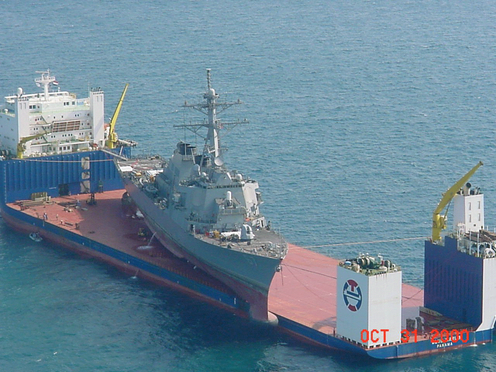
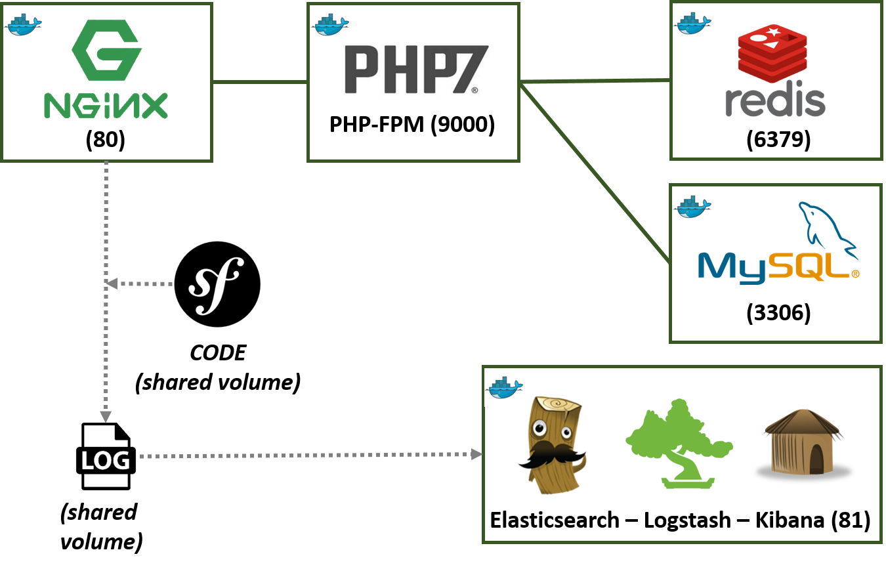

> [05/07/2016] : màj du docker-compose (suppression conteneur code+alias) + màj schéma + ajout
> PHPMyAdmin + simplification toolbox.  
> Un grand merci à tous ceux qui m'ont fait des retours ♥

TL;DR : [Répo Github du projet](https://github.com/maxpou/docker-symfony)

# Une stack Docker pour votre application Symfony

Je développe des applications web depuis quelques temps sur une stack
[Vagrant que j'ai un peu pimpé](https://github.com/maxpou/scotch-box). Bosser sur une VM est
vraiment plus agréable/malléable qu'un WAMP. Cependant, cette solution si miraculeuse soit-elle a
aussi ses inconvénients.

Tout d'abord, le temps d'initialisation de la box est particulièrement long. Deuxième argument, si
on se plante on est obligé de tout réinstaller (_ex:_ récemment j'ai oublié de mettre un point avant
le slash de cette commande... `sudo rm -rf /`). Et enfin, si on souhaite instancier plusieurs
machines sur une seule, le PC hôte se retrouve rapidement sur les rotules.


Ce sont donc ces trois points qui m'ont motivé à migrer mon poste de dev sur Docker (et puis si
autant de monde en parle, c'est sans doutes que ça vaut le détour !).

Je vais volontairement passer sous silence l'étape de présentation de Docker. Il y a plein
d'articles/conférences à ce sujet sur la toile. Voici une conférence que j'ai bien aimé à ce sujet :
[Docker de "Zéro" à "Héros"](https://www.youtube.com/watch?v=CUVBNrqFRHk) par l'excellent Nicolas DE
LOOF (qui anime aussi la web série
[Quoi d'neuf Docker ?](https://www.youtube.com/channel/UCOAhkxpryr_BKybt9wIw-NQ)).

## Un conteneur pour les gouverner tous ?

Lors de mes premières expériences avec Docker, j'étais parti sur un méga-conteneur qui portait PHP,
Apache, MySQL... tout ce qui est nécessaire pour faire tourner une application web. Et puis j'ai
vite lâché l'affaire car je ne voyais pas la plus-value de cet outil comparé à ma vagrant.
 _(ma première expérience avec Docker)_

## 1 application (process) = 1 conteneur

A l'occasion du [3e anniversaire de Docker](https://github.com/docker/docker-birthday-3), j'ai
vraiment vu l'intérêt de cet outil. Sans doutes, parce que le TP était plus pertinent que bon nombre
d'articles sur la toile. Il faut donc lancer un process par conteneur. Le tout se fera avec
docker-compose, qui jouera le rôle de chef d'orchestre de tous mes conteneurs.

Voici l'objectif vers lequel je souhaite tendre :



Détail des conteneurs :

- NGINX : le serveur web ;
- PHP-FPM : le service qui exécutera le code PHP (PHP7 s'il vous plait !) ;
- Application : un conteneur qui portera le code symfony ;
- MySQL : Un SGBDR que l'on ne présente plus ;
- Redis : Un SGBD clé-valeur avec lequel j'aime bien jouer en ce moment ;
- ELK : Le trio de choc : Elasticsearch - Logstash - Kibana... parcequ'il y a mieux que les `| tail`
  / `| grep` pour visualiser ses logs !

_Nota : Je suis parti du
[travail de Vincent COMPOSIEUX](https://vincent.composieux.fr/article/faire-tourner-une-application-symfony-avec-docker-et-docker-compose)
qui est plutôt propre pour ensuite l'adapter à mes besoins._

## Solution

```yaml
# docker-compose.yml
version: '2'

services:
  db:
    image: mysql
    ports:
      - 3306:3306
    volumes:
      - './.data/db:/var/lib/mysql'
    environment:
      MYSQL_ROOT_PASSWORD: root
  redis:
    image: redis:alpine
    ports:
      - 6379:6379
  php:
    build: php7-fpm
    ports:
      - 9000:9000
    links:
      - db:mysqldb
      - redis
    volumes:
      - chemin/vers/votre/app/symfony:/var/www/symfony
      - ./logs/symfony:/var/www/symfony/app/logs
  nginx:
    build: nginx
    ports:
      - 80:80
    links:
      - php
    volumes_from:
      - php
    volumes:
      - ./logs/nginx/:/var/log/nginx
  elk:
    image: willdurand/elk
    ports:
      - 81:80
    volumes:
      - ./elk/logstash:/etc/logstash
      - ./elk/logstash/patterns:/opt/logstash/patterns
    volumes_from:
      - php
      - nginx
```

La 22 et 23e ligne du fichier (_services.php.volumes_) indiquent qu'il y a un mapping de volumes. Il
vous faudra donc indiquer le chemin (absolu ou relatif) vers l'application Symfony. Le répertoire de
logs se construiera tout seul comme un grand.

2 composantes du docker-compose n'étant pas des images, il faut donc construire les Dockerfiles.

```bash
# nginx/Dockerfile
FROM debian:jessie

MAINTAINER Maxence POUTORD <maxence.poutord@gmail.com>

RUN apt-get update && apt-get install -y \
    nginx

ADD nginx.conf /etc/nginx/
ADD symfony.conf /etc/nginx/sites-available/

RUN ln -s /etc/nginx/sites-available/symfony.conf /etc/nginx/sites-enabled/symfony
RUN rm /etc/nginx/sites-enabled/default

RUN echo "upstream php-upstream { server php:9000; }" > /etc/nginx/conf.d/upstream.conf

RUN usermod -u 1000 www-data

CMD ["nginx"]

EXPOSE 80
EXPOSE 443
```

```bash
# php7-fpm/Dockerfile
FROM php:7.0-fpm

MAINTAINER Maxence POUTORD <maxence.poutord@gmail.com>

RUN apt-get update && apt-get install -y \
    git \
    unzip

# Install Composer
RUN curl -sS https://getcomposer.org/installer | php -- --install-dir=/usr/local/bin --filename=composer
RUN composer --version

# Set timezone
RUN rm /etc/localtime
RUN ln -s /usr/share/zoneinfo/Europe/Paris /etc/localtime
RUN "date"

# Type docker-php-ext-install to see available extensions
RUN docker-php-ext-install pdo pdo_mysql

RUN echo 'alias sf="php app/console"' >> ~/.bashrc

WORKDIR /var/www/symfony
```

Il faut garder à l'esprit que les images se doivent d'être les plus petites possibles. Il ne faut
installer que ce qui est nécessaire (le apt-get clean est
[implicite sur les debian](https://github.com/docker/docker/blob/03e2923e42446dbb830c654d0eec323a0b4ef02a/contrib/mkimage/debootstrap#L82-L105)).  
Une fois que tout est prêt, un petit `docker-compose build` permettra de construire les différentes
images. Et un `docker-compose up` lancera le tout.

Vous pouvez vérifier avec la commande docker-compose ps (tout doit-être à Up) :

```bash
$ docker-compose ps
           Name                          Command               State              Ports
--------------------------------------------------------------------------------------------------
dockersymfony_db_1            /entrypoint.sh mysqld            Up      0.0.0.0:3306->3306/tcp
dockersymfony_elk_1           /usr/bin/supervisord -n -c ...   Up      0.0.0.0:81->80/tcp
dockersymfony_nginx_1         nginx                            Up      443/tcp, 0.0.0.0:80->80/tcp
dockersymfony_php_1           php-fpm                          Up      0.0.0.0:9000->9000/tcp
dockersymfony_redis_1         /entrypoint.sh redis-server      Up      0.0.0.0:6379->6379/tcp
```

Maintenant, vous allez devoir retrouver l'IP associée au conteneur NGINX et modifier votre fichier
hosts :

```bash
$ docker inspect --format '{{ .NetworkSettings.IPAddress }}' $(docker ps -f name=nginx -q)
# unix seulement (sur Windows, modifier ce fichier C:\Windows\System32\drivers\etc\hosts)
$ sudo echo "171.17.0.1 symfony.dev" >> /etc/hosts
```

Vous devrez aussi modifier le fichier parameters.yml de votre application :

```yaml
# path/to/sfApp/app/config/parameters.yml
parameters:
  redis_host: redis
  database_host: mysqldb
```

Et voilà !


Accédez à votre application sur [symfony.dev](http://symfony.dev/) pour voir votre application et
sur [symfony.dev:81](http://symfony.dev:81/) pour consulter les logs avec Kibana.

**Le code source est sur mon répo GitHub** : https://github.com/maxpou/docker-symfony

## Et je veux mon PHPMyAdmin moi !

C'est très simple, il suffit d'ajouter ceci à votre fichier docker-compose :

```yaml
phpmyadmin:
  image: phpmyadmin/phpmyadmin
  ports:
    - '8080:80'
  links:
    - db
```

Accédez ensuite à l'interface web via : [symfony.dev:8080](http://symfony.dev:8080/)

## Boîte à outils

Voici quelques commandes qui peuvent-être utiles :

```bash
# Acceder en bash
$ docker-compose exec php bash
# Composer (ex : composer update)
$ docker-compose exec php composer update
# Commandes Symfony
$ docker-compose exec php php /var/www/symfony/app/console cache:clear
# Commandes Symfony bis (avec un alias = plus simple!)
$ docker-compose exec php bash
$ sf cache:clear
# Commandes MySQL
$ docker-compose exec db mysql -uroot -p"root"
# Commandes Redis
$ docker-compose exec redis redis-cli
# F***ing cache/logs ;)
$ sudo chmod -R 777 symfony/app/cache symfony/app/logs
# Vérifier la consommation de CPU
$ docker stats $(docker inspect -f "{{ .Name }}" $(docker ps -q))
# Supprimer conteneurs
$ docker rm $(docker ps -a -q)
```
