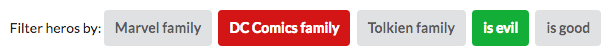

I recently realize a POC with [Vue.js](https://github.com/maxpou/find-a-room-vuejs2). I was confronted to this problem: **how to apply an unknown number of filter to a collection?**

My previous POC works like this: when I click to a filter, this filter is automatically push in an array of filter. And printed datas depends on this array of filters.



Let's start with the following data:

```javascript
const heroes = [
  { name: 'Wolverine',      family: 'Marvel',    isEvil: false },
  { name: 'Deadpool',       family: 'Marvel',    isEvil: false },
  { name: 'Magneto',        family: 'Marvel',    isEvil: true  },
  { name: 'Charles Xavier', family: 'Marvel',    isEvil: false },
  { name: 'Batman',         family: 'DC Comics', isEvil: false },
  { name: 'Harley Quinn',   family: 'DC Comics', isEvil: true  },
  { name: 'Legolas',        family: 'Tolkien',   isEvil: false },
  { name: 'Gandalf',        family: 'Tolkien',   isEvil: false },
  { name: 'Saruman',        family: 'Tolkien',   isEvil: true  }
];
```

And the following filters:

```js
// not DC Comics
const f1 = h => h.family !== 'DC Comics'
// no evil hero
const f2 = h => h.isEvil === false
```

I can now chain the filters like this:

```js
heroes.filter(f1)
      .filter(f2)
      .filter(whatever)
      // ...
```

But what if I have to apply severals filters on the same bench of data? ... like this:

```js
const activeFilters = [f1, f2]
```

Looping inside an array can be a solution:

```js
var filteredHeroes = heroes
for (let filterIndex in activeFilters) {
  filteredHeroes = filteredHeroes.filter(activeFilters[filterIndex])
}
```

But as I explain in [my previous post](https://www.maxpou.fr/no-more-loop-in-js/): imperative programming is not very elegant.

## Solution: using recursion

A nicer solution is to use a functional approach by using recursion:

```js
function recursive_filter (data, arrayFilters, index = 0) {
  if (arrayFilters.length === 0) {
    return data
  }
  if (index === arrayFilters.length - 1) {
    return data.filter(arrayFilters[index])
  }
  return recursive_filter(data.filter(arrayFilters[index]), arrayFilters, (index + 1))
}
```

```js
const filteredHeroes = recursive_filter(heroes, activeFilters)
```

## Bad solution: extending native prototype

As [explained in the MDN](https://developer.mozilla.org/en-US/docs/Web/JavaScript/Inheritance_and_the_prototype_chain#Bad_practice_Extension_of_native_prototypes), it is not recommended to extend native object (Array in our case). So the following code will works **despite the good practice violation**.

```js
// DON't DO IT!
Array.prototype.recursive_filter = function (arrayFilters, index = 0) {
  if (arrayFilters.length === 0) {
    return this
  }
  if (index === arrayFilters.length - 1) {
    return this.filter(arrayFilters[index])
  }
  return this.filter(arrayFilters[index]).recursive_filter(arrayFilters, (index + 1))
}

const filteredHeroes = heroes.recursive_filter(activeFilters)
```
