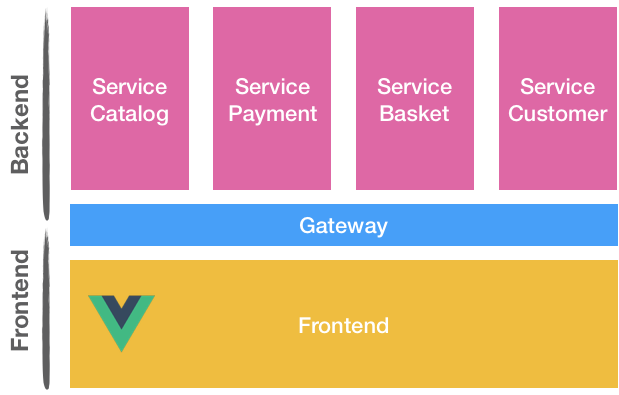
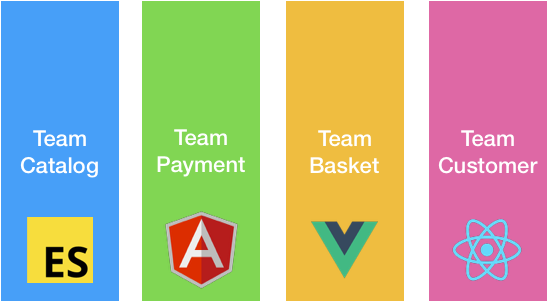
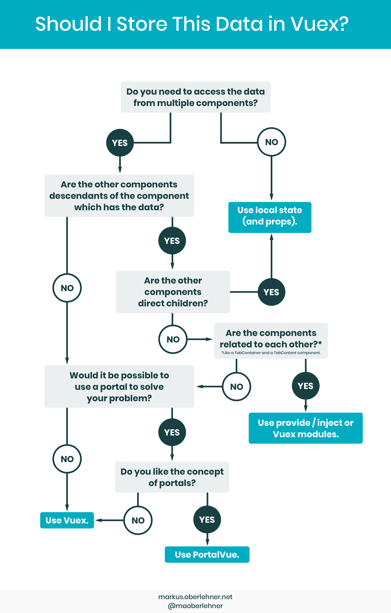

> TLDR;
> * Split your application into completely isolated **modules**
> * Consider **micro-frontends** architecture
> * Don't overuse your **Vuex store**


## Tip #1: Think Module!

The file architecture given by `vue-cli` is great. But after 3-4 pages, your files will start to become overweight.
You might be tempted to put separate your components into multiple folders. But, again, after 10 pages, you will face the same issue again.

The idea is to split your application by notions. Stick to one unique word.
For example, in a shop application, we could get *Catalog*, *Basket* and *Payment*. 

```
├─ src/
│  ├─ core/
│  ├─ modules/
│  │  ├─ Catalog/
│  │  │  ├─ Components/
│  │  │  ├─ Pages/
│  │  │  ├─ Routes/
│  │  │  ├─ Services/
│  │  │  │  ├─ catalog.api.js
│  │  │  │  └─ catalog.services.js
│  │  │  ├─ Store/
│  │  │  │  ├─ catalog.action.js
│  │  │  │  └─ catalog.getters.js
│  │  │  │  └─ catalog.mutationTypes.js
│  │  │  │  └─ catalog.state.js
│  │  │  │  └─ index.js
│  │  │  ├─ Tests/
│  │  │  ├─ Catalog.vue
```

Few important things here:

**Isolation**

To keep a good isolation, modules should not between them. What I mean is, `Module A` shouldn't share a component with `Module B`. For common functionalities *(i.e. user logged in, user language...)*, you have the `core` folder!

**Smart vs. Dumb components**

It is important to keep a separation between your **smart components** (`Pages` folder) from the **dumbs** (`Components` folder). In a nutshell:
* smart components: can access the store, router, window object...
* dumbs components: take props, emits events. That's it!

The main benefits of [this approach](https://medium.com/@dan_abramov/smart-and-dumb-components-7ca2f9a7c7d0) are reusability, a better separation of concerns...


**Split, split, split!**

If your component is getting too big, don't be shy: split it! In the Vue.js's guide, [the "Tightly coupled component names" rule](https://vuejs.org/v2/style-guide/#Tightly-coupled-component-names-strongly-recommended) is considered as Strongly Recommended.

```
// 👎 Bad
|- TodoList.vue
|- TodoItem.vue
|- TodoButton.vue

// 👍 Good
|- CatalogList.vue
|- CatalogListItem.vue
|- CatalogListItemButton.vue
```

**Isolate styles too!**

Remember: **Global CSS are evil**. Avoid them as much as you can!
* `.vue` files: the easier quick win for that is to use the scoped attribute in the style tag: `<styles scoped>`
* Not a big fan of `.vue` files? (if you want to create multiple small components without creating dozen of files). Consider libraries such as [💅 vue-styled-components](https://github.com/styled-components/vue-styled-components). The style encapsulation works like a charm!
  ```js
  import styled from 'vue-styled-components';

  const StyledTitle = styled.h1`
      font-size: 1.5em;
      text-align: center;
      color: palevioletred;
  `;

  <StyledTitle>Cool title</StyledTitle>
  ```

**Testing**

Testing application is a very complex topic, who deserves an entire blog post. To keep it simple, let's take the previous file architecture and see what to test and how to do it.

* Components: Low priority, easy to do. write unit tests for each component. It should be easy to do.
* Pages: High priority, hard to do. You probably gonna have to mock api/browser parts.
* Routes: Usually bugs aren't here. Leave it for E2E tests.
* Services:
  * api interface: I personnally don't test this part (90% of the code is mocked).
  * helpers/dataFormaters: High priority, easy to do. Usually, the easiest tests to do in your app!
* Store: The hardest part to test. You can test it via integration tests. Testing action, getter and initial state separately is useless.


**💡 Lazy load your modules!**

To reduce the JavaScript bundle, consider [lazy load your modules](https://router.vuejs.org/guide/advanced/lazy-loading.html#grouping-components-in-the-same-chunk)!  

```js{6}
export default new Router({
  routes: [
    {
      path: '/catalog',
      name: 'catalog',
      component: () => import(/* webpackChunkName: "catalog" */ './modules/Catalog/views/Catalog.vue')
    },
    // ...
  ]
})
```


If you already did this and you still think that your app is too big, you might consider the next tip.

## Tip #2: Consider micro-frontends

Over the last years, microservices architecture had become quite trendy. A lot of companies splitted their plain old monolith backend into a lot of small services on the backend.



Today, it seems that some companies had copy this backend paradigm into frontend world. The promise is quite similar to the backend: split big monolith into multiple applications, scale and be able to write application with different technologies. Yes. You correctly read the last sentence. You can write the payment application in Vue and the Catalog application in React.

If needed, different applications can talk together through events registered on the window object (observer publish/subscribe).



**⚠️ But I give you a warning. There's no silver bullet. When you leave a paradigm for another one, you don't get rid of the problems. You replace them.**


**👍 Pros: complete isolation**

If the backend is also micro-service oriented, teams can work in silos. They control their domain from end-to-end.


**👍 Pros: ability to use different frameworks / different version of one framework**

Let say team working on the Catalog want to update to the next version of Vue. Unfortunatelly, the team who's working on the payment isn't ready yet. They have to deliver a big feature before and would be ready in 3 months.
When the application is separated into multiple small applications, they're completely independents. They can bump version of one library or one framework without impacting any other team.

Also, if another team want to start a new sub-application, they can use the technology they want without impacting everybody.§


**👍 Pros: independent deployments**

This is probably the biggest advantage. "Team Catalog" can work and release independently from "Team Payment".

**🤔 Cons: design system integration**

If you have a Design System written in Vue, you probably don't want to rewrite it in React just because one team want to experiment something. In this case, you might be interested in [Web Components](https://developer.mozilla.org/en-US/docs/Web/Web_Components). From my experience, it's great. But when you do some, it's another story. Plus it's not supported by IE11 (polyfills are needed).

💡 Tip: You can [generate Web Components](https://cli.vuejs.org/guide/build-targets.html#web-component) with `vue-cli` and this command:

```bash
vue-cli-service build --target wc --name foo 'src/components/*.vue'
```

**🤔 Cons: aligning teams is hard**

If you're still working on a plain old monolith, it's gonna be a very long journey to get there.
Also, if the backend is not already in a micro-service architecture, you can't work in completely isolated silos. Maybe the Frontend team will be independant, but the back will not.

**🤔 Cons: performances**

When you modularise your app, each module can be splitted into [chunks (via tools like WebPack 4)](https://medium.com/webpack/webpack-4-code-splitting-chunk-graph-and-the-splitchunks-optimization-be739a861366). You load the main dependencies once, then when you load the Payment page, the code is loaded. If you convert existing modules to separated/isolated application, then the main framework on each application will be loaded on each module.

**🤔 Cons: routing**

To go from Module A to module B, Module A need to know the full path. A common thing is to hard code the URI. After all: *["Cool URIs don't change" (W3C)](https://www.w3.org/Provider/Style/URI)*

> *⚠️ Avoid Hype Driven Development™️. You probably don't need this architecture yet. Only consider Micro-frontend architecture if you think that you reached the limit of modularisation!*

## Tip #3: Be kind with your store (Vuex)

One of the biggest problems with a component-based application is the store. At first glance, it looks amazing. The first time I saw the vue tools, it completely blew my mind. I started using it everywhere! Then, problems start arriving. 

* 20 mutations when a page load (makes time travel impossible);
* open a page, do something, go to another page and come back. The state isn't reinitialized;
* overkilled features. You need to create mutation for everything.

Here are few tips to keep your store maintainable.


**Don't overuse the store**

There are a lot of misconceptions about the store. I don't know why, but many people think that: "Vue is to manage the UI and Vuex is to manage application state". I strongly disagree with this. Based on my experience, moving all the logic in the store lead to overhead and unnecessary complex features. Also, more code === to more surface area for bugs.

Usually, when we have existential questions like this, we turn to the creators.

> It's not mandatory, nor recommended putting all your state inside a Vuex store.  
> — [Evan You (creator of Vue.js)](https://github.com/vuejs/vuex/issues/236#issuecomment-231754241) 

I also put another quote from Dan Abramov, mostly because Vuex is partialy inspired by Redux. Also, component oriented application have a lot of point of interest.

> Use React for ephemeral state that doesn't matter to the app globally and doesn't mutate in complex ways. For example, a toggle in some UI element, a form input state. Use Redux for state that matters globally or is mutated in complex ways. For example, cached users, or a post draft.  
> — [Dan Abramov (creator of redux, equivalent of Vuex but for React)](https://github.com/reduxjs/redux/issues/1287#issuecomment-175351978)

When I ask to myself: "should I use the store or not?", I usually do something like that in my mind:


In other terms, here are few examples:

* Store "Current user, i18n preferences" → Yes.
* "Data loaded via API call" → Joker! Do the less awkward. I usually keep it in the component's state. I agree that sometimes, it makes sense to share this data with the rest of the app.
* State related to an edit/creation form → No.
* "Toggle a UI element" → No.
* "Manage a `isLoading` state" → No.


I'm not saying that you shouldn't use the store. Just use it with parsimony!

**Use namespaced stores (for modules)**

```js{4,7}
const store = new Vuex.Store({
  modules: {
    catalog: {
      namespaced: true,
      state,
      getters: {
        getFeaturedProducts () { ... } // -> getters['catalog/getFeaturedProducts']
      },
    }
  }
})
```

**Don't writte simplistic getters.**

To be relevant, a getter must contain some logic. If you want to access to a subproperty, prefer `mapState`.

```js
getters: {
  // 🤔 non useful getter
  getProducts: state => state.products,
  // 👍 useful getter
  getFeaturedProducts: state => state.products.filter(p => p.isFeatured),
}
```