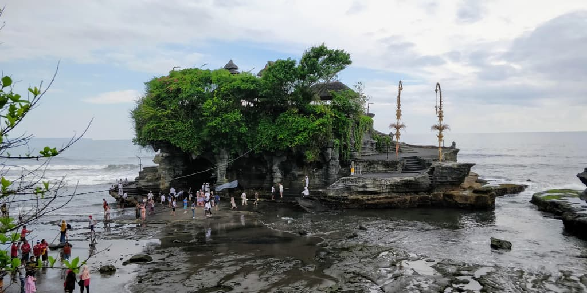

After spending a month in Lisbon and another one in Spain, I decided to start 2019 with a continent I never explored before: Asia. And more precisely: Bali, a small island in Indonesia.  
If you check on [Nomad List](https://nomadlist.com/), Canggu is the first destination for digital nomad. I was intrigued and I decided to check it out for myself.

If you're intrigued by the hype around Canggu or if you plan to move to there, I wrote this blog post for you.

I wrote this post after more than 2 months in Bali. In the beginning, I planned to stay only a month there. I finally stayed for three!

## Visa

*Disclaimer: I'm not a visa expert. I'm talking here about "holidays visa" - which means: you're supposed to be on holidays and not working with/in Indonesia.*

There're different options on the table:
* < 30 days - VISA Exemption - You don't need a visa.
* Between 30 and 60 days - Visa On Arrival (VOA) - When you arrive in the airport, you've to pay $35 and you can stay 30 days in the country. If you need, you can extend it with 30 more days. If you don't like administrative things like me, I recommend you to do your extension with an agent (i.e. Visa4Bali).
* > 60 days - Social Visa - allow you to stay in the country for 6 months. But, you can't leave the country.

When I arrived, I took a VOA and I extended it. The thing is, I wanted to stay for 3 months in Bali. So, I've to leave the country ("Visa Run"). Thanks to AirAsia, you can get a return ticket from Singapore or Kuala Lumpur for nearly 50e. I pick Kuala Lumpur! I'm now in my 3rd month in Bali. Because I'm gonna stay 27 days in Bali, I didn't need to pay for a visa. 

## Accommodation

Because I don't have (and I don't want to have) scooter, I had to find something in Canggu. Thanks to Booking.com, I've found a homestay for ~21€/night. With this price, I had a big room (maybe too big) with a private bathroom, a simple breakfast and a swimming pool. Also, my room was cleaned -almost- every day. 
Good point, I was in a walking distance (10mins) from the Dojo (coworking space) and the beach.

## Internet

Almost all coffee/restaurants/accommodations have a WIFI to share. Unfortunately, it's very flaky and not 100% reliable! That's why I recommend you to get a local SIM Cards. In Indonesia, it's cheap and ludicrously straightforward: you pay, you put the SIM in the phone and... tadaa 🎉it's working! (I'd love to get something as simple as this in France!).
As far as I know, Telkomsel is the best provider. You can buy SIM cards from everywhere (avoid the airport, you gonna pay 10x the normal price). With this provider, I'm getting +/- 23MBS. I paid 100k (6.2e) for 12Gb of data.

Also, talking about internet, something you have to know. Freedom of speech doesn't exist in Indonesia. A lot of websites are blocked by ISP: Reddit, torrents, porn and Facebook (I'm looking at you Telkomsel). Using a VPN is strongly recommended.

## Coworking spaces

Dojo is one of the most famous coworking space in Bali. I really liked the "maker" atmosphere in this place. A lot of people are bootstrapping their own product/startup. It was globally very inspiring. From a social aspect, people are really open-minded and making new friends is super easy. Also, Dojo organises a LOT of events (marketing, language exchange, public speaking course, developer, personal development...). Like, one per day! Every Friday, you have the Beach and Beers, which is a great event to meet new people!
If I had to find thee cons, I'd say the price. I've found the place a bit overpriced (2.900.000IDR/180€ for 1 month unlimited). Because I pay coworking spaces with my own money, I pick a 100h/month option (1.800.000IDR/112€).

If you're on a tight budget, you can also work from cafes. They all have internet and finding someone with a laptop in a cafe is very common!

When I will come back to Canggu, I want to give a try to the second co-working pace in Canggu: [Outpost](https://www.outpost-asia.com/location/canggu).

## Food

💥 Booom! 💥
For people who like to eat (like me 😉), you found your place! The food scene in Bali is amazing. Because I didn't have a kitchen in my homestay, I always went to the restaurant. Poor me 😃.

Here are few price range: (some places also add +10% then +5% for tax&services)

* 🍛 20k/35k for a local Indonesian Warung (see pictures on the left) (1,2€ / 2,2€)
* 🍺 25k/30k for a 25cl local beer (Bintang). Add 10k (0,6€) for a big bottle. (1,6€ / 2,2€)
* ☕️ 30k for a cup of coffee and 50k for a cup of [Kopi Luwak coffee 💩](https://en.wikipedia.org/wiki/Kopi_Luwak) (2,2€ / 3,1€)
* 🍍 40k/65k for a fruit salad/smoothie bowl (2,5€ / 4€)
* 🍕 60k/75k for a margarita pizza (3,7 / 4,7€)
* 🍔 90k/120k for a burger (5,6€ / 7,5€)

Most of the time I was eating in Indonesian Warung. Because I like to eat local, it's very good and crazy cheap!

## What to do in Canggu?

Canggu has definitely a lot to offer. I guess most of the tourist come here for surfing. Waves here are very good! And the other part of tourists come here for Yoga, although the Yoga scene is not the same as in Ubud. If you want to relax, you can also go for a massage. I've found the 1h Balinese massage very good 😃. A 1h massage will cost you around 120k (7€6). Outside Canggu, it even cheaper.

*Tanah Lot Temple*

You can move to Tana Lot, a nice temple close to Canggu or move around Bali... See next part :)

You can also party. By night there's a lot of drunk people in the streets. Mostly Australians. 
Few things you have to know: 
* **fake alcohol** is a thing here. They put methanol in a bottle and sell it for alcohol. In the best scenario, you will end up with a big headache. Worse scenario, you will die. Usually, Bintang (local beer) is a safe bet. I don't think I already drink fake alcohol.
* consuming drugs *(including marijuana)* is not allowed. In some country, you can do it because it's not very risky. But here, it's **punishable by death**. Now you know!

## Moving around

Here are a few things to visit if you are in Bali:

**Ubud:** *(I'm actually writing this blog post from Ubud!)*.
Monkey Forest, Tegallalang Rice Terrace or visit few temples in the area.

**Amed:**
Diving or snorkelling! You can dive around the USS Liberty, a cargo ship torpedoed by a Japanese submarine during WWII. Life under the sea is breathtakingly beautiful. It's also a good spot to access to the Gili Gili Island.

*Ulun Danu Bratan Temple*

*Jatiluwih Rice Terraces (UNESCO World Heritages)*

**Bratan area:**
This area is great to see waterfalls. You have the well known Gitgit waterfall and also the Banyumala Twin Waterfalls (my favourites!). If you are in the area, go visit the Ulun Danu Bratan Temple! And then, finish with the Jatiluwih Rice Terraces (UNESCO World Heritages). I liked this area because it's way less touristy than the other part of Bali.

**Nusa Penida:**
Take a scooter and get lost in this paradisiac island. You have to go to Kelingking Beach. It's probably the most beautiful beach I ever saw! Manta bay is also a good place for diving/snorkeling. Here, you can spot some manta ray. But take care of the loan!

*Kelingking Beach ❤️*

**Nusa Lembongan and Nusa Ceningan:**
have a walk, Devil's Tears, Blue Lagoon, take a drink at Mahana Point

## Transport

One thing I don't like in Bali: it's a scooter country! Usually, when I arrive in a city I take public transport or I walk. In Bali, there are no public transports. So, most of the time I walk (footpath are kinda dangerous).

For longer distances, a scooter is a must have. You can get one for 50-70k per day. But if you don't have an international licence with you and you find the police, you can get a fine. It's happened to me once...

If you don't want to take this risk, you have 2 options: local taxis (aka taxi mafia) or online taxi (**Gojek** or Grab).
Local taxis are literally scamming you with European prices. For this reason, I mostly use the application Gojek. It's very cheap...and maybe too cheap: *(don't be a dick and give them a tip)*
* [🛵 scooter] 4k (~0.25€) for 5' (1.9km)
* [🛵 scooter] 53k (~3.3€) for 1h
* [🚕 car] 229k (~14,3€) for 1h15 (36.2km)

Something good with these apps, they also deliver food!

Driving without a helmet is tolerated in Canggu. But you know, accidents happen, no matter how careful we are. Since I'm in Bali I heard many sad stories about driving accident, the last time was last week 😢 Sorry to talk about sad things but it had to be said. If I want to rent a scooter (or take a taxi) and there's no helmet, I consider it as a no go.

## Money and Expenses

In Bali, most of the transactions are done by cash. When they accept a credit card, there is an additional 3% fee. Also, when you withdraw money, make sure to choose a reliable ATM. **Card skimming is a thing here!** Fortunately, I haven't been skimmed (yet). 🤞

It the beginning, I thought Bali will be cheap. I don't know how but, it turns out I spent more money in Canggu than in other European cities. Well, the fact that I didn't have a kitchen helps a lot! If you want, here's a detailed version of my expenses:  

|                      |  Per month  |
|----------------------|-------------|
| Rent                 | 640€        |
| Food/Fun/Beers       | 350€        |
| Coworking space      | 112€        |
| Fun                  | 50€         |
| Visa run ✈️          | 50€         |
| Visa                 | 35€         |
| Insurance            | 30€         |
| Taxi/Scooter rental  | 30€         |
| Internet (Phone)     | 7€          |
| Laundry              | 6€          |
| Revolut (Premium)    | 5€          |
| VPN (Proton)         | 4€          |
| **Total**            | **~1.300€** |

## Global feedback

Canggu deserves it #1 place on Nomad List. I really liked Canggu and the atmosphere!
But, I have the feeling that Bali is becoming a victim of its own success.

* 🌤 **Weather**. I went there during the rainy season and it wasn't raining that much. Once, I had a 12h of heavy rain! Otherwise, I had my ~30°c every day.
* 🗣 **Language**. Because it's a touristic place, (almost) everybody speaks English.
* 👨🏼‍💻 **Nomad friendly**. Canggu is very nomad friendly.
* 🍴 **Food**. Awesome! (cf. Food section above) and the Bali Coffee is great too! (I'm not a big fan of Kopi Luwak...)
* 🌉 **Size of the city**. Canggu is very spread out city.
* 🚶‍♀️ **Walkability**. Very bad. I felt lucky when I found a sidewalk. And when you have one, you can't 
* 📡 **Wi-Fi**. Wifi is between OK and Bad. You can get a decent connection at Dojo (if it's not crowded). The 4G works well, I had around 23MBPS (Telkomsel).
* 👮‍♂️ **Safety**. Bali is a very safe place. I felt quite safe. 🐕 Wild dogs are legion here
* 💵 **Prices**. The biggest challenge for me was to avoid tourist traps. Otherwise it globally cheap. I spent ~1,300€ a month, but if you're on a budget, you can live with less.

## Hey, do you have a map to share?

Here you go! 2 things to notice:
* I added **small descriptions to each pin** (don't hesitate to expand the map!);
* There are other cities/areas (Amed, Ubud, Nusa Penida...).

<iframe src="https://www.google.com/maps/d/embed?mid=1wJxlB1XiirTKSOu4bS6kO0pyBkkdIUqj" width="640" height="480"></iframe>
