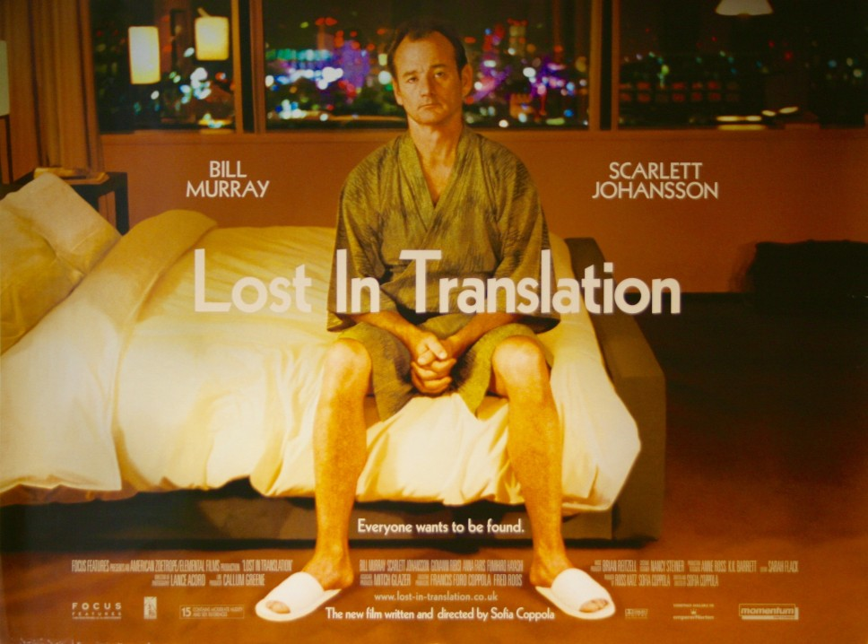

Last October, I joined the so-called Digital Nomad movement. If you never heard about it, I am combining remote working with travelling. I really like this lifestyle because it gives me a lot of freedom and flexibility.

However, when I get back home or when I read articles on the internet, I realised that my life is far from what people think.

*The idea behind this blog post is to debunk some myths about the digital nomad movement.*

## Myth #1: You work from the beach

Let's start from the beginning. When you Google the term "Digital Nomad", you will get this:

It looks fantastic right?

Sorry, I have stop you right now. This is complete **bullshit** and most of **these pictures do not represent the real life of a digital nomad**.

Look. The first posture is probably OK for an occasional usage of laptop. But if you take the habit to work like this, get prepared to end up with [RSI](https://en.wikipedia.org/wiki/Repetitive_strain_injury)/back issues/etc.  
Another thing: the brightness. If in the middle of the summer you can't see your smartphone, don't expect to see your laptop screen properly in the middle of the beach. And I'm not gonna talk about the heat generated by the sun your MacBook, neither the sand on a ~1.500 USD laptop... or sunglasses usage to see a screen (spoiler: you can't see anything)!

Thanks to the social media, some self-obsessed pseudo-influencers try to sell you a dream... a dream that they don't even live!

*As you can see, I don't have a lot of sympathy for people who fake their life ;)*

## Myth #2: You must be rich

Let's talk a minute about money, even if it's a controversial topic. Because, it's something I heard a lot, and I think there are a few misconceptions.

**You don't need to be rich to live where most people spend their dreamed holidays.**

The most commons destinations for nomad are actually quite cheap to live. For example, in Bali (Indonesia) you can easily live with $1.300/month. In Chiang Mai (in Thailand), you can live with $900/month... 

How much does it cost to live in NYC, Paris or London?

*Choose your destination according to your wallet. I've met on the road persons who make between less than 15k to a 6 digits yearly income salary.*

## Myth #3: You can work from wherever you want

I personally consider every place in the globe with a chair, a table and a decent WiFi as a potential office.

But, there are laws. What I want is not necessarily what I can get.
The vast majority of nomad enter in countries on tourist visas. Which mean, you are supposed to be on holidays. In other words: you are legally not authorized to work.

If you are working for a foreign company and your job has nothing to do with the country in which you are, it's okay (but still illegal). But it's another story if you are a travel blogger, travel writer...

And trust me, getting problems with immigration is the last thing you want!

## Myth #4: You are constantly travelling

When you have the freedom to be wherever you want, you might be tempted to change city as often as you change your underwear. That more or less what I did at the beginning.

A few weeks ago, I faced something I never had before. I landed in Ho-Chi-Minh City (Vietnam) for the very first time. When I arrived at my apartment, I felt really bad. After a short introspection, I realized that in less than 60 days, I visited 4 countries and 6 cities. I was like Bill Murray in *Lost in Translation*: completely lost.

Moving too fast is the best way to get a *"nomadic burnout"*. It happens when you travel too fast. Connecting with people, learning the local culture, facing language/culture barriers, trying not to get scam... is very exhausting.

Most of the nomad I know, use to stay -at least- 2 or 3 months in each place.

## Myth #5: You won the Golden Ticket

... I also heard "you are living the perfect life!". 

**Don't get me wrong**. I am not here to complain. I'm not saying I am not enjoying my life. No. I love it.

But, please: don't be naive! Every situation comes with its upsides and downsides. In this post, I mostly focus on some cliches related to this lifestyle. There are also a few others downsides I didn't mention like:

* **Mental health issues**: another underrepresented but important topic. Mostly because it's always better for our ego to post a picture on the beach rather than talking about our problems. When you live on a paradisiac island, people think you can't complain and you become more isolated.  
If you want to read more, [Tim Grassin wrote this awesome post](https://medium.com/@timgrassin/why-digital-nomad-life-can-be-hard-on-your-mental-health-994af0ce32f3).

* **Loneliness**: Let's be honest: **dealing with loneliness is one of the hardest parts of being a digital nomad**. It's a constant fight. You meet new people on Meetup/Facebook/Tinder/... and a month after, you go separate ways.  
Building connection becomes harder when you grow up. It's even more when you're moving every few months. By the way, it's also the reason why I'm always moving to cities with an existent digital nomad scene.

* **Remote working**. Being a part-time remote is challenging. But, 100% remote is another level. It requires a lot of discipline. When I switched to 100% remote, I realised how I underestimate it: you can't postpone a meeting because you're not in the office today (and you will be next week), you don't know if your colleague is joking or not, overworking, managing interruptions, communication issues, etc.  
**Remote working requires hustle and grit.**  
    <iframe width="560" height="315" src="https://www.youtube.com/embed/Mh4f9AYRCZY" frameborder="0" allow="accelerometer; autoplay; encrypted-media; gyroscope; picture-in-picture" allowfullscreen></iframe>
    
    *Tips: Always double-check your environment before turning on your webcam* 😉

* **Administrative nightmares**: I'm French working for an Irish company, I own an Irish Phone number and I spend most of my time in South-West Asia living in short term accommodations (changing once or twice a month).  
You can't imagine how many problems I faced with web forms 😄. Also, forgetting a wallet in a taxi or losing my phone (linked to my bank) because I get drunk last night can lead to serious problems.

* **Timezone hell**: The vast majority of my colleagues work in Ireland. Right now, I'm in Thailand, ahead of 6 hours (7 in winter). When my colleagues start their workday, mine is about to end. But it could be worse. I've met people working with 12h diff!
    

* And also: unreliable WiFi, power outage, taxes, health insurance, etc.

## Sum up

*I didn't win THE golden ticket, I won MY golden ticket*.

Despite all these downsides, I really like this lifestyle. It completely fits me and I think it worth the trouble. Having the freedom to work and travel is an incredible privilege.  

I wouldn't go back to a normal sedentary life... for now 😉
