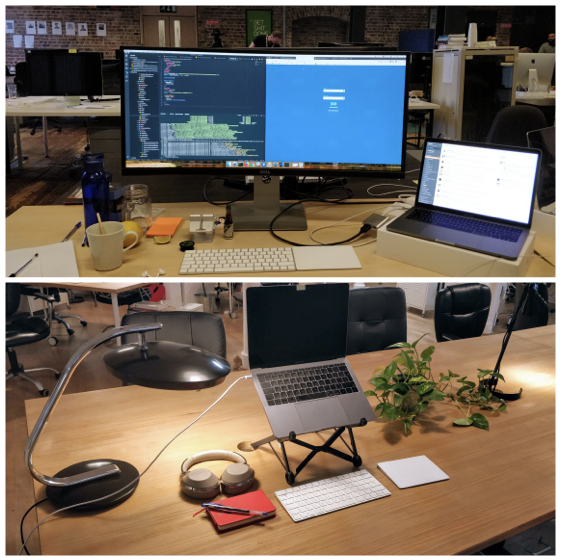
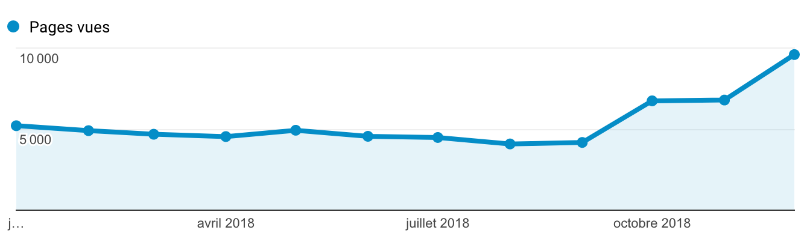
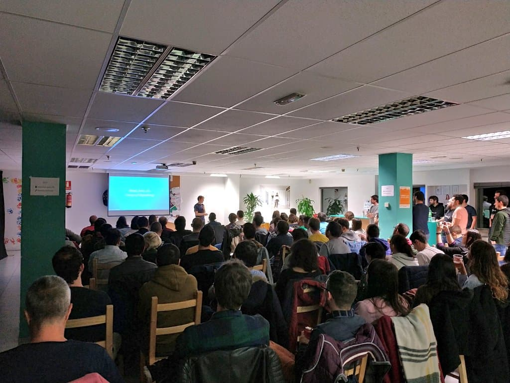
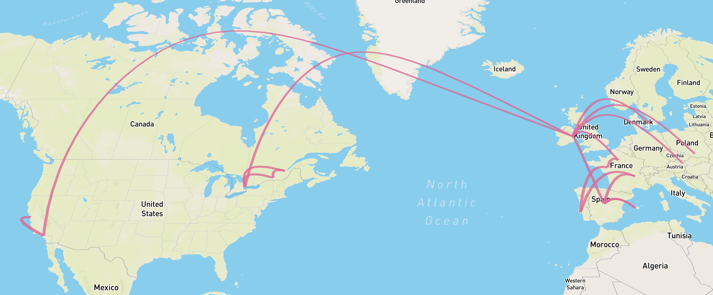
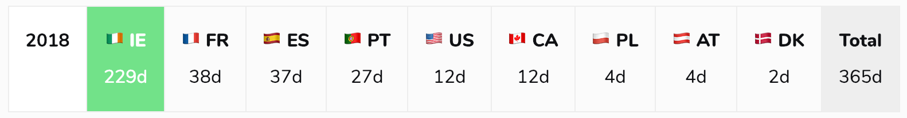

*Disclaimer: I mostly wrote this blog post for myself. Writing my Year in review helps me to celebrate my biggest wins, see what was wrong and define goals for the upcoming year.*

2018 was a whirlwind year full of a lot of great opportunities and travel.

## 👨🏼‍💻 Work

In April, I left HostelWorld. I stayed 18 months there, which is longer than most of my friends though! I loved to work with people from everywhere in the world. But, I felt overwhelmed by *politics decisions*. Plus, my team and I weren't really challenged.  

In May, joined [VSware](http://vsware.ie) in Dublin as a Senior Frontend Engineer. In a nutshell, the company is doing a cloud-based solution for schools (currently focusing on the Norwegian market). Here are few insights from what changed for me:

* I switched from a PHP/JavaScript position to a 100% JavaScript position. This is exactly what I wanted!
* I work on a day to day with a [very large Vue.js application](https://www.maxpou.fr/3-tips-scaling-vue-application).
* I have the ability to work remotely.

Since October, I'm 100% remote! 😱

## 🎒 New remote/nomadic life

**Going full-time remote was probably one of the biggest change for me in 2018**. Now, every place in the world with a table and a decent WIFI is a potential office for me. Surprisingly, I found myself comfortable to work from anywhere. It can be at home, in a cafe or, in a coworking space.  
Hey, since you're here: forget about the long chair on the beach, except if you want to break your back or show off on Instagram.

*Before/after ~ no more 24' curved screen! But, I'm now more focus with only one screen!*

To make this shift successful, I set up some rules to avoid procrastination and get a healthy work-life balance: 
* Don’t fall into the temptation of working from bed;
* If I can't work, stop pretending to work. Do it later;
* Communicate, communicate, communicate. Communication is the key!
* Every day, I write down my [MIT (Most Important Thing)](https://about.gitlab.com/2018/05/17/eliminating-distractions-and-getting-things-done/?utm_medium=social&utm_source=twitter#2-write-down-your-mits) to keep focus and avoid distractions;
* No overwork;
* Come back to the office every now and then to say "hello".

I've found a big difference between full-time remote and part-time remote. You can't postpone a meeting because you're in the office next week and it's more convenient...

## 👨🏼‍🔬 Sides Projects

I wasn’t a very prolific author in 2018. I only blogged 3 times! The main reason (after laziness), was my platform.
Jekyll started to be too heavy to me. So, I [moved my personal website to Gatsby](https://www.maxpou.fr/hello-gatsby). Working with this tool is pure pleasure. Hot reload, performances, fancy technologies... I don't regret it at all!  
Another important thing for me: I decided to release the template to the community. It was a good idea because it seems that [other people](https://twitter.com/ekaoddlass/status/1078329646981120005) enjoy using it 💜

In 2017 I had a total of 36,546 pages view on my website. In 2018, I blogged less and I reached 64,700 pages view! There are a few reasons:
* Gatsby made my website more SEO friendly;
* I also posted my posts on Reddit. The community here is great, I had really good feedback!
* [I cross-posted blog the Vue.js article on Dev.to platform](https://dev.to/maxpou/3-tips-for-scaling-large-vuejs-application-2edi). With only 2 posts, I have more followers on Dev.to (~400) than Twitter (~280) 🤷‍♂️ 

Also, [docker-symfony](https://github.com/maxpou/docker-symfony) reached 1 000 ⭐️ on GitHub! Yay! Unfortunately, I can't maintain it since I stopped using PHP.

## 🗣 Conference

I spoke 6 times about 2 different topics: Progressive Web Apps (PWA) and Frontend Testing.
For the first time, I delivered talks outside France or Ireland! I had the opportunity to speak in 4 different countries: Ireland, Austria, Poland and Spain. Yes, no conference in France for 2018! 

Also, I gave my very first workshop! It was an introduction to Vue.js at [@DublinJS](https://www.meetup.com/DublinJS/events/fbllfpyxdbjb/).

A funny anecdote: during my talk at Voxxed Vienna, [I showed -by mistake- all my GitHub Recovery Codes + Personal access token](https://twitter.com/_maxpou/status/978919918124109824) 🤦‍♂️

## ✈️ Travel

*My 2018 trips on a map!*

This year, I travelled a LOT! I did 9 countries and 14 cities! For the first time in my life, I went outside Europe. In January, I visit the US: Los Angeles and San Francisco. 4 months later, I visited Canada: Toronto, Quebec City and Montreal!

Since I've got a [NomadList profile](https://nomadlist.com/@maxpou), I can now track my trips like a pro!

## ✨ Random stuff

* 🍀 **Farewell Dublin**. as you guess, I left Ireland after 2 years living as an expat. Apart from the chaotic housing situation, I still really like this country. And I don't exclude to come back!
* 🎒 **Minimalism**. After watching [The Minimalist (available on Netflix)](https://www.theminimalists.com/films/) and [Matt D'Avella's podcast](https://www.youtube.com/watch?v=tG2GJZcBKOE), I decided to try this way of life. Now, all my clothes, electronics... fit in a [backpack](https://www.minaal.com/collections/bags/products/minaal-carry-on-bag). The only thing I miss is my Xbox!
* 🥗 **Eat better**. This year I also started eating better: more vegetables and fruits and less meat/fish. But, I didn't become a vegan or a vegetarian (and I don't want to be).
* 📕 **Readings**. [According to my Pocket stats](https://getpocket.com/stats/2018/0eca961094), I've read the equivalent of 7 books. But I think I've read much more since I didn't use this app for months.

## Previous goals

* ✅ Get a new job
* 😐 Continue to give talks. *I gave a few talks this year. But not as much as I wanted to.*
* ✅ Give talks in other countries than France & Ireland. *Vienna (Austria), Krakow (Poland) and Madrid (Spain)*
* ✅ Switch to a frontend position.
* 😐 ~ ✅ Travel 1 country / month. *I think this goal was a bit unrealistic. But, I'm happy with what I did!*
* 😐 Keep blogging. *Only 3 blog post this year!*
* 😐 Sport. *No gym for me in 2018! After, I used to walk 1-2h/day.*

## High-level 2019 goals

In 2019, I'm going to work from Asia, I have a few goals attached to this trip.

* [Asia trip] Be able to work with my Irish colleagues;
* [Asia trip] Be grateful. Having the ability to work from the other side of the globe is a great opportunity.
* [Asia trip] Enjoy my trip!
* Make more relevant/valuable side project;
* Give Miracle Morning another try;
* Write blog posts (let say 6 and one in French);
* Dry January - *one month without alcohol or anything else...*
* Give meditation another try;
* Continue to give talks & workshops;
* ~~Reach 500 followers on Twitter~~. *Nah I'm jocking. Getting more followers is everything but not a priority for me!*
* Write my 2019 year in review on time! 🙃

As you can see, 2018 was a great year for me. I can't wait to see what 2019 has in store!
