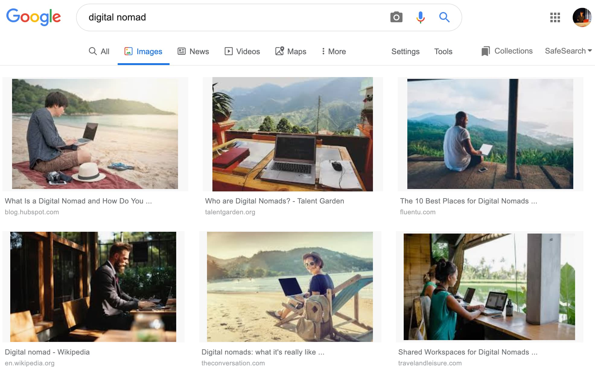
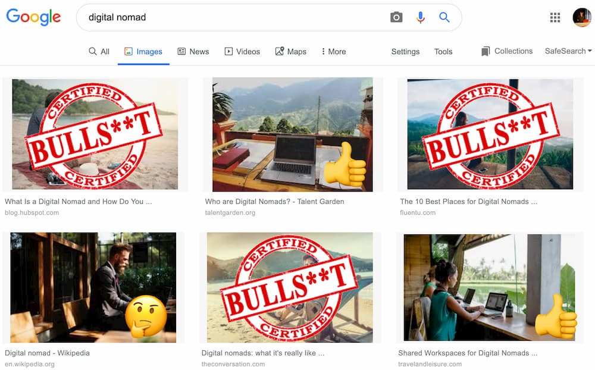
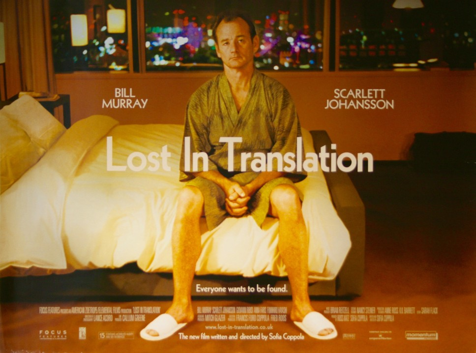

Depuis octobre 2018, je suis ce que l'on appelle un "digital nomad" (ou nomade digital). Si vous
n'en avez jamais entendu parlé, l'idée c'est de combiner le télétravail avec le voyage. Ce qui me
permet de travailler depuis des endroits assez cool comme la Thaïlande, Bali, etc.

Par contre, quand je rentre en France ou bien quand je lis des articles sur internet, je me rends
compte que ma vie est complètement différente de ce que beaucoup de gens pensent.

_L'idée de cet article est de démystifier quelques mythes autour des nomades._

## Mythe #1: Tu travailles depuis la plage

Commençons par le début. Quand on Google "Digital Nomad", on obtient ceci :

Ça a l’air cool non ?

Bon désolé pour la petite douche froide, mais ce n'est que du bullshit. La plupart de ces images ne
représentent pas du tout le quotidien d'un nomade numérique.

Dès la première image, rien ne va. La posture du type est peut-être ok pour un usage occasionnel ou
bien si vous voulez faire bien. Par contre, si vous prenez l'habitude de travailler comme ça, vous
allez vite fait finir avec des
[TMS](https://fr.wikipedia.org/wiki/Trouble_musculosquelettique)/douleurs dans le dos/etc.

Un autre truc : la luminosité. Si en plein été, vous n'arrivez pas à voir votre écran de votre
smartphone, n'imaginez pas une seule seconde pouvoir lire votre écran de PC au beau milieu de la
plage. Je pourrais aussi parler de la chaleur dégagée par le soleil sur l'ordinateur portable sur
vos jambes, du risque de mettre du sable/eau sur un MacBook a plus de 1500€... ou bien de la nana
qui nous fait croire qu'elle bosse avec lunette de soleil (spoiler: on voit rien).

Grâce aux réseaux sociaux, quelques pseudo-influenceurs obsédés par eux-mêmes essaient de vous
vendre un rêve... un rêve qu'ils ne vivent même pas !

_Comme vous pouvez le voir, je n'ai pas vraiment de sympathie pour ce type de personnes qui mentent
sur leur vie ;)_

## Mythe #2: Tu dois être riche

Parlons argent même si c'est un sujet délicat.

**Vous n’avez pas besoin d’être riche pour vivre là où la plupart des gens passent leurs vacances de
rêve.**

En réalité, les destinations les plus communes pour les nomades sont des endroits ou la vie est très
bas. Par exemple à Bali (Indonésie) on vit très bien avec 1300€/mois. À Chiang Mai (Thaïlande) on
vit très confortablement avec 900€/mois...

Ça coûte combien de vivre à Paris, New-York ou Londres ?

_Bien entendu, il faut aussi choisir ses destinations en fonction de son porte-monnaie. J'ai croisé
des gens qui gagnent à peine un SMIC à des salaires à 6 chiffres._

## Mythe #3: Tu peux travailler d'où tu veux

Je considère aujourd'hui chaque endroit avec une chaise, une table et un WiFi décent comme un bureau
potentiel. Donc forcément, ça élargi le spectre des possibilités.

Par contre, il y a des lois. Et ce que je veux n'est pas nécessairement ce que je peux avoir.

La quasi-totalité des nomades entrent dans des pays avec un visa touriste. Ce qui veut dire que l'on
est supposé être en vacances. En d'autres termes: on a légalement pas le droit de travailler.

Si vous travaillez pour une entreprise qui est dans un pays étranger et que votre travaille n’est
pas lié au pays ou vous trouvez, vous êtes en zone grise. C’est à dire que l’on viendra probablement
pas vous embêter si vous gardez profil bas. Par contre si vous êtes blogueur, prof d’anglais...
c’est un peu plus compliqué !

Et croyez-moi, avoir des problèmes avec les personnes de l’immigration, c’est la dernière des choses
que vous souhaitez ! Quand on me demande ce que je fais, je dis que je suis en vacances.

## Mythe #4: Tu voyages constamment

Cette dose insolente de liberté que vous vous prenez quand vous commencez votre vie nomade peut-être
grisante. Et la tentation de changer de pays aussi fréquemment que l’on change de sous-vêtements,
est grande. C’est plus ou moins ce que j’ai fait au début.

Et puis un jour, il m’est arrivé quelque chose de complètement nouveau. En arrivant à Hô-Chi-Minh
City (Vietnam), je me suis senti pas très bien. Après une petite introspection, je me suis rendu
compte qu’en moins de deux mois j’avais traversé 4 pays et 6 villes. Je me sentais comme Bill Murray
dans _Lost in Translation_ : complètement perdu.

Bouger trop vite est le meilleur moyen de faire un _"nomadic burnout"_. On ne s’en rend pas
forcément compte au début mais connecter avec des locaux, se familiariser avec la culture locale, le
langage, éviter les pièges à touristes, les arnaques... c’est très épuisant. N'oubliez pas qu'en
plus de tout ça, il faut travailler.

La plupart des nomades que je connais font du _"slow travel"_. Ils restent en moyenne 1 ou 2 mois
dans chaque endroit.

## Mythe #5: Tu as gagné le ticket doré (le Golden Ticket)

... et j'ai aussi entendu "tu mènes la vie parfaite !".

**Ne vous méprenez pas**. Je n'ai pas écrit cet article pour me plaindre et dire ma vie est
difficile. Non. Je l'adore.

Mais s’il vous plaît : ne soyez pas naïf. Chaque situation vient avec son lot d’avantages mais aussi
d’inconvénients. Dans cet article, je me suis pas mal attardé aux clichés relatifs à ce style de
vie. Il y a aussi quelques inconvénients que je n’ai pas mentionné comme :

- **Problèmes de santé mentale** : un autre sujet sous-représenté mais important. Sans doute parce
  que c'est toujours mieux pour son ego de poser des photos les pieds dans le sable plutôt que de
  parler de ses problèmes. Et puis de toutes façons quand on vit sur une ile paradisiaque nos
  problèmes deviennent vite inaudibles. Si, vous voulez en savoir plus, je vous renvoie à
  l'[article de Tim Grassin (en Anglais)](https://medium.com/@timgrassin/why-digital-nomad-life-can-be-hard-on-your-mental-health-994af0ce32f3).

- **Solitude** : pour être transparent, **l'isolement est l'aspect le plus difficile de la vie
  nomade**. J'en ai parlé avec pas mal de nomades avec même certain plutôt chevronnés. On s'accorde
  tous là-dessus. C'est ce qui fait que beaucoup de personnes quittent la vie nomade après 6-12
  mois. C'est un combat permanent. Quand on voyage, on rencontre de nouvelles personnes sur
  Meetup/Facebook/Tinder/... et quelques semaines après, chacun prend un chemin différent. Se faire
  des amis c'est difficile quand on grandit. Ça l'est encore plus quand vous changez d'endroit tous
  les mois ou presque. C'est pour cette raison que quand je voyage, je vais souvent dans des spots
  avec une communauté déjà présente. Ça permet aussi de retrouver des gens que l’on a rencontré dans
  d’autres villes

- **Télétravail**. Faire du télétravail de temps à autre peut-être challengeant. Mais passer "100%
remote" c’est complètement différent. Quand je suis passé au télétravail, je me suis rapidement
aperçu que j'avais sous-estimé certains aspects. Vous ne pouvez plus reporter une réunion parce que
vous n'êtes pas au bureau aujourd'hui (et que vous le serez la semaine prochaine), vous ne savez pas
si votre collègue plaisante ou non, le surmenage, la gestion des interruptions, problèmes de
communication, etc.  
**Le télétravail requiert de la rigueur et de l'organisation.**
<iframe width="560" height="315" src="https://www.youtube.com/embed/Mh4f9AYRCZY" frameborder="0" allow="accelerometer; autoplay; encrypted-media; gyroscope; picture-in-picture" allowfullscreen></iframe>

_Petit conseil : toujours vérifier son environnement avant d'allumer la webcam_ 😉

- **Cauchemars administratifs** : Je suis Français travaillant pour une entreprise en Irlande
  (ancien expat). Mon téléphone est irlandais et je passe la plupart de mon temps en Asie du
  Sud-est. Je n'ai plus d'adresse car ça change en moyenne entre une et deux fois par mois. Je vous
  laisse imaginer tous les problèmes de formulaire web que j'ai pu avoir 😄.  
  Un achat sur internet vous demande une adresse de facturation? Je donne une fausse adresse. Un
  justificatif de domicile ? Photoshop. Et pour les trucs administratifs ? Et bien
  [c’est la croix et la bannière](https://www.service-public.fr/particuliers/vosdroits/F17317).

- **L'enfer des fuseaux horaires** : Mes collègues travaillent en Irlande. Quand, je suis en
  Thaïlande, j'ai +6 heures de décalage (+7 en hiver). Ce qui veut dire que lorsque mes collègues
  commencent leur journée de travail, la mienne est sur le point de se terminer. Il faut savoir
  s'arrêter sinon on a vite fait de faire deux journées en une. Mais cela pourrait être pire. J'ai
  rencontré des gens qui travaillent avec 12h de décalage !

   _Le décalage horaire affecte aussi mes soirées!_

- Mais aussi: les WiFi peu fiables, les pannes de courant, taxes, assurance maladie, etc..

## On récapitule

_Je n'ai pas gagné LE ticket d'or, j'ai gagné MON ticket doré_.

Malgré tous ces inconvénients, j'aime vraiment ce style de vie. Cela me convient parfaitement et je
pense que cela en vaut la peine. Avoir la liberté de travailler et de voyager est un privilège
incroyable.

Je ne retournerais pas à une vie sédentaire normale ... pour l'instant 😉
