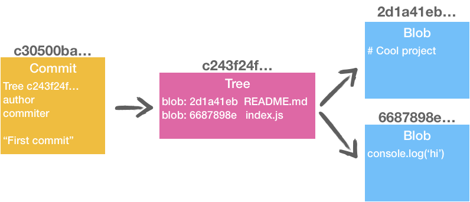
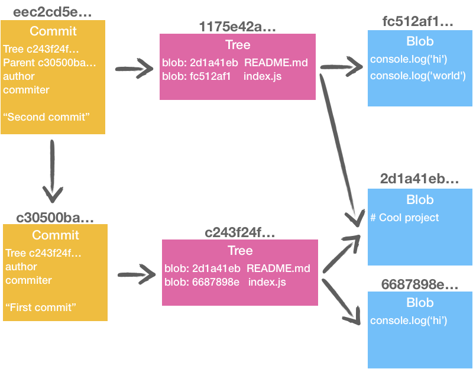
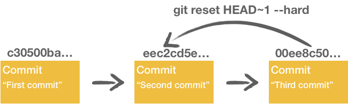

Nowadays, most of our project use Git as a version control system. It means most of our project have a `.git` folder. But, have you ever tried to open it?
I tried once... and I closed it within a minute!

I've been using Git as a "black box" for years.


Until a year ago. I was tired of using it without knowing how it works under the hood. I finally grab the bull by the horns and started to learn it. I read [Pro Git](https://git-scm.com/book/en/v2) and make tons of experimentations. I've found out that it's not as complicated as it looks like!

So, If you:
* are the guy in the picture above,
* want to understand what's in this `.git` folder,
* already "lost code with git"...

...this blog post is for you! 😃


## Step 1: Git Data Model

To make things more understandable, I will start with a new basic project (2 files: `index.js` and `README.md`).

1. `git init`
2. `echo "console.log('hi')" >> index.js`
3. `echo "# Cool project" >> README.md`
4. `git add . && git commit -m "First commit"`

Now let's see what we have in the .git folder:

```
$ tree .git/objects

.git/objects
├── 2d
│   └── 1a41ebd2d32cb426b6d32e61e063f330aa1af8
├── 66
│   └── 87898e2a0fe2da282efab6b5f7f38b7f788f56
├── c2
│   └── 43f24fb294ebc954b0a7ee6020589245f78315
├── c3
│   └── 0500babf488d06033e8d039cbf64be3edbd089
├── info
└── pack

6 directories, 4 files
```

Git created 4 files. For not ending with thousands of files under the same folder, git automatically truncates the 2 first characters for the folder name. To retrieve one git object, you have to concatenate the folder name + file name.

And because the files are not human-readable, you can use `git cat-file <sha-1> -p` to see what's inside (or use the `-t` option to get the type). By the way, you can only use the first 8 characters.

Here's how the files are linked together:



💡 Git object model has 4 different types: 
* **commit**: contain the committer, date, message and also the directory tree;
* **tree**: reference other trees and/or blobs;
* **blob**: store file data; 
* **tag**: store a commit reference (not addressed in this blog post).

Please note that blobs don't store their filename (and location). That's one of the reasons why sometimes git lost history when you change file location ;)

🤔If you try it locally, expect to have different hash (different author&date)!

## Step 2: Adding a second commit!

Now we want to update `index.js` and add a second line to the file:

1. `echo "console.log('world')" >> index.js`
2. `git add . && git commit -m "Second commit"`

We now have 3 more entries:

```html{4,5,14,15,16,17}
$ tree .git/objects

.git/objects
├── 11
│   └── 75e42a41f75f4b25bab53db36d581f72387aa9
├── 2d
│   └── 1a41ebd2d32cb426b6d32e61e063f330aa1af8
├── 66
│   └── 87898e2a0fe2da282efab6b5f7f38b7f788f56
├── c2
│   └── 43f24fb294ebc954b0a7ee6020589245f78315
├── c3
│   └── 0500babf488d06033e8d039cbf64be3edbd089
├── ee
│   └── c2cd5e0b771793e03bbd5f8614c567af964a4e
├── fc
│   └── 512af17ca7ec04be6958047648b32629e4b5a5
├── info
└── pack

9 directories, 7 files
```

We now have something like this:



👀 Something interesting here: Git doesn't store diff between files! Thanks to the **packfiles** (in `.git/objects/pack`), Git keeps a reasonable place on the disk.


## Step 3: Playing with time and f*** up everything 🤦‍♂️

In this last step, we are going to add one commit. Then, we will go back in the past to "remove this commit".

1. `echo "console.log('😃')" >> index.js`
2. `git add . && git commit -m "Third commit"`

As you might guess now, git created 3 new files. The structure is similar from step 2.

```
.git/objects
├── 00
│   └── ee8c50f8d74eaf1d3a4160e9d9c9eb1c683132
├── 09
│   └── f760de83890e3c363a38e6dc0700b76e782bc1
├── cf
│   └── 81d6f570911938726cff95b62acbf198fd3510
└── ...

12 directories, 10 files
```

Now, let's pretend we want to go back in the past from 1 commit (`git reset HEAD~1 --hard`).



...and now you think you fucked up everything and your commit is gone forever. Right?
Maybe. Let's count how many git objects we have...

```
$ tree .git/objects

.git/objects
└── ...

12 directories, 10 files
```

Look: we still have 10 files! Nothing was deleted! Guess what? If I `git cat-file cf81d6f570911938726cff95b62acbf198fd3510 -p`, I will get the content of index.js at the third commit. 🎉

> "You can't lose code with git."  
> —Me

More seriously, I use `git push --force`, `git rebase` and `git reset --hard` daily and I never lost anything. But, we are human and humans are fallible.

Don't worry, if you want to rollback, you don't have to go threw all those files. There's a magic trick!

## reflog: the magic wand ✨

If you try to retrieve the history with `git log`, you will not see the "Third commit". But, if you add the additional option `-g` (for `--walk-reflogs`), then you'll see the third commit. 

To make it nicer, you can do `git log -g --abbrev-commit --pretty=oneline`.


This super-useful command has an alias: `git reflog` ❤️

```
$ git reflog

eec2cd5 (HEAD -> master) HEAD@{0}: reset: moving to HEAD~1
00ee8c5 HEAD@{1}: commit: Third commit
eec2cd5 (HEAD -> master) HEAD@{2}: commit: Second commit
c30500b HEAD@{3}: commit (initial): First commit
```
(Note: you can get something similar in `.git/logs/HEAD`)

Now, you have the third commit's fingetprint: `00ee8c5`. You can now `git reset 00ee8c5 --hard` to cancel previous reset.

**Caveats:**

In some cases, `git reflog` __will not__ help you:

* when you pull someone else code;
* when you remove your repo and clone it again;
* if you're looking for a >90 days change (after that `git gc` clean it up). I don't know about you, but, I can't remember what I did ~1 month ago. So, 3 months should be more than enough 😉

Also, if you use git commit like you `ctrl + s`, you might be easily lost. I'm sorry, but, can't do anything for you, except recommending you to read my post about the [conventional commits](https://www.maxpou.fr/git-conventional-commits). In my opinion, it's the cleanest way to use git.


## Wrapping up ~ TL;DR

* there are 4 different types of git objects: commit, tree, blob and tag.
* blobs don't know their name (it's the reason why you lose history during a move).
* Git doesn't store diffs.
* committed code cannot be lost. `git reflog` can help you.

That's it for today!
