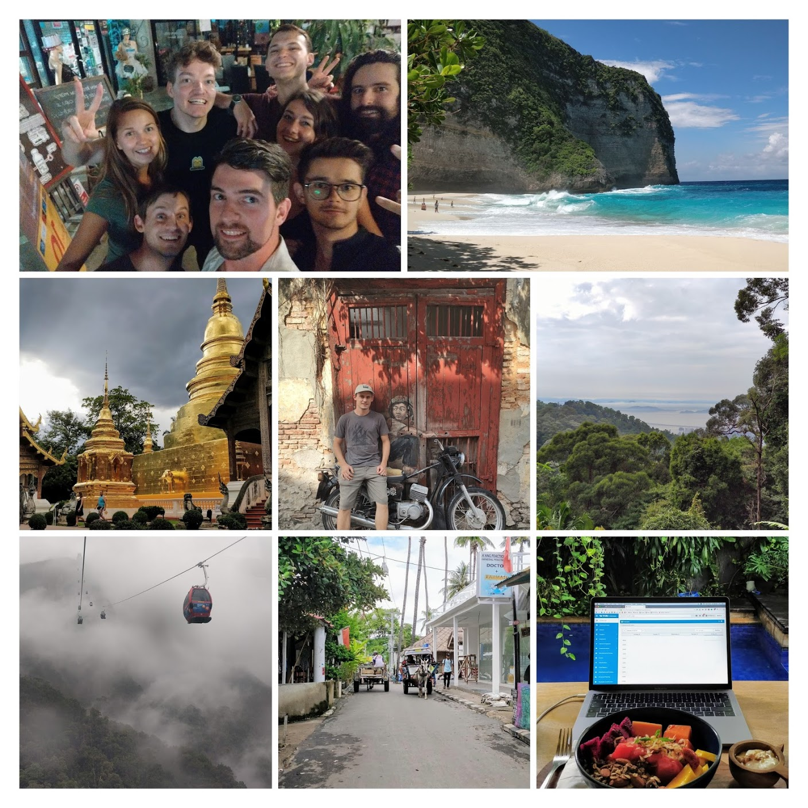
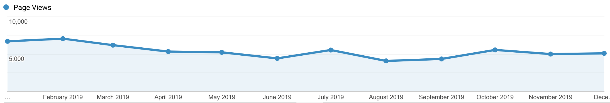
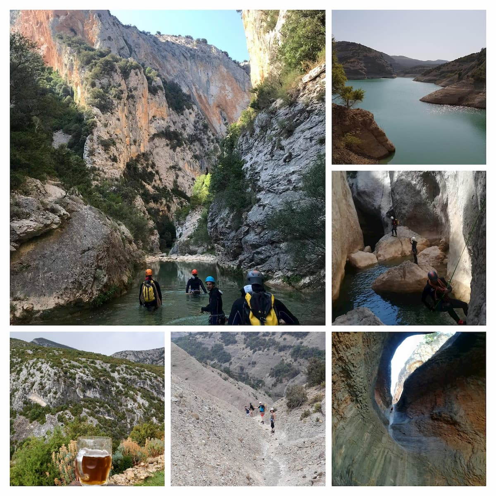
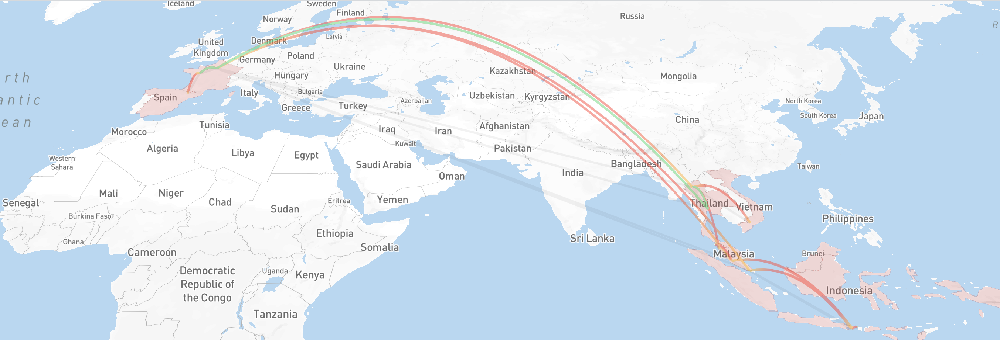
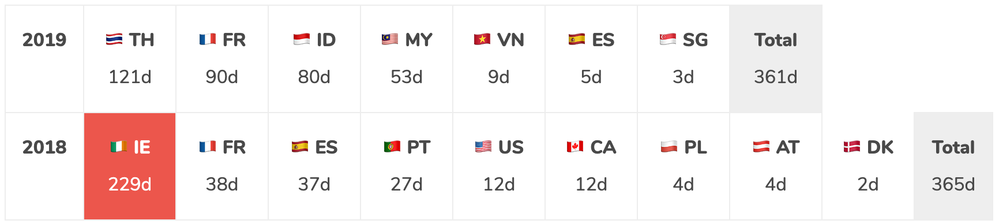
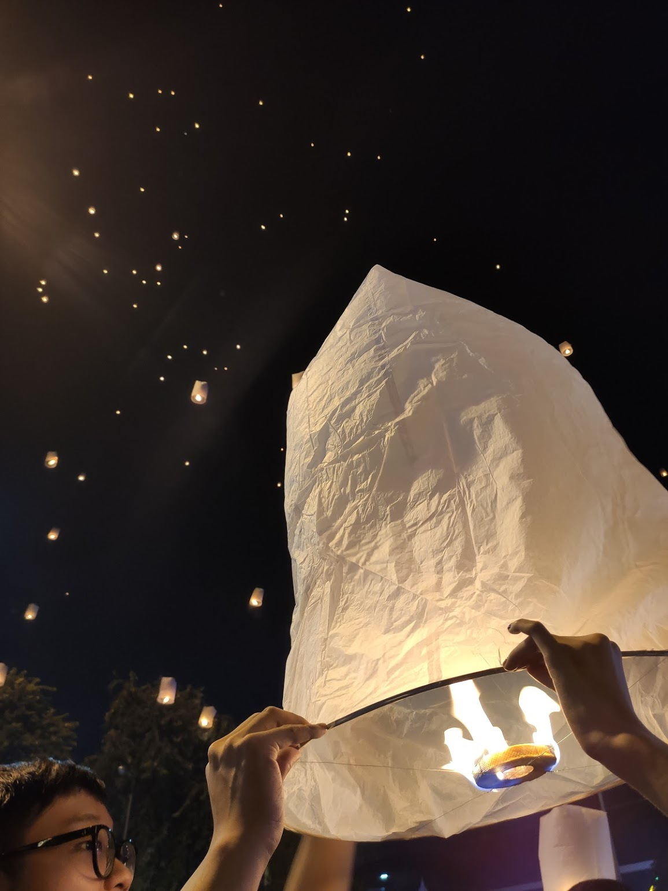

_Disclaimer: I mostly wrote this blog post for myself. Writing my Year in review helps me to
celebrate my biggest wins, see what was wrong and define goals for the upcoming year._

## 👨‍💻 Work

- I am still working as a Sr Frontend Engineer at VSware where I'm building software for education.
- On a day to day, I work with:
  - A (too?) [big Vue.js application](https://www.maxpou.fr/3-tips-scaling-vue-application). I don't
    touch the backend (in Java).
  - Frontend Infrastructure: with interesting problems like scaling monorepo, continuous
    deployment/integration...
  - Vue.js Testing. I converted a few colleagues to Testing-library 🎉
  - Interesting features to develop. For example, I created a sort of Google Calendar from scratch.
- I'm still 100% remote and the most of my colleagues are in the same office in Ireland. In 2019, I
  spent a lot of time in Asia.
  - timezone diff is great in the morning because I can work without being polluted by Slack;
  - timezone diff can be tough... when I was in Bali (+8h), I had to end meetings at 1 AM 😬
  - timezone diff sometimes pushed me to do overwork.

Overall, I 💙 working remotely.

## 👨🏼‍🔬 Side projects

- This year was special because I gave zero talks! I'm thinking about removing "Public speaker" in
  my twitter bio 😄
- I worked on my Gatsby theme/starter
  [gatsby-starter-morning-dew](https://github.com/maxpou/gatsby-starter-morning-dew). This project
  passed 100+ ⭐️ on GitHub. Git/CI pipeline is nearly perfect to me. Overall, I'm super proud of
  what I've done for this project.

### ✍️ Blog

- Last year, I published 7 posts, [3 posts about git](https://www.maxpou.fr/tags/Git)! Promise, I
  will be more diverse in 2020!
- 34k users and 62.5k page views on maxpou.fr. This is more or less the same numbers as last year.
  
- Cross-posted a few on [dev.to](https://dev.to/maxpou) (2,465 reactions - 85,568 Total Post Views).
- My post [Git: Cheat Sheet](https://dev.to/maxpou/git-cheat-sheet-advanced-3a17) is the 25th most
  viewed post on Dev.to for 2019. And 30th all time 🤩

### 😥Failures: online courses

At the beginning of 2019, I get contacted by a famous platform to do some online courses about
Vue.js Testing. I already gave a few [training in the past](/speaking#trainings--workshop) and I
setup twice a testing strategies for Vue.js application. At first glance, it looked like an easy way
to get money and improve my personal branding. But, recording courses is not like giving a talk.
Every time you make a mistake or a car start horning on the street, you have to start over.
Additionally, I also underestimated the required equipment to record my voice and my screen. I'm
travelling with only one backpack, there's no room in my bag for a decent microphone/2nd screen.
Sadly, I had to admit that the job wasn't for me and I resigned.

## 🧗‍♂️ Sport

Since I'm 8, I go every year in Spain to do Canyoning. In the beginning, it was with my parents. Now
my cousin and I took a dozen friends and we play the role of guide.

This year was a consecration for us. We did the most difficult canyon of the region: **Las Gorgas
Negras**. A ~12h long journey. We woke up at 5 AM, started the approach to the canyon (~3h) then we
were all the time in the water until our camping (~9h). As you might guess, it was very
exhausting!  
The good thing is, we managed to take our camping at the end of the canyon. So, straight after the
canyon, we went to the camping's bar. I think it's the first time I drank a beer in a wetsuit 😅

## ✈️ Travels

This year [I travelled a LOT](https://nomadlist.com/@maxpou), especially in Asia. This continent was
completely new for me. And I loved it.

This year, I lived in:

- Singapore.
- Bali (Indonesia): Canggu, Ubud and Gili Air. I also visited the whole island when my friends went
  to visit me
- Malaysia: Kuala Lumpur, Langkawi and Penang (George Town)
- Thailand: Bangkok and Chiang Mai
- Vietnam: Ho Chi Minh City (Saigon)

I also went to Rodellar (Sierra de Guara, Spain), but it was for holidays.

## ✨ Random stuff

 _Lantern Festival in Chiang Mai, Thailand_

- 📖Read 2 books. Looks ridiculous but I did "x2" regarding 2018!
- 🏃‍♂️Sport. Not as much as I wanted but I started to run.
- 👮🏻‍♂️I gave my first bribe. Almost two actually but, I didn't stop 🙊
- 🍲Eating Indian food or a Thai curry for breakfast seems normal now;
- 💆‍♂️Had a LOT of massage (mostly in Bali);
- 🤝[Met cool persons from the nomad/maker community](https://twitter.com/dinkydani21/status/1192819477584461828)
- 😷Had to wear a pollution mask during
  [Haze in Malaysia](https://twitter.com/_maxpou/status/1172381208321282049)
- 🍻Got drunk at 11 AM in a plane with a Hells Angels member
- 🏮Saw the Lantern Festival in Chiang Mai, Thailand
- 🎂[Celebrated my 1st year as a Digital Nomad](https://twitter.com/_maxpou/status/1178963882930343937)
- 🎂Celebrated my 30 with my friends in France. I'm getting old 😁

## Previous "high-level goals"

_I copy/paste my previous goals. After reflection, I found some of them a little bit BS since
they're not measurable._

- ✅Be able to work with my colleagues in Ireland ~ _It was not easy to deal with timezone but I
  think I managed to do it :)_
- ✅Stay happy and be grateful.
- ✅Enjoy my trips in Asia.
- ✅Make more relevant/valuable side project.
- ❌Give Miracle Morning another try ~ _This thing is not for me. Definitely!_
- ✅Write 6 posts (+1 in French) ~ _I wrote 7 posts in English and 0 in French._
- ✅Dry January ~ _I did one month in January and another 30 days without alcohol in Oct-Nov._
- ❌Give meditation another try ~ _same as Miracle morning, I tried but I leave this for the
  others!_
- ❌Continue to give talks & workshops ~ _it wasn't possible since I don't have visibility for more
  than a month_;
- ✅Write my 2019 year in review on time!

_...and [100 days before 2020](https://twitter.com/_maxpou/status/1176158709933674497), I set up
additional goals_

- ❌Read 2 books ~ _I read only one_.
- ✅Explore Malaysian Islands
- ✅Stop overworking

## High-level 2020 goals

- [Travel] Discover new countries ~ _thinking about Hungary 🇭🇺 and Japan 🇯🇵_;
- [Travel] Be more organised when it comes to my travels;
- [Life] Stay remote / nomad;
- [Life] Continue to meet nomads when I travel;
- [Life] Better invest my money;
- [Life] Complete another Dry January;
- [Blog] Write 8 blog posts + continue to cross-post on dev.to;
- [Blog] Write one post in a new platform ~ _why not?_;
- [Blog] Add new functionalities on my blog (i.e. RSS);
- [Work] Learn more about Wasm (WebAssembly);
- [Work] Give 1 technical talk.
