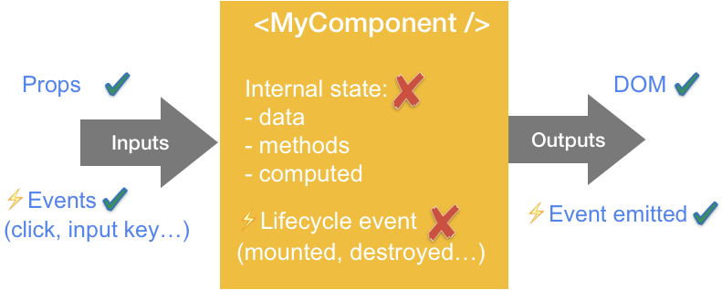

## #1 - Think documentation

> Your company wiki can be outdated. Tests can't.

Everybody wants good and well-written documentation. Unfortunately, it's hard to keep it up to date.
I believe tests can replace, somehow, a part of the documentation. Tests provide a good description of how your application should behave.

Let me show you an example I could write:

```js
// Shop.spec.js
it('should show list of product', () => { /* ... */ })
it('should hide non-available products', () => { /* ... */ })
it('should display a discount label when available', () => { /* ... */ })
it('should paginate when > 10 products', () => { /* ... */ })
```

Just by reading the name of the name of the file and the 4 descriptions, I already know what is this functionality and some business rules.

Also, if the *"should hide non-available products"* test breaks, I know exactly where to start my investigations.


## #2 - Keep it small

Small tests are **easier to understand and easier to maintain**.

One of the first blocker for not writing tests is the time-consuming aspect. If it takes a few minutes to understand what the purpose of the test is, there's something wrong. And if the test fails in the future, next dev will be probably more inclined to remove this test. 

Also, by reducing the size of your test, you **enforce your test's isolation**. So you're sure not to test the same thing many times.

**Exception**: if you want to test a process (like the full payment flow).


## #3 - Keep it flat

I tend not to write any condition (if/else/...) in my tests. If your test has an if condition, maybe you are testing 2 different things. Which means, your test may have too many responsibilities. 

Remember the S of SOLID (S = Single-responsibility Principle). If it makes the coffee, toast your bread and fetch the forecast... there might be something wrong.


## #4 - Only mock what you can't control

> Every time we mock, we diverge from the real world scenario.

For this reason, you should avoid them as much as possible. But, sometimes we have no other option but to use it. Here are the only exceptions:

* for external API calls (HTTP GET/POST/...);
* for browsers API (local/session storage, navigator...);
* ... and time-based stuff ([date](./jest-mock-date), random methods...).


Talking about time, if you're testing a timer, don't block the pipeline for the x seconds required by the timer. Mock the clock!


## #5 - Avoid assertion in loops (forEach/...)

A common error is to test a list in a loop.

Example: I want to test a page that loads 30 items.
  ```js
  import fakeDataProducts from '../fixtures'

  it('should shows list of product', async () => {
    const wrapper = await render(ProductList)
    fakeDataProducts.products.forEach(product => {
      expect(wrapper.find(product.name))
        .toBeInTheDocument()
    })
  })
  ```

What's wrong here?

* **Too many assertions**: multiple assertions can potentially slow down the execution of the test suite.
* **Non-valuable tests**: asserting the presence of one item can be a good idea. But, testing the presence of each item doesn't seem to add much value.

**Exception**: When each element of the array represents a different use case.


## #6 - Test your app in the same way as a user will use it

> The more your tests resemble the way your software is used, the more confidence they can give you.  
> — Kent C. Dodds

Let say you want to login on your favourite social network. You fill your username and your password. Then what? Do you search in the DOM for the button with `id="login-form-btn"`? or do you click on the button called "Log In"?

If the keyword "Log In" is already present on the page, you can query your item with accessibility attribute *(i.e. `aria-label`, ...)*. In this way, you will enforce your component accessibility.


## #7 - Favour integration tests

You probably read Martin Fowler's blog talking about the [Testing Pyramid](https://martinfowler.com/bliki/TestPyramid.html). In a nutshell, this blog said: write a lot of unit tests (fast and cheap), some integration tests and a few end-to-end tests (slow and expensive).

But, this post was written in 2012. 8 years ago! I believe we play a different game today with different rules too.

Unit testing a Redux/Vuex store gives me zero confidence. I've done it in the past. Many times... but, the number of bugs haven't changed. Why? Because bugs and regressions are generally not in small pieces of code.
We found them at a higher level.

  
*(Unit vs. Integration tests)*

**Integration tests are more expensive than unit tests. But, it's worth the trouble.**


## #8 - Avoid implementation detail

Let's say you want to test a "like button". You might be tempted to do something like this:

```js
const wrapper = mount(<LikeButton />)
wrapper.find('Like').simulate('click')
expect(wrapper.state().liked).toBe(true)
```

What's wrong here?

* **False positives:** (aka *false alarm*) It looks like an error but it's not.  
Let say, you want to refactor the component. By refactoring, I mean changing the implementation, not in the behaviour or the contract (props, events...). Otherwise, it's not a refactor.  
If you rename `liked` to `isLiked`, the test will fail. And it should not. We write tests to fail when something goes wrong. Nobody cares about a variable name! But, it's a different story when it comes to behaviour. Only test what matters!

* **False negatives:** (test pass but it shouldn't)  
Instead of verifying the output, we check the internals. We can't be sure the output still works as expected.
This scenario can happen because we did not test the app in the same way as your final user will. In other words, our users and other devs who are going to use this component don't really care about the magic inside the component.

To avoid implementation detail, **treat your component as a black box:** only test the inputs and the outputs.



The same test, without implementation detail could be:

```js
const spy = jest.fn()
const wrapper = mount(<LikeButton onClick={spy}/>)
wrapper.find('Like').simulate('click')

expect(wrapper.prop('aria-label').toEqual('liked')
expect(spy.mock.calls[0][0]).toBe(true)
```

## #9 - Automate everything


*I remember when I joined a company a few years ago. On Day One, I couldn't start the application. After investigations, it turns out someone forgot a `;` in a SQL file and pushed it to master. The application was broken because of a god damn semicolon. With basic tooling, those kinds of problems should never happen.*

If you ask a dev to run the run manually the test before opening a pull request, it's not gonna work. Humans are fallible. Plus, this is a dumb job. Better delegate this job to a robot, they are cheap and never lie.

Because I don't even trust myself, all of my side projects have CI enabled by default. The only way for me to merge my own code is [to open a pull request and get a green build](https://github.com/maxpou/gatsby-starter-morning-dew/pulls?q=is%3Apr+is%3Aclosed).


## #10 - Write tests for confidence, not for metrics

> "When a measure becomes a target, it ceases to be a good measure"  
> － Goodhart's law

I see a lot of people writing *Coverage Driven Test™️*. Because their manager asked to, or because they want to show off with a "100% code coverage" on the GitHub repository.

In my opinion, this is a really bad idea. And for a few reasons:

* Code covered does not necessarily mean code tested;
* High code coverage gives the **illusion of quality**. But, you can have a high percentage with irrelevant tests that does nothing except bumping the score (cf. implementation detail);
* Dev doesn't write tests for being confident but to satisfy a metric.

This last point is very important. By taking the problem on the wrong side, we forgot why we write tests.
We should all write tests for **confidence**. Confidence for shipping code that works as described and also confidence that the behaviour will remain unchanged 6 months later when you or a colleague will work on this part of the application.

**Not all code needs tests.** Expecting the same amount of test in your App hidden settings and in the payment page is absolute nonsense. Writing tests is an investment. If tests don't provide any visible ROI (Return On Investment), skip them. Except, if you're working on a library (open source or not).

---

Thanks for reading this article 🤘

You can leave a message on the section below if you think I forgot an important point... or if you just want to insult me :)

This post was the first one of my "testing series". In the next weeks/months, I plan to talk about code coverage, good practices in Vue.js testing and also how to test JAMstack/Gatsby applications.

