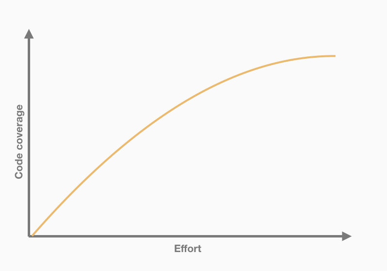

*Edit 25/05/2020: The title of this article has been edited.*

The company I'm working for recently set a code coverage rule requirement.  Although I believe tests improve the software quality and help developers to write code with confidence, I'm strongly against this coverage rules. I believe this metric should never be used as a target. But first, let's understand how code coverage works under the hood.

*This article is intended for web application testing. Not for a library (open source or not).*

## How Code Coverage is generated

Let's take the following code:

```js
function foo (a) {
  if (a) {
  // do something with 'a'.
  } else {
  // do something else.
  }
}
```

will be rewriten as:

```js
function foo(a) {
  cov_2mofekog2n.f[0]++;
  cov_2mofekog2n.s[0]++;
  if (a) {
    // do something with 'a'.
    cov_2mofekog2n.b[0][0]++;
  } else {
    // do something else.
    cov_2mofekog2n.b[0][1]++;
  }
}
```

A global counter object `cov_2mofekog2n` is created for this file. This object's have key that stand for:
* `f`: function;
* `s`: statement. Note: the else belongs to the if statement. That's why we have only one statement here.
* `b`: branch. Note that branch 0 have 2 counter (because if and else are 2 different branches)


As [Benjamin Coe mentioned](https://blog.npmjs.org/post/178487845610/rethinking-javascript-test-coverage), this way of measuring the coverage changed had now. Code coverage is now computed on Node V8's side. But, the idea of a global counter remains the same.

Now we have seen how this metric is computed, let's see why we shouldn't use it as a target.


## Reason #1: Covered code !== tested code

We can take the previous code example and add the following test.

```js
// foo.test.js
import foo from './foo.js'

describe('Foo.js', () => {
  it('should do something', () => {
    foo(true)
    foo(false)
  });
});
```

Now, if you run `npm run test -- --coverage`, you will get... 100% code coverage. In other words: **You don't need any assertion to cover code**. 

The example itself might sound ridiculous because dev usually don't write empty functions or tests like that. Ok. 

Let's take a more realistic example.

```js
// shop.spec.js
describe('Shop', () => {
  it('should render the component', () => {
    const wrapper = mount(<Shop />, { products })
    expect(wrapper.text()).toMatch(/Our products/)
  });
});
```

With a test like this, it's super easy to get high coverage. However, this test doesn't test anything related on how the product itself is rendered.

**Code coverage doesn't give any indication of what is actually tested.**


## Reason #2: Dev focus on coverage instead of confidence

If I continue with the shop example. We still have one test that tests almost nothing (but covers a lot!).
When I get the code coverage report, it says that one scenario is not tested: when one product is available.

```js
getPageTitle() {
  return this.products.length === 1
    ? 'Our product'
    : 'Our products'
}
```

According to you, what is the next step now?
* Add a test to cover this untested function? (with a low impact)
* or reinforce tests on parts that are already covered but not tested? (with a high impact)

If you are in a company with a xx% code coverage requirement, you will be more inclined to "cover" code to bump the score.

We were supposed to **write tests for confidence**. Confidence to ship code that works as expected. And we ends up writing tests for metrics. A nonsense!

Also, if you have a xx% code coverage policy, it means you're expecting the same level of test across the whole application. **Do you think that a hidden settings page and a main feature deserves the same attention?**

## Reason #3: High code coverage !== high quality of tests

> "When a measure becomes a target, it ceases to be a good measure"  
> － Goodhart's law

In one of my previous experiences, I was granted as a tech lead. I thought it could be a good idea to set a 100% code coverage policy. I thought it was something good to enforce the code quality. I was pretty proud to have a 100%cc and keep it over the time. And one day I got disillusioned when I went through the code base.

Some dev didn't write code for confidence but to make the CI build green. As we saw before, if you understand how code coverage works, it's super easy to trump this metric.

Here are a few example of low quality tests:

* a dev couldn't test an `if` statement. So he updated the code to trump the coverage and get the 100%.
  ```js
  function myFunction(something, unitTest = false) {
    // code

    if (weirdAndHardToTestCondition || unitTest) {
      // code
    }

    return whatever;
  }
  ```
* [implementation detail](/10-tips-write-better-tests#8---avoid-implementation-detail) a.k.a. tests that result with false positives and false negatives. You have a lot of them when you search for react/vue components on GitHub;
* reducing code readability when code cannot be tested. Less lines of code === less uncovered percentage. You can also write more verbose code on the covered part to gain even more percent.
  ```js
  // given generatePdf() is hard to test...
  const filename = `${user.name}-${user.lastname}.pdf`
  const data = formatData(user.data)
  const PDF = generatePdf(filename, data)
  
  // now become
  const PDF = generatePdf(`${user.name}-${user.lastname}.pdf`, formatData(user.data))
  ```
* and the cherry on top: a developper extended the testing framework to test private methods. That spicy one was in PHP (with the reflection method).


## Not all code need to be tested



Before giving my [talk about Frontend Testing](/speaking/#talks), I asked developers why they don't test. Without any surprises, most of them told me: *"we don't have time to test"*. When I asked my maker friends, I heard the same song.

Writing tests cost time. Therefore money.

Sometimes the amount of time invested on writing tests does not pay off. Because of the time consuming aspect or because devs are flooded by too many tests.

That's more or less what Kent C. Dodds explains in his famous post [Write tests. Not too many. Mostly integration.](https://kentcdodds.com/blog/write-tests)


## Wrapping up: should we throw out the baby with the bathwater?

Of course not!

Sometimes, *but not always*, Code Coverage can help to highlight untested parts of an application. But it's just a metric. So please, use it as a metric, as a tool to help you to take the right decision. Not the opposite. And stop writing *Coverage-Driven Test™️* 🙏

**Using a metric as a target is a bad idea**.
* Evaluate developers velocity with number of commit / day and they will add 30 commits per pull request;
* Evaluate a team velocity based on the number of lines and they will abuse from auto generated code;
* Evaluate a code quality with the usage of design pattern/code complexity and we will ends up with over complicated code (you can have a look at the famous [FizzBuzzEnterpriseEdition repository](https://github.com/EnterpriseQualityCoding/FizzBuzzEnterpriseEdition))
* Evaluate a code quality with code coverage and you will ends up with all the things I mentioned before.
* Etc.
