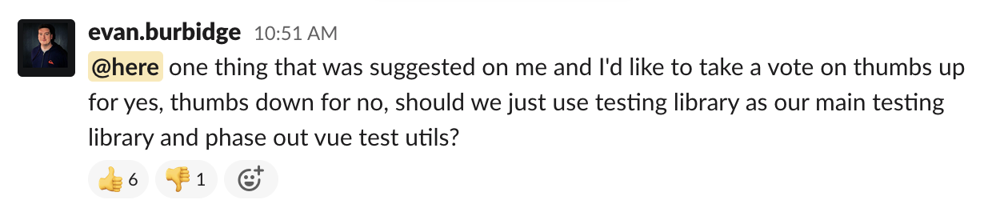
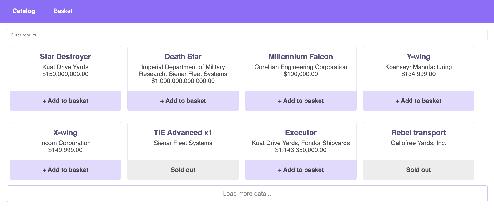

Today, I want to talk about testing in the Vue.js ecosystem. Between my previous job and my current one, I've been searching for too long a way to test Vue.js applications. I always ended up with something too verbose or overcomplicated.

1.5 year ago, my colleague John introduced me to a very cool library: [Vue Testing Library](https://github.com/testing-library/vue-testing-library). In a nutshell, it provides a solution to test Vue.js applications... but from a user point of view. Their motto? This one:

> The more your tests resemble the way your software is used, the more confidence they can give you.
>   
> － [Kent C. Dodds](https://kentcdodds.com), author of Testing Library


We were already using the official library: vue-test-utils. It provides good results for unit testing components. But, we were not completely convinced by the integration tests. In addition, I don't think unit testing components bring much value. We decided to give a try.

After a year of using it, a colleague he threw this question on the Frontend chat:


_(actually the only 👎 is due to a misunderstanding)_

Why do we all like it? Because it provides an **easy** and **straightforward** way to test our Vue.js Application.

Ok, enough talking. Let's jump to the code :)

## Let's get it started!

For this article, I'll take a small app I created.


👉 A demo is available here: [vue-testing-library.netlify.app](https://vue-testing-library.netlify.app/#/)  
👉 Code is here: [github.com/maxpou/vue-testing-library-sample](https://github.com/maxpou/vue-testing-library-sample)  



The application features are quite basic:
* fetch products from the Star Wars API and print it to the screen;
* filter products by name when user type something in the textbox;
* add product in the basket;
* ~~buy products.~~ Sorry. I'm Max, not Elon Musk. I can't sell starships 😁


This application is heavily based on vue-cli (including jest+vue-test-utils). Actually, Vue Testing Library **acts as a wrapper for vue-test-utils**. You can add the library like this:


```bash
npm install --save-dev @testing-library/vue @testing-library/jest-dom
```

[Jest-dom](https://github.com/testing-library/jest-dom) is not mandatory. But I recommend you to install it as it provides some very handy matchers for Jest.


## Our first test

The first thing I want to test is the presence of starships on the screen!

```js
// tests/unit/catalog.spec.js
import { render, screen } from '@testing-library/vue'

it('should show products name, detail and price', () => {
  render(App)

  screen.getByText('Executor')
  screen.getByText('Kuat Drive Yards, Fondor Shipyards')
  screen.getByText('$1,143,350,000.00')
})
```

You can now run `npm test`.

💥 Boom! It's done!

1. `render(App)`: this is where we instantiate the component.
2. `screen.getByText('Executor')`: we search for the _"Executor"_ occurrence in the mounted component. If this value is not found, an error will be thrown. This value must be unique!

Also, you probably realised that you don't need to do any specific configuration!

Note: the API calls are [mocked with Jest](/jest-mock-axios-calls).

## Interacting with the page (click, keypress...)

Now I want to test a user interaction. The spaceship filtering is a good candidate.
Let's test the following scenario: if the user types *"wing"*, we should only see *"X-wing"* and *"Y-wing"*.

```js{3}
it('should filter products when user type on the textbox', async () => {
  await render(App)
  await fireEvent.change(screen.getByLabelText('Filter results'), { target: { value: 'wing' } })

  expect(screen.queryByText('Death Star')).not.toBeInTheDocument()
  expect(screen.getByText('X-wing')).toBeInTheDocument()
  expect(screen.getByText('Y-wing')).toBeInTheDocument()
})
```

### fireEvent()

To write text in an input text, we use `fireEvent.change(selector, options)`. If we wanted to "click" on something, we would use instead `fireEvent.click()`. Keep in mind, `fireEvent` returns a promise, don't forget the await statement before.


### queryByText() vs. getByText()

When you want to test a missing text, `queryByText` is the prefered way.
Remember, `getByText` throws an error when the text is not present! 

I mentioned before, I use Jest-dom. To extend Jest's `expect()` function, you need to register it on the config files ([like this](https://github.com/maxpou/vue-testing-library-sample/blob/master/jest.config.js#L6-L8)).

## Testing the router (with vue-router)

Usually, Vue.js components are not aware of the router. We have to provide the routes to the render function.

We could define the routes on every test... but I don't like to write the same code multiple times. Instead, I recommend you to overload Testing Library's `render()` function with our defined routes.

```js
// tests/render.js
import { render as r } from '@testing-library/vue'
import { routes } from '../src/router'

export function render (ui) {
  return r(ui, { routes })
}
```

If I want to test something with a page transition, my test will look like the previous tests.

```js{5}
import { render } from '../render'

it('basket should be empty', async () => {
  await render(App)
  await fireEvent.click(screen.getByText('Basket'))

  await screen.findByText('Your basket is empty!')
})
```

You probably noticed the `findByText()`. I could not use `getByText()` because new page rendering is asynchronous.
`findByXXX` is good when you want to find something that is not accessible straight away.

## Testing the store (with Vuex)

This part is a little bit trickier than the router part.

To work properly, a Vuex store needs to be registered somewhere.

The painless way I found to test components with a store, was to split it into 2 separate functions. Your tests will use `getDefaultStore()` and your app will use the Vuex instance (2nd export).

```js
// src/store/index.js
export function getDefaultStore () {
  return {
    getters: { /* ... */ },
    modules: { /* ... */ }
  }
}

export default new Vuex.Store(getDefaultStore())
```

After that, you can override Testing Library's `render()` function with your custom stuff.

```js
// tests/render.js
export function render (ui) {
  const store = getDefaultStore()

  // reset/override default store here
  store.modules.basket.state.items = []
  store.modules.catalog.state.starships = []
  store.modules.catalog.state.currentPage = 0
  store.modules.catalog.state.fullyLoaded = false

  return r(ui, { store })
}
```

You might wonder why I'm cleaning the store with multiple `store.modules.xxxx`? Well, I want my test to [be fully isolated](/10-tips-write-better-tests#2---isolate-your-tests). It's not an easy job since Vuex is based on mutations. Without these lines, you may have problems where test #3 depends on test #2.

Once it's done, you don't need to do anything specific. Vuex test should look like any other test,

```js
it('should add items to basket', async () => {
  await render(App)

  await fireEvent.click(screen.getByLabelText('Add Millennium Falcon'))
  await fireEvent.click(screen.getByLabelText('Add Imperial shuttle'))
  await fireEvent.click(screen.getByLabelText('Add Imperial shuttle'))

  expect(screen.getByRole('navigation')).toHaveTextContent('Basket (3)')
  await fireEvent.click(screen.getByText('Basket (3)'))
})
```

See! It doesn't look like I'm testing a store 🙂

## One render function to rule them all!

Let's sum up. We created a custom wrapper for the vue-router and another one for Vuex. I could post a render function like this:


```js
// test/render.js
export function render (ui) {
  const store = getDefaultStore()
  // store overrides...

  return r(ui, { routes, store })
}
```

...but, it's a little bit too *"hello world"* for me. I guess you also use some cool Vue.js related libraries (VueI18n, VeeValidate...)? 
Here's good news for you. This is the wrapper I use for ~90% of my tests:

```js
export function render(ui, { store: storeOverrides = {} } = {}) {
  return r(
    ui,
    {
      routes,
      store: { ...getDefaultStore(), ...storeOverrides },
    },
    (vue, store, router) => {
      vue.use(VueI18n);
      vue.use(VeeValidate);
      const i18n = new VueI18n({ locale: 'en', messages: { en: messages }, silentTranslationWarn: true })
      return { i18n, router };
    }
  )
}
```

The `storeOverrides` parameter allows you to override a part of the store for a specific test (i.e. testing functionality with a different user).

## The quest for the perfect query

In the beginning, finding the perfect query to use can be hazardous. In this blog post, we already saw a few.
If you're lost, don't worry. **`getByText()` and `queryByText()` cover the most common usages**. Once you're comfortable with them, feel free to check these resources.

* [testing-library.com/docs/guide-which-query](https://testing-library.com/docs/guide-which-query): the official documentation;
* [testing-playground.com](https://testing-playground.com/): you can copy/paste your HTML and they will tell you which query is the most appropriate.


Also, when you hesitate, **think about your users**. How do they interact with your app? 
For a login feature, do you want them to: 
* fill their credentials in a textbox with a `class="form form-password"`?
* fill their credentials in a textbox labeled "password"?


You see? 😉

[Think users](/10-tips-write-better-tests#6---test-your-app-in-the-same-way-as-a-user-will-use-it). If you pick the 2nd, you will kill two birds with one stone. You will test the login feature **plus your component accessibility**!


💡 **Tip:** [eslint-plugin-testing-library](https://github.com/testing-library/eslint-plugin-testing-library) is a great addition! It can spot some misused queries.

## Debugging

Vue Testing Library doesn't let you access to component's internals. It's voluntary.
The idea behind this decision is to prevent developers from [testing implementation detail](/10-tips-write-better-tests#8---avoid-implementation-detail).

Here's what you can do:
* add some `console.log()` in the lifecycle component (`mounted`, `updated`...);
* use the `debug()` function provided by the library.
  ```js{4}
  it('should test something but it\'s not working', async () => {
    await render(App)

    screen.debug()
    // screen.getByText('broken assertion')
  })
  ```
  Then, when you `npm test`, component DOM will be printed in the console (with a nice syntax color).

> 🙋🏽‍♀️ Help, `debug()` give me a truncated output!

You can override the debug max size like this.

```bash
DEBUG_PRINT_LIMIT=100000 npm test
```


---

And that's it for today!
I hope the examples given here will help you to cover the most common use cases.

Happy testing 🙂