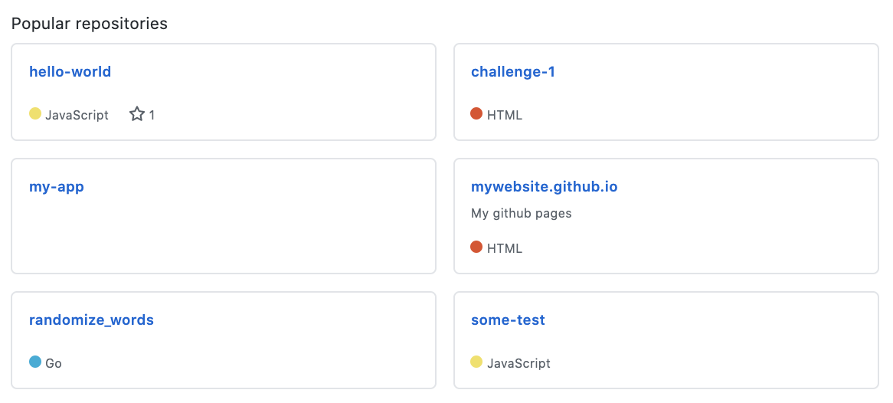

A few week ago 2 people asked me the same question on Twitter: *"how do I make a better portfolio?"*
Since, it's not the first time I have this question, I decided to *answer in public™️*.

Before I start, just want to highlight something. Having a GitHub profile is not and should never be mandatory. It's "a nice to have".

## Quality over quantity

It's common to see GitHub profiles like this:

*(repositories names were anonymised)*

The person picked 6 repositories and pinned them. All the repo have 3 commits, no readme. This developper seems to experiment a lot of things but, nothing really stands out. If a recruiter asks you "what problem did you encounter and how did you solve it", the answer will be limited.

Don't get me wrong, there's nothing bad about experimenting new things! I also have a lot of hello world projects on my GitHub profile. However, those are not pinned on my profile. I only pin what I think it's relevant. I know recruiters don't have time to go through all my projects. That's why [I have 5](https://github.com/maxpou) when I'm writing those lines.

Instead of having 6 small projects, pick one. And polish it!

## Learn in public

> "I don't put it on GitHub unless it's perfect"

This one comes from a senior dev I used to work with in my previous company. I think it's a pity to think like that. In general, **people who are afraid of making mistakes end up doing nothing**.

And also, if one day someone checks your project's git log and finds out that you forgot a bracket/semicolon, I don't think he will blame you for that. And if he does, it's good for you. Nobody wants to work with toxic people.

## There's alway something to do!

I did a mentoring session once with a girl who wanted to retrain in IT. She showed me the small game she developed. But, she wanted to find a new project because she thought this project was "done".

A project is never done. There's always something to do... Remember the 1st advice: "Quality over quantity"!

Here are a few things you can do...

### Add a README.md

The readme is the entry point of your project. The first thing people will see!
I think every code repository should have one. If you don't want people to get interest in your project you can add one and write "nothing to see here".

Your readme should answer those questions:
* What is this project about? _(1-2 sentences should be enough)._
* How to install it?
* How to use it?
* What does it look like? you can add a screenshot or a gif animation.

💡 **Tip:** You can take some inspiration in the [Awesome README repository](https://github.com/matiassingers/awesome-readme).

### Do marketing

If you're building an app, advertise about it! I've an ex-colleague who's building a minimalist text editor. Every now and then, he publishes links on social media (Twitter, LinkedIn...) about his product and the new features he added. He also added his product on ProductHunt/Reddit. These platforms are great to gather feedback!

💡 **Tip:** There is also smaller communities in WhatsApp, Telegram or Discord (i.e. [Party Corgi](https://discord.gg/partycorgi)).

### Add more features

On a green field project, finding more features should not be the hardest thing to find. If you did a bit of marketing on it or if you asked for feedback to your friends/family, you should have a list of ideas to add.

At some point, you might face the situation where you have to rethink the way you wrote your app. It's a good point for you because it means you overcome the "Hello world" stage. Interesting problems usually arrive when your app is growing.

### And also...

* Manage your todo list with tickets/issues (please do NOT use Jira). If you have a few tickets, you can group them into different categories: "bug", "enhancement"... If people spot a bug or have a feature request, they will probably open an "issue" on your repository! Also, one small tip: fix all bugs before starting any new feature!
* [Write tests](/10-tips-write-better-tests)! Lot of recruiters like to see tests when they review code. The project you're working on can be a good opportunity to write some!
* Add **continuous integration (CI)**. Every time you add code a robot will check if tests are passing and if you don't have dead code/oversights/... You can use tools like TravisCI, GitHub Actions...
* Automate the deployment. Many tools allow you to deploy your app on the web once you `git push` to the `master` branch. You can check Netlify, GitLab Pages, GitHub Pages, Vercel...
* Make your app [accessible (a11y)](https://developers.google.com/web/fundamentals/accessibility), so people with disabilities can use your app.
* Make it mobile friendly (responsive web design) and if you feel comfortable, why not creating a Progressive Web App (PWA)?
* Monetize it? If you think you're solving a problem that other people have and if you, you should think about monetization. This project might pay you your coffee... or more!
