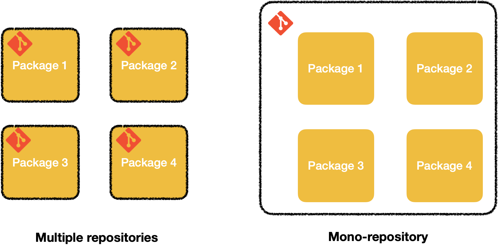
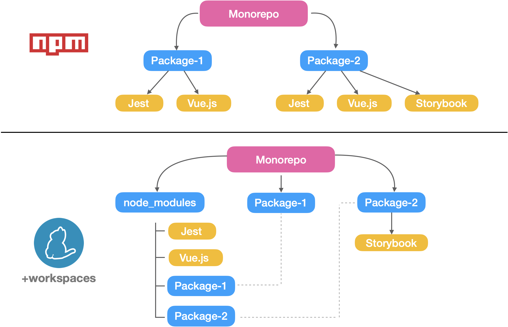
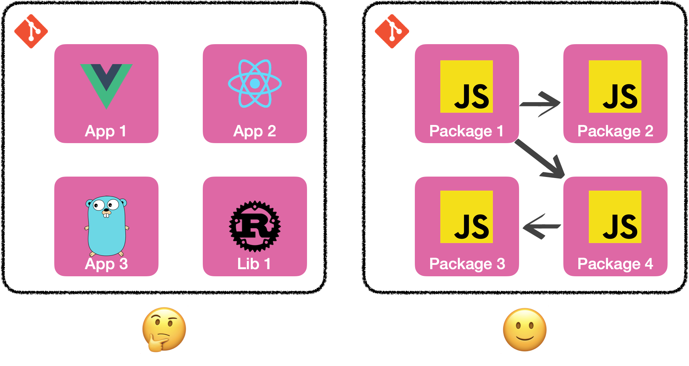

La tendance actuelle est de diviser nos codebases. Ces dernières années, on a vu apparaître des
concepts comme les microservices, les micro-frontends...

Et puis à contre-courant, on voit aussi des projets se rassembler sous un seul et unique repository
git. On appelle cela des monorepos (ou monorepository).



Ça va faire pas loin de 2 ans maintenant que j’en utilise et maintient un. Cet article est un
condensé de ce que j’aime et n’aime pas avec les monorepos.

_Contexte: le monorepo sur lequel je travaille contient ~ 40 packages (npm), principalement des
applications vue.js. Toutes ces petites applications font partie d’une plus grande application. Nous
avons décidé de diviser une énorme application en plus petites, car la maintenance était devenue
ingérable. On est à peu près 15 à travailler sur ce monorepo (pas à plein temps)._

## Avantages

### 🤝 Teamwork

**Favorise les contributions**:  
Lorsque vous avez déjà le code, c'est plus facile de contribuer. Vous avez déjà tout sous la main.
Plus besoin de rechercher le repo, de le cloner et d'installer les dépendances.

**Meilleure vue d'ensemble de l'ensemble du système**:  
Quand on a tout le code au même endroit, les informations comme _"combien de fois est utilisé tel ou
tel composant?"_ ou bien _"ou est utilisé cet endpoint"_ se trouvent en un clin d'oeil (avec bon
vieux `ctrl + F`).

**Privilégie les grands refactoring**:  
Par la, j'entends que vous pouvez changer un composant présent dans plusieurs packages en un seul
commit. Pareil si vous voulez changer la version d'une librairie...

**Supprimez du code mort en toute confiance**:  
Combien de fois avez-vous voulu supprimer du code, mais vous ne l'avez pas fait parce que vous ne
saviez pas si le code était utilisé ailleurs? Encore un avantage d'avoir tout le code sous la main.

**Source unique de vérité**:  
Le projet sur lequel je travaille avait un nom très étrange pour la branche principale. Et puis un
jour on a décidé d’utiliser un autre nom tout aussi étrange pour le remplacer. Certains repos
étaient mis à jour et d’autres non. A chaque fois que quelqu'un clonait le repo, un bourde n'était
jamais bien loin.

### 👨‍👩‍👧 Dependencies

**Plus de place sur le disque dur**:  
Si vous êtes familiers avec l’écosystème JavaScript, vous savez probablement que le dossier
node*module peut être
[extrêmement lourd](https://www.reddit.com/r/ProgrammerHumor/comments/6s0wov/heaviest_objects_in_the_universe/).
Lorsque nous avions environ 30 applications / packages, cela prenait 12 Go sur le disque dur. Oui,
12 Go! Nous avions des dépendances comme Vue.js installées 30 fois. Heureusement, certains outils
(comme yarn) créent un lien symbolique *(symlinks)\_ entre les dépendances redondantes lorsque les
workspaces sont activés. Grâce à cette fonctionnalité,
[nous sommes passés de 12 Go à 1.7 Go](https://twitter.com/_maxpou/status/1263426573379739651).

 _Note: Je sais que npm 7.0 supporte maintenant
les workspaces. Cependant, c'est encore un petit peu tôt et
[certaines commandes ne sont pas encore supportées](https://github.com/npm/rfcs/pull/117/files)._

**hot-reload entre les packages**:  
Certains outils lient automatiquement les dépendances locales entre elles. Ce qui signifie que si
package-a est utilisé dans package-b, vous pouvez travailler sur package-a et voir le résultat en
direct dans package-b.

**Ajouter un package est plus simple**:  
Pour nous, tous nos packages sont dans un dossier `packages`. L'ajout d'un nouveau package est très
simple. Pas besoin de paramétrer l'intégration continue (CI), le registre npm, ni de redéfinir les
permissions du GitLab... tout a déjà été fait!

## Inconvénients

### 🛠 Git & code hosting platforms (GitLab/GitHub...)

**Autorisation**:  
Quand on met des permissions de lecture/ecriture sur GitLab/GitHub/etc., c'est pour le repo tout
entier.

**💡 Astuce:** Vous pouvez créer un fichier CODEOWNERS
([doc GitLab](https://docs.gitlab.com/ee/user/project/code_owners.html),
[doc GitHub](https://docs.github.com/en/github/creating-cloning-and-archiving-repositories/about-code-owners))
pour définir des règles d’autorisation.

```md
# .gitlab/CODEOWNERS

packages/app-1 @user1 packages/app-2 @user2
```

_Avec l'exemple du dessus, user2 devra avoir l'approbation de user1 pour modifier app-1._

**Un Git log peu lisible**:  
Si les merge requests sont mergées dans l'état avec 10-15 commits, vous allez peut-être avoir
quelques soucis le jour où vous aurez besoin d'utiliser git log.

**💡 Astuce:** Si vous pouvez utiliser la méthode du
["conventional commit"](git-conventional-commits) vous pouvez mettre entre parenthèse le nom du
package. Comme ça, ce sera plus facile pour voir l'historique d'un paquet spécifique.

```bash
# Lister toutes les features du package-B
git log --all --grep="feat(package-B):"

# ou bien:
git log --all path/to/package-b
```

**Git log peut devenir inutilisable**:  
Si vous avez beaucoup de commits / branches / tags, cela signifie que vous aurez beaucoup d'objets
git stockés. git peinera peut-être lorsque vous souhaitez obtenir l'historique (git log/git blame).

**💡 Astuce:** faites un petit flush du garbage collector de temps à autres (`git gc`). N'oubliez
pas non plus de supprimer vos vieilles branches (`git fetch --all --prune` marche bien).

**Oubliez les branches de type "next"**:  
Votre branche `main` / `master` doit être seule source de vérité. Vous ne pouvez pas avoir de
branche `next`. Ça va être un enfer à maintenir... Si vous souhaitez que certaines fonctionnalités
ne soient disponibles que pour un environnement spécifique, je vous recommande chaudement d'utiliser
des _"feature flags"_.

**Le repo peut devenir très lourd**:  
A un moment, le répertoire `.git` a la racine du monorepo va peut-être atteindre quelques Gb.

**💡 Astuce:** Voici 2 options si vous souhaitez économiser de l'espace disque.

```bash
# Clone le repo mais sans historique
git clone --depth 1 <repo-url>

# 1. clone un repo vide et sans historique
# 2. pull uniquement le package-a de la branche main
git clone \
  --depth 1 \
  --no-checkout \
  --filter=blob:none \
  <repo-url>
git checkout main -- packages/package-a
```

_Note: Voici un peu de lecture si vous souhaitez en apprendre plus sur le
["partial cloning"](https://docs.gitlab.com/ee/topics/git/partial_clone.html) (en anglais)._

### 🤖 Continuous Integration (CI)

**Quand c'est cassé, tout le monde est bloqué!**  
Si la branche `main` est marquée en rouge par votre intégration continue, tout le monde est impacté.
Vous ne pouvez pas mettre ce problème sous le tapis. Ça doit être traité immédiatement.

**Le dilemme de l'intégration continue**:  
Si les bases de code sont mutualisées, vous avez plus de code. Qui dit plus de code, dit plus de
travail pour l'intégration continue (CI). Donc plus de tests, de lint, de build...

Lorsqu'il s'agit de CI, le temps est le nerf de la guerre. D'une part, on veut que ce soit le plus
rapide possible et d'autre part on recherche aussi de la fiabilité. Je veux dire, quand mon CI me
donne le feu vert, je suis plus confiant pour fusionner mon travail.

Il peut être tentant de réduire le nombre de packages analysés pour gagner du temps. Mais
l'intégration continue perdra son intérêt car elle ne pourra pas repérer une régression
"cross-repo".

|                                            | Toute la codebase | Package sélectionné | Packages affecté |
| ------------------------------------------ | ----------------- | ------------------- | ---------------- |
| Vitesse de Build/lint/test                 | 🐌 Lent           | 🚀 Rapide           | 🚗 Normal        |
| Détecte les cross-packages<br/>régression? | ✅ Oui            | ❌ Non              | ✅ Oui           |
| Facile à mettre en place?                  | 😀 Oui            | 😀 Oui              | 😟 Non           |

La 3e option est, à mon avis, la plus viable. Mais vous devrez tout faire manuellement. Une 4e
option pourrait utiliser des filtres. Les packages étiquetés "importants" utilisent la 1ère
stratégie et les autres utilisent la 2ème stratégie.

**💡 Astuces:**

- Je vous recommande d'ajouter un label spécifique pour shunter la CI (ex `NO_CI`). Si vous modifiez
  une typo dans le README, vous n'avez pas besoin d'exécuter toute une batterie de tests.
- Si votre pipeline (CI) comporte des tâches parallèles, n'oubliez pas d'activer l'option
  "fail-fast".

### 🤝 Teamwork

**Changements cachés**:  
Certains repos sont parfois plus "sensibles" que d'autres. Une erreur d'inattention lors d'une revue
de code et vous vous retrouvez vite avec quelque chose de non désiré.

**La quantité de code peut être intimidante**:  
La première fois que j'ai "git pull" le code source de Gatsby.js, j'ai extrait l'historique complet
d'environ 90 paquets. Le projet avait ~5 ans et 3000 contributeurs. Je vous laisse imaginer ma tête
quand j'ai ouvert tout ça dans mon IDE. J'étais complètement dépassé. La quantité de code était
juste énorme!

Si vous travaillez avec 10% d'une base de code, vous ne vous souciez probablement pas des 90%
restants.

## Conclusion



Dans l'ensemble, je pense qu'utiliser un monorepo peut être une bonne chose.

Dans notre cas, cela nous facilite grandement la vie. Sur nos 40 packages, 35 sont des applications
vue.js avec une structure et des dépendances très similaires. Et chaque application est une petite
partie d'une grande application. On a pas mis dans le même repo des apps qui n'ont rien à voir entre
elles.

De plus, on reste une équipe à taille humaine. Donc les problèmes énoncés plus hauts se fixent
plutôt rapidement.
