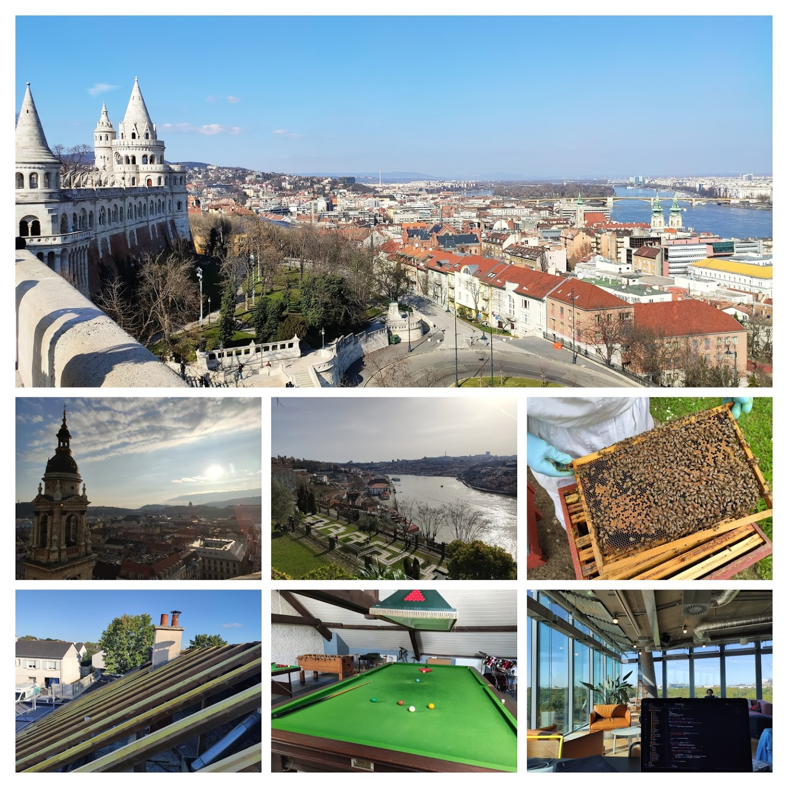
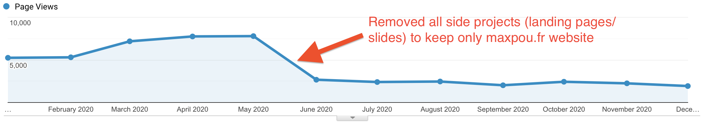

*Disclaimer: I mostly wrote this blog post for myself. Writing my [Year in review](/tags/Year%20In%20Review) helps me to celebrate my biggest wins, see what was wrong and define goals for the upcoming year.*

## 👨‍💻 Work

I am still working at VSware as a Sr Software Engineer.

This year again, I learned a lot of things and I also reinforced my skill set. My mains focuses were:
* Managing a big frontend infrastructure;
* Making accessible apps (A11Y) ~ _Our application needs to meet AA criteria (WCAG). I had to learn how to use a screen-reader and how to make web apps usable for everybody. I also did a knowledge sharing session with my team._
* Writing relevant tests.

## 👨🏼‍🔬 Side projects

2020 was not a very prolific year for me. However, I managed to do some stuff aside from my work:

* [Gatsby-started-morning-dew](https://github.com/maxpou/gatsby-starter-morning-dew) gained 80 stars on GitHub (for a total of 180). I still maintain this project since my blog uses it directly. I sometimes receive email from happy users... it's very pleasant :)
* [Revamped my resume](/cv) using web technologies. I don't know if it's a good idea or not but it was fun to adapt a webpage for mobile, desktop and ... printers!
* Mentoring: I (mostly) mentored G., a guy who wants to retrain in web dev. He made very good progress over the last year and I hope he'll find a job in Q1 2021! I tried to mentor a few other people, but it's hard to keep it up. I don't think I've room to handle more than 1 person.

## ✍️ Blog

* Last year I published 11 posts (+2 translated in French);
* I added some cool features on my blog: dark mode, RSS, ability to publish an article in a different language and some SEO/A11y improvements.
* maxpou.fr cumulated 49k pages views and 21k users. If we compare the numbers with last year, it's a significant drop. But, before June, my data was biased since I included statistics from my side project. 🤦‍♂️  
This year, I'll change the way I write my posts and see the impact on SEO/frequentation. This website is also a place where I like to experiment with things. Most of the time it doesn't work!

* I still cross-post most of my articles on [dev.to](https://dev.to/maxpou). I cumulated a total of 134k views / 3.6k reactions / 3.4k followers.

## ✈️ Travels

[I lived in 4 countries in 2020](https://nomadlist.com/@maxpou), all Europeans. I was expecting more... but you know how it is right now. I don't know if I'll continue to travel as much as I used to in 2021/2022.

I lived in / visited:
* Portugal: Lisbon and Porto;
* Hungary: Budapest;
* France: Lyon and Angers _(was there for 1st lockdown)_;
* Germany: Berlin and Kiel _(I visited my cousin)_.

Right now, I'm in Berlin. I moved there this summer between 2 lockdowns. I'm not gonna lie, it's not the perfect timing to move to a new city since all meetups are cancelled.

## ✨ Random stuff

* 🌆 Moved to Berlin. _I might stay...who knows!?_
* 🛎 I have my name on my doorbell. Might sound stupid to you, I've been homeless -in an administrative way- for years! But I don't think I'll stay long in this place. I'm still giving a fake address every time someone is asking me :D
* 🍺 [Brew beer for the first time](https://twitter.com/_maxpou/status/1346376814541873152) (with my parents)! There's 8L of IPA fermenting right now!
* 🍸 Discovered a new passion for Gin. My actual top 3 is: Monkey 47, Opihr and Gunpowder.
* 👨‍🔧 Spent a few days helping a friend to change his roof! First time in my life I walked on a roof.
* 🕹 Reinstalled Age of Empires II. I used to play this game 20y ago! Still love it and I play regularly now. Ping me if you want to kick my ass! ;)
* 😔 I experimented anxiety for the first time in my life.
* 🏢 [Worked a full day in an office](https://twitter.com/_maxpou/status/1233385732946960384)! The last time I walked into an office was in Dec 2018! _(A friend invited me to work in his office company.)_
* 🎱 Played snooker for first time! I'm not bad at pool but this game is way too difficult for me!
* 🐦 Reached 600 followers on Twitter. I'm an influencer now! Just joking. It's just a number for me and I don't really care about it.

## Previous "high-level goals"

* 😐 [Travel] Discover new countries (Hungary 🇭🇺 and Japan 🇯🇵) ~ *I only went to Hungary.*
* ❌ [Travel] Be more organised when it comes to my travels ~ *That was a stupid goal. I like to be somehow unorganised when I (used to) travel. It gives more room to improvisation... (as long as I don't miss my bus/train/plane)*
* ✅ [Life] Stay remote / nomad ~ *this one is partially true.*;
* ❌ [Life] Continue to meet nomads when I travel;
* ❌ [Life] Better invest my money ~ *I'm still investing my money, but not regularly.*
* ✅ [Life] Complete another Dry January ~ *I DID IT!*
* ✅ [Blog] Write 8 blog posts + continue to cross-post on dev.to ~ *I wrote 11 (some of them are in)*
* ✅ [Blog] Write one post in a new platform ~ *why not?*;
* ✅ [Blog] Add new functionalities on my blog (i.e. RSS) ~ *I added cool stuff like RSS/dark mode/translated posts.*
* ❌ [Work] Learn more about Wasm (WebAssembly);
* ✅ [Work] Give 1 technical talk ~ *I was honoured to be the guest speaker for the 1st Vue.js Kenya 🇰🇪!*

## High-level 2021 goals

* [Work] Find a new challenge at work (or get a new job)
* [Work] Give 2/3 talks
* [Work] Learn more about Wasm (WebAssembly)
* [Work] Find a new cool side project!
* [Work] Continue to mentor people (but 1 person max)
* [Life] make 2021 better than 2020
* [Life] Keep the "Dry January" tradition alive!
* [Life] Better invest my money
* [Blog] Keep blogging (10 blog posts, write shorter posts)
* [Blog] Improve my website (i.e. use webmentions instead of disqus)
* [Travel] Travel again (if I'm allowed to!)

