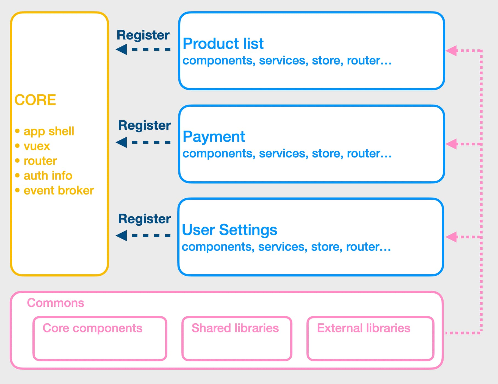
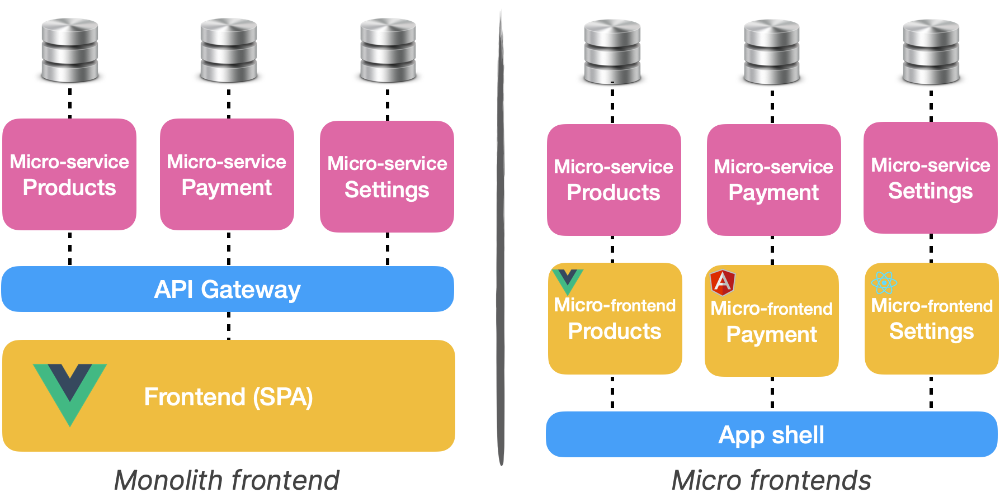
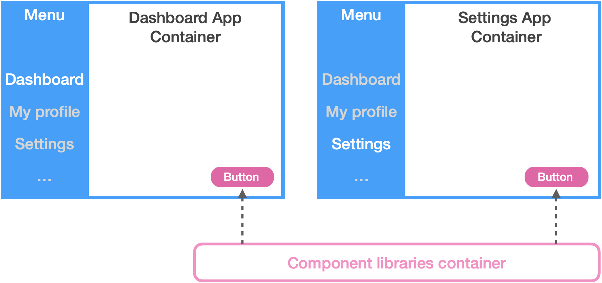
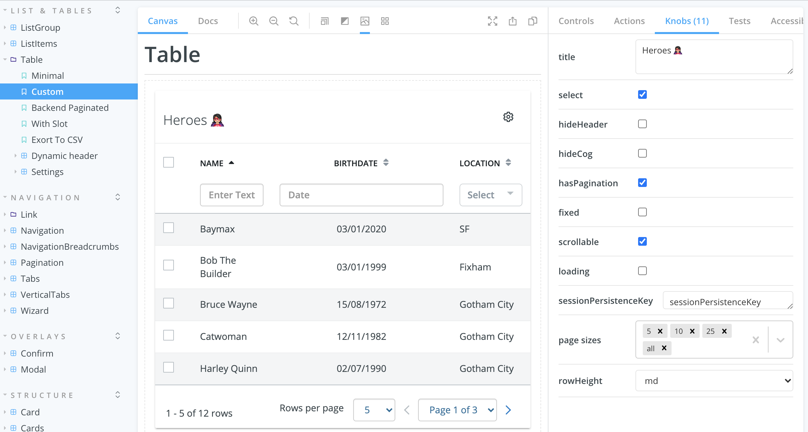

Just like React, Vue.js is a great tool to build web applications. In this article, I will share a
project I have been working on over the last 3 years. I will go through different technical points
such as the modular architecture we use, micro-frontends, component's state management, TypeScript,
Vue 3 and more. Keep in mind that there is not one but many ways to scaffold a Vue app. This is one
of them.

## How big?

For the last 3 years, I have been working on a large vue.js application. If you're curious about the
project, here are some numbers:

- +5k vue&js files / +650k lines of codes;
- 10 years old codebase. Vue.js landed in December 2016;
- we have 2 repos: the app monolith + 1 monorepo (contains ~40 npm packages);
- it's a Single Page Application (SPA) with +30 screens.

As I often say: this application is not big. It's **too big**.

## Modules everywhere



We adopted a modularised architecture for this app. In a nutshell, 1 module = 1 business part of the
app. And a module is something that looks like a standalone Vue application. We consider modules as
self-contained which can potentially be exported. By the way, some are exported as npm packages
([in a monorepo](/monorepo-pros-and-cons)).

Modules are not allowed to talk to each other... in theory. If 2 modules have to communicate, we can
use the [CustomEvent API](https://developer.mozilla.org/en-US/docs/Web/API/CustomEvent/CustomEvent)
from the browser and dispatch an event via the window object.

> 🙋‍♀️ How do you register modules?

With the vue-router. A module loosely corresponds to a single top-level URL root. With this trick,
modules are ["lazy loaded"](https://router.vuejs.org/guide/advanced/lazy-loading.html). So users
don't load the entire app when the application loads.

```js
// if module is a npm package
const ProductList = () => import('@company/product-list')
// or if the module is local
const ProductList = () => import('./path/to/product-list')


const router = new VueRouter({
  routes: [
    { path: '/product-list', component: ProductList }
    { path: '/payments', component: Payments }
    { path: '/user-settings', component: UserSettings }
    // ... other modules go here!
  ],
})
```

**☝️ Granularity is important!**  
Among our ~40 packages, ~30 are modules. And we haven't externalized everything yet. A single
business part of the app is sometimes splitted into multiple modules. We didn't discuss the scope of
a module before creating it. In my opinion, we have too many modules today and a lot of them should
be merged. If you decide to go with this approach, don't make the same mistake we did.

## Micro-frontends?



Our module architecture shows some limits. Because we only export one app, big changes are nearly
impossible. Let's say we want to experiment with Vue.js 3, we will have to ensure that our few
thousand vue files are compatible. And this scenario happens for every major change we want to do. I
tried once to update our testing library. Out of our ~2200 tests, 500 were failing.

[Micro frontends](/3-tips-scaling-vue-application#tip-2-consider-micro-frontends) appear to be a
good fix for these problems. Because we could gradually update our dependencies. But nothing in life
comes free. The biggest downside I see is potential inconsistencies across our app. Some teams will
use the latest version of every tool where others will not update their dependencies. It can lead to
"mismatched dependencies", one team using v1 of our common component and another team using the v2.
This architectural style also brings interesting challenges regarding the deployment. Deploying one
application is very different from deploying multiple applications.

## Webpack 5 & Module federation

> Module federation allows a JavaScript application to dynamically run code from another
> bundle/build, on client and server

 _The same
component library container can be shared across multiple "app containers"_

If you have 2 microservices, having your favourite framework installed twice is not a big deal.
Users won't perceive it. But it's a different story on the frontend side. If 2 micro frontends use
the same frameworks and libraries, the user will download everything twice.

With Webpack 5 and the module federation plugin, it's now possible to _"share code"_ between
containers (or pages/builds). So if your component library is a standalone container, you can deploy
a new version of it without redeploying all the micro frontends.

_Note: at the moment, this part is still in the "investigation stage"._

## State management and Vuex


Vuex provides a handy way to manage the state between components. In the beginning, I really liked
it... but over time, this feeling faded out. Here are a few reasons:

- devs tend to put
  [everything in the store](/3-tips-scaling-vue-application#tip-3-be-kind-with-your-store-vuex);
- the store makes your app
  [harder to test (integration/unit)](/vue-js-testing-library#testing-the-store-with-vuex);
- scoped stores are hard to unregister. Unnecessary data can be kept in memory, sometimes causing
  state-sync issues;
- if you have +10 mutation when page load, time travel (via devtools) does not work well;
- dead code in state/mutation/actions is hard to identify.

I mentioned earlier, we splitted our app into small modules. Since our modules are like a small
_vue-cli_ app with a few pages only, **controlling the pages state with a Vuex store does not make a
lot of sense at the end**.

I stopped using Vuex in modules, something like 2y ago. So far, so good. I found the code more
readable and more maintainable. However, I still use it for high-level stuff like i18n and user
settings.

## What about TypeScript?

A few years ago, a colleague wanted to introduce TypeScript. After many debates, we ended up with
this decision: "TS is cool and static type checking can be beneficial for such a big codebase.
However, **adding it would require too much effort**. The return of investment is not worthy".

It might change with Vue 3. Integration with this language looks very promising!

## What about Vue 3?

I see two main reasons to think about Vue.js 3: Performance improvements and Composition API.

- **Performance improvements**: it's (almost) always a good thing to thrive for performances. But in
  this case, I don't think it will solve our problems. It's like if you replace your car with a
  Ferrari to get your coffee at the end of the road. But the thing is, we live on the 6th floor with
  no elevator.  
  Our bottleneck is not in the component rendering but in the amount of code the browser has to
  parse before rendering the page. Deleting code is not as fancy as bumping a framework version.

- **Composition API** (Hooks made in Vue): The feature we were all looking for, when React added
  hooks ~2y ago. In a nutshell, the Composition API provides a lot of value when you want to reuse
  some logic or when you struggle to read large components. Much like with Mixins, you can extract
  component logic into a file. Then you can _compose_ your component with this logic. If you, like
  me, can't wait to use it, there's a [plugin for Vue 2.x](https://github.com/vuejs/composition-api)
  which seems to be stable enough to go to
  [production](https://github.com/vuejs/composition-api/issues/527).

For these reasons, _I don't think_ we will see Vue.js 3 this year. But the Composition API will
probably arrive soon in the codebase.

_Edit: Vue team is working on
[compatibility bridges](https://twitter.com/vuejs/status/1388144585600274433) between versions 2
and 3. It might change!_

## Component library and Storybook

 _Storybook is a great bridge between the frontend and the UX
team. We heavily rely on this tool and so far, we're very happy to use it._

Even if you start from an existing component library, you might have to build your reusable
components. In one place we put all our components, including very specific components into our
application. I tend to consider this package as an "open-source package", something that anybody
could reuse.

When we have to build a new screen it's pretty much like doing a lego construction. There's a kind
of component box and developers pick what they need. Most of the time, writing CSS is not needed.

## Testing

We have 3 different types of tests:

- **Static code analysis** (with ESLint): We created a set of rules on the top of Airbnb's config.
  This configuration is used everywhere in the app. It prevents us from pushing dead or misformatted
  code to the main branch. By the way, having a shareable ESlint config is a good way to
  [close the door on bikeshedding](/lesson-learned-maintaining-large-vue-js-codebase#close-the-door-on-bikeshedding)!
- **Unit tests** (with Jest): Less than 10% of our `xxx.test.js` are unit tests. It's mostly used to
  test the business part of the app. Because writing integration tests would require too many
  scenarios and test files would end up being unnecessarily verbose. Also, integration tests are
  slower than unit tests. By the way, we don't unit test components or Vuex stores.
- **Integration tests** (with Vue Testing Library): where the magic happens. We really like this
  library, because it provides [a very straightforward way](/vue-js-testing-library) to test our
  app.

At the moment, we have a total of ~3100 unit&integration tests.
