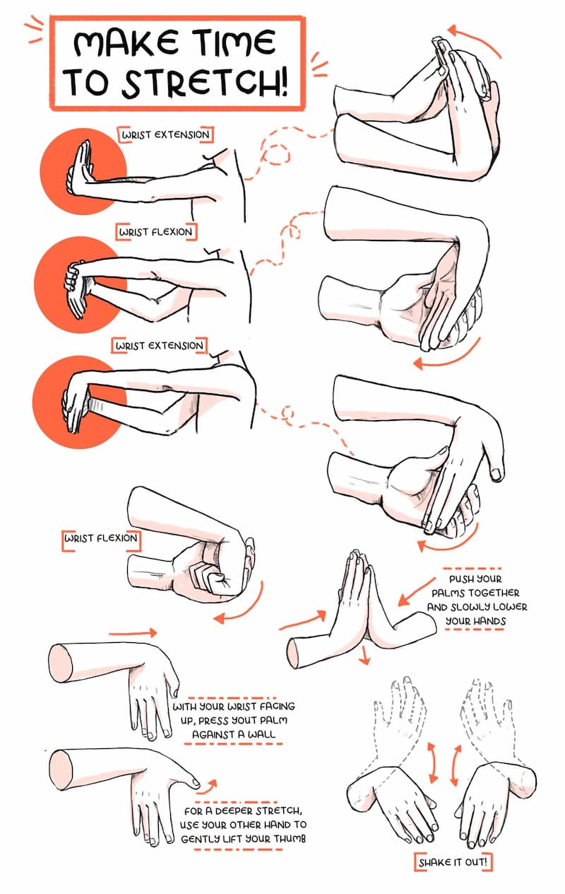
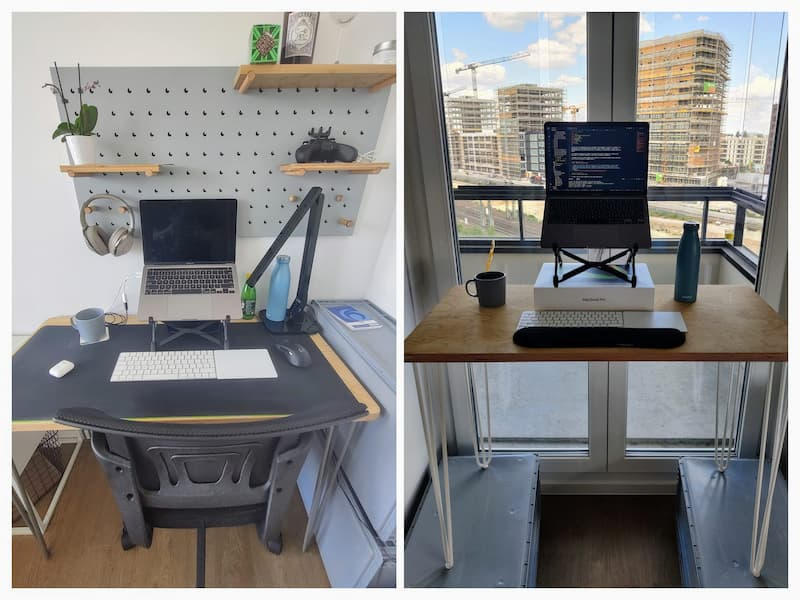
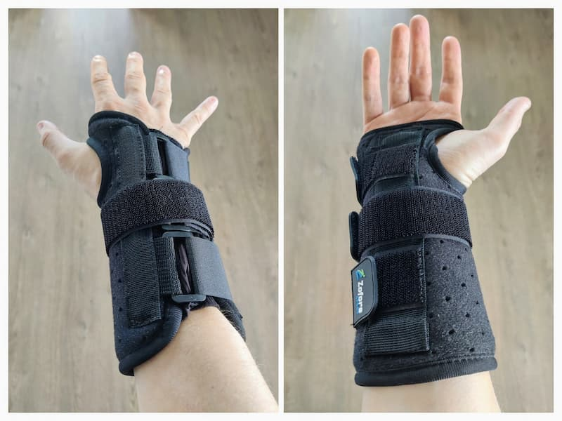

Three months ago, I started feeling a pain in my hands. In the beginning, I ignored it. I thought it
was not going to stay. Then the pain intensified. And I couldn't ignore it anymore. I couldn't use a
keyboard/mouse for more than 10 minutes. After a few minutes, I started to feel a burning pain in my
wrists.

I'm a developer. Working with a laptop is my job and, I love what I'm doing for a living. As you
might guess, I completely freaked out. I don't want to be forced to change job.

_Disclaimer: This post is NOT intended to be a substitute for professional medical advice and should
not be relied on as health or personal advice._

## RSI - Repetitive Strain Injury

> A repetitive strain injury (RSI) is an injury to part of the musculoskeletal or nervous system
> caused by repetitive use, vibrations, compression or long periods in a fixed position. Other
> common names include repetitive stress disorders, cumulative trauma disorders (CTDs), and overuse
> syndrome  
> — [Wikipedia](https://en.wikipedia.org/wiki/Repetitive_strain_injury)

## Step 1: Identifying the cause

Used to work from cafes / co-working spaces. My posture always kept changing. Because of the
lockdown, I had to work from home.

This is how my setup looks like:

<!-- PHOTO HERE  -->

As you can see, it didn't take me long to identify the root cause. Bad posture:

- chair
- shitty desk
- Apple Magic trackpad

## Step 2: Fixing the pain

To fix this pain, I tried several things:

### Tip #1 - Icing

**Long term viable: 🙅‍♂️ - definitely not!**

Fill a bucket of water and ice and put your hand in it for ~3 minutes. All your pain will
disappear... for 20 minutes or so. It feels like magic!

I've been using this technique when the pain was at its peak. I was working with an ice bucket next
to me. But icing only reduces the pain and I don't like to sweep problems under the carpet.

### Tip #2 - Stop video games (Age Of Empires 2)

**Long term viable: 😕 - Not really**

I've been playing Age of Empires 2 for years. If you don't know this game (shame on you!), it's a
strategic game where speed is a key to victory. By speed, I mean to perform a lot of actions per
minute (aka APM).

In other words, it just incompatible with RSI. After playing for a few minutes, my hand was on fire.
I had to stop it.

### Tip #3 - 1 week laptop free

**Long term viable: 🙅‍♂️ - definitely not!**

When I realised that something was wrong with my body, I came to my manager and told him I had to
take a week break for the next week. I told him what's going on and he understood.

To be honest, regardless of my manager's answer, it was clear in my head that I will not work the
following week. Health comes first!

It wasn't the most exciting holidays since I couldn't do outdoor activities (rain+covid lockdown) or
coding/playing video games.

### Tip #4 - Voice Control (control computer with voice)

**Long term viable: 🙅‍♂️ - definitely not!**

This one was inspired by Joshua Comeau. He wrote an
[article](https://www.joshwcomeau.com/blog/hands-free-coding/) where he explains how he writes code
without using his hands (with the voice).

Since I didn't feel ready to invest in dedicated software, I started using
[Voice Control](https://support.apple.com/en-gb/guide/mac-help/mh40719/mac), MacOS's default tool to
interact with your laptop without using a keyboard/mouse. It was a complete disaster!

For navigation it's okay but, when it comes to typing, it becomes unusable. When I say "Type: maxpou
dot fr", it was converted into "Mexboroughblue don't ever ever" 🥲. I guess the algorithm wasn't
trained by a French guy speaking English.

After spending 4h with this tool, I stopped.

### Tip #5 - Doing wrist exercises

**Long term viable: 😕**

Many professionals recommend doing wrist exercises to prevent RSI, even if you don’t have it. Like
many people (I guess), I ignored these recommendations.

It's probably one of the first things I adopted when I started getting RSI symptoms. I did
[these exercises](https://www.youtube.com/watch?v=BPBWIfKTZCI) 3 times a day (5mins / session).

### Tip #6 - Improving my workstation

**Long term viable: 👍**

I'm used to living in short-term accommodations. At the moment I live in Berlin but, I don't think
I'll commit to this city it just temporary and I don't want to invest in a proper setup. I already
have a laptop stand and I use external input devices. I believe it's a good thing for my posture.

Since RSI can be a career killer I had to improve my workstation.

- switched from basic chair to an office chair;
- alternate from a trackpad to a mouse from time to time. But I use the mouse, I've to put the
  trackpad away otherwise my hand goes naturally on the trackpad;
- made a standing desk. I actually use an empty room in my apartment as my 2nd office. You can see
  the standing desk is very basic but it does the job!!! I spend my morning standing and the
  afternoon sitting.
- use wrist rest. I don't find this thing very comfortable when I'm seated. So I only use it when
  I'm standing.

### Tip #7 - Wearing a brace wrist

**Long term viable: 😟**

Wearing a rigid brace wrist when you sleep/do offscreen activities.

### Tip #8 - Taking more breaks

**Long term viable: 🙂 - Yes!**

It's [reccomended](https://www.rsiprevention.com/prevention) to take a 5 minutes break every 20-30
minutes of continuous activity.

- Go to a coffee shop
- Do some hand stretch exercises
- cook
- ...

Also, I use more video calls than used to. You know when a colleague requires some help. Instead of
long slack messages, I tend to favour quick calls with screen sharing sessions.

## Epilogue

3 months after, most of the pain is now gone 🥳! But I still suffer when I spend too much time
typing. I can also use the laptop for recreational use, but I know I've limited time until the pain
comes back. I think I'll have to live with RSI since it's never cured completely.

One of the best things I've learned is not to work harder or longer, but the complete opposite. I
take breaks during my workday. I felt a bit guilty at the beginning but I now realised that it
didn't really affect my productivity.

If you want to get other tips, Swyx gathered a few tips about
[RSI on his blog](https://www.swyx.io/rsi-tips/).
