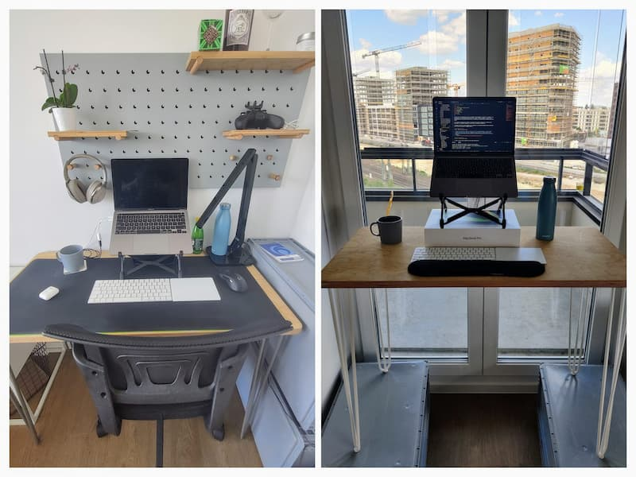

Three months ago, I started feeling a pain in my hands. In the beginning, I ignored it. I thought it
was not going to stay. Then the pain intensified, and I reached a point where I couldn't use a
keyboard/mouse for more than 10 minutes in a row. I quickly realized I had RSI (Repetitive Strain
Injury).

Working with a laptop is a part of my job and, I love what I'm doing for a living. As you might
guess, I completely freaked out. I didn't want to be forced to change jobs.

_Disclaimer: This post is NOT intended to be a substitute for professional medical advice and should
not be relied on as health or personal advice._

## RSI - Repetitive Strain Injury

> A repetitive strain injury (RSI) is an injury to part of the musculoskeletal or nervous system
> caused by repetitive use, vibrations, compression or long periods in a fixed position. Other
> common names include repetitive stress disorders, cumulative trauma disorders (CTDs), and overuse
> syndrome  
> — [Wikipedia](https://en.wikipedia.org/wiki/Repetitive_strain_injury)

## Step 1: Identifying the cause

I'm used to working from cafes / co-working spaces. My posture always kept changing. Because of the
lockdown, I had to work from home.

Here is what my configuration looked like:

It didn't take me long to identify the root cause. Ergonomic was pretty bad:

- a basic chair that can't be adjusted
- a very small desk where my arm can't rest
- Apple Magic trackpad. I only use one screen and I constantly use the trackpad to switch between
  desktops. And doing long travel is bad.

Also, because of the bad equipment, my wrist was "broken" instead of being straight.

## Step 2: Fixing the pain

To fix this pain, I took several actions:

### #1 - Icing

Fill a bucket of water and ice and put your hand in it for ~3 minutes. All your pain will
disappear... for 20 minutes or so. It feels like magic!

I've been using this technique when the pain was at its peak. I was working with an ice bucket next
to me. But icing only reduces the pain and I don't like to sweep problems under the carpet.

### #2 - Stopping video games

I've been playing Age of Empires 2 for years. If you don't know this game (shame on you!), it's a
strategic game where speed is a key to victory. By speed, I mean to perform many actions per minute
(aka APM).

In other words, it's incompatible with RSI. After playing for a few minutes, my hand was on fire. I
also tried to play other games with a gamepad and I ended up with the same pain. I had to stop
playing.

### #3 - Taking a one-week laptop free

When I realized that something was wrong with my body, I came to my manager and told him I had to
take a week break for the next week. I told him what's going on and he understood.

To be honest, regardless of my manager's answer, it was clear in my head that I will not work the
following week. Health comes first!

It wasn't the most exciting holiday since I couldn't do outdoor activities (rain+covid lockdown) or
coding/playing video games.

### #4 - [FAIL!] Using Voice Control (control computer with voice)

I remember a few months ago, I read a blog post from Joshua Comeau, about
[hands-free coding](https://www.joshwcomeau.com/blog/hands-free-coding/). In his article, he
explains how he writes code by using his voice.

Since I didn't feel ready to invest in dedicated software, I started using
[Voice Control](https://support.apple.com/en-gb/guide/mac-help/mh40719/mac), MacOS's default tool to
interact with your laptop without using a keyboard/mouse. It turned into a complete disaster!

For navigation it's okay but, when it comes to typing, it becomes unusable. When I say "Type: maxpou
dot fr", it was converted into "Mexboroughblue don't ever ever" 🥲. I guess the algorithm wasn't
trained by a French guy speaking English.

After spending 4 hours with this tool, I gave up.

### #5 - Doing wrist exercises

Many professionals recommend doing wrist exercises to prevent RSI, even if you don’t have it. Like
many people (I guess), I ignored these recommendations.

It's probably one of the first things I adopted when I started getting RSI symptoms. I did
[these exercises](https://www.youtube.com/watch?v=BPBWIfKTZCI) 3 times a day (5mins / session). I
also set an alarm on my phone not to forget.

### #6 - Improving my workstation

I'm used to living in short-term accommodations. At the moment I live in Berlin but, I don't think
I'll commit to this city. It is just temporary and I don't want to invest in a proper setup. I
already have a laptop stand and I use external input devices. I believe it's a good thing for my
posture.

Since RSI can be a career killer I had to improve my workstation.

- switched from basic chair to an office chair;
- alternate from a trackpad to a mouse from time to time. But I use the mouse, I've to put the
  trackpad away otherwise my hand goes naturally on the trackpad;
- made a standing desk. I actually use an empty room in my apartment as my 2nd office. You can see
  the standing desk is very basic but it does the job!!! I usually spend my morning standing and the
  afternoon sitting.
- use wrist rest. I don't find this thing very comfortable when I'm seated. So I only use it when
  I'm standing.

It's not perfect but, I feel better at the end of the day!

### #7 - Wearing a brace wrist

I bought this brace wrist based on advice. I read that wearing a rigid brace wrist when you sleep/do
offscreen activities can be beneficial. It's very uncomfortable to wear one when you're
eating/cooking or at the shop. So, I only used mine when I slept.

It took me a few days to get used to it. But I think wearing it for a month was beneficial to me.

### #8 - Taking more breaks

It's [recommended](https://www.rsiprevention.com/prevention) to take a 5 minutes break every 20-30
minutes of continuous activity. I've found out that there are many occasions to take a break:

- Go to the coffee shop
- Do some hand stretch exercises
- Cook
- Prepare coffee
- ...

Also, I use more video calls than used to. You know when a colleague requires some help. Instead of
long slack messages, I tend to favour quick calls with a screen sharing session.

## Epilogue

5 months after, most of the pain is now gone 🥳! But I still suffer when I spend too much time
typing. I can also use the laptop for recreational use, but I know I've limited time until the pain
returns. I think I'll have to live with RSI since it's never cured completely.

One of the things I've learned is to work smarter. I also take more breaks during my workday. I felt
a bit guilty at the beginning but, I now realized that it didn't really affect my productivity.

I couldn't finish this article without mentioning Swyx and his great post about
[RSI (swyx.io)](https://www.swyx.io/rsi-tips/). His blog post was like a gold mine to me.
