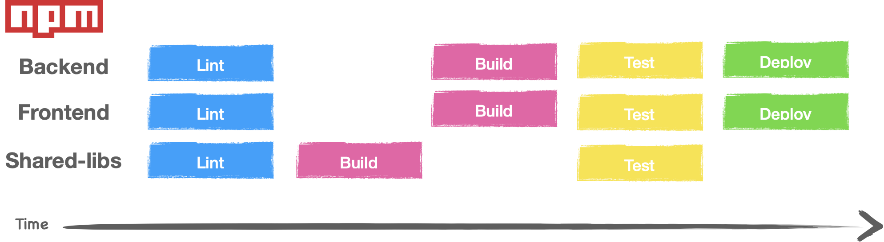
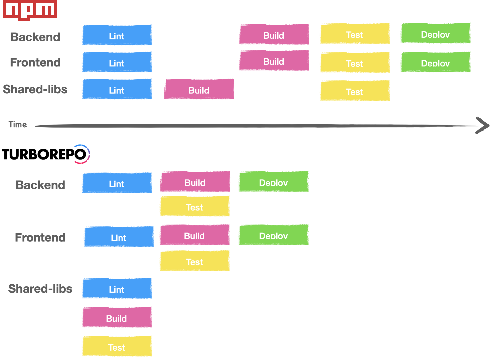
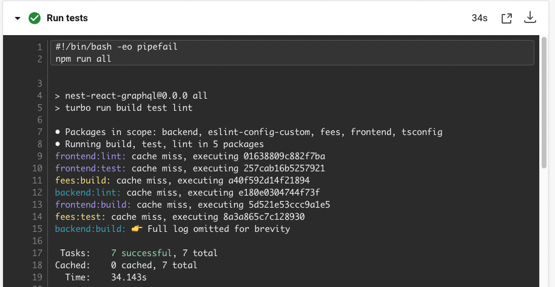
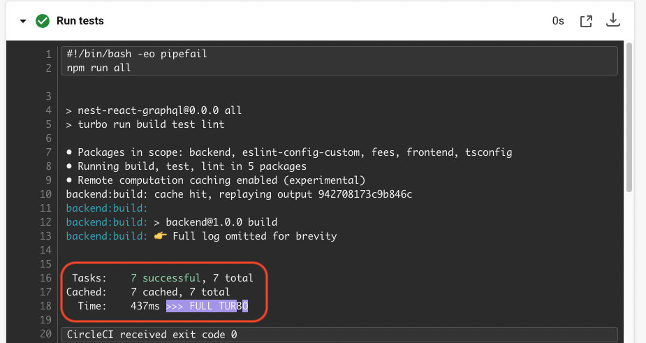
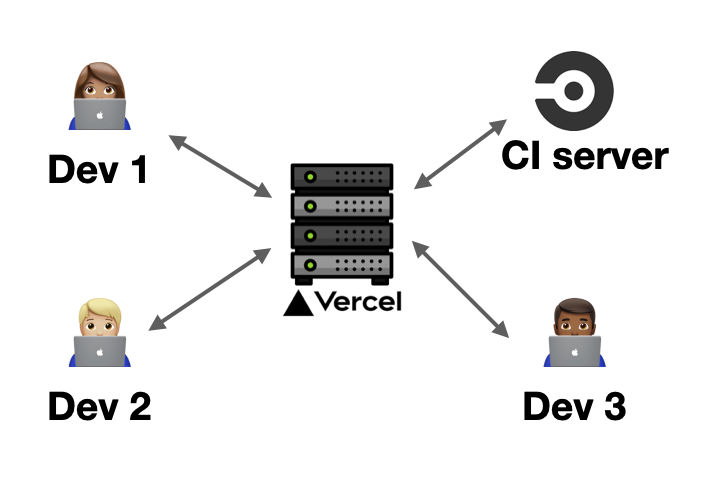

import Warning from '../../../../src/components/MDX/Warning'

I have been working with monorepos for a couple of years now. I really like to have everything in
one place. But this architectural style [often comes with cons](/monorepo-pros-and-cons). My biggest
pain point: the Continuous Integration (CI)! This is usually something quite painful, mostly when
you have packages depending on each other.

Let's say I have a monorepo with 3 packages:

- frontend: the frontend app;
- backend: the backend app;
- shared-libs: some code that can be shared between Backend and Frontend.

My CI pipeline should look like something similar:



And, inside my jobs, something like this:

```bash
# lint all
npm run lint --workspaces --if-present

# build all
npm run build --workspace=shared-libs
npm run build --workspace=frontend --workspace=backend

# test&deploy all
npm run test --workspaces --if-present
npm run deploy --workspaces --if-present
```

But now if I add a new package that depends on `shared-libs`, I will have to rethink my entire
pipeline. In my previous company we had between 35 and 40 packages in a single monorepo. I will let
you guess how complex it was to manage ;)

But, that was before Turborepo.

## Turbo's Pipelines to the rescue

In a nutshell, Turborepo is a tool that manages the monorepo complexity. One of his core concepts is
the "pipelines", an option in the turbo config file where you can define the relation between the
packages and also the jobs.

Mine look like this:

```json
{
  "$schema": "https://turborepo.org/schema.json",
  "baseBranch": "origin/main",
  "pipeline": {
    "build": {
      "outputs": ["dist/**", "build/**"],
      "dependsOn": ["^build"]
    },
    "lint": {
      "outputs": []
    },
    "test": {
      "dependsOn": ["^build"],
      "outputs": []
    },
    "dev": {
      "cache": false
    },
    "deploy": {
      "dependsOn": ["build", "test", "lint"],
      "outputs": []
    }
    // ...
  }
}
```

Then with the config, turbo will be able to optimise my entire deployment pipeline.



With only one command:

```bash
npx turbo run build test lint deploy
```

## Caching

Another part where this tool shine is the cache. Turbo can detect if a task needs to be run or not
based on the previous execution. If it hits a cache, it will return the logs previously cached. In
this way, commands like `npx turbo run build test lint` can take less than a second.  
This is very convenient when you change the colour of a button, you don't want to run all the
lint/test/build on the backend app.

You can also configure jobs like test to only refresh the cache if a js/ts file was changed.

<Warning title="Heads-up!">
  Keep in mind that cache is like a double-edged tool. If it's badly configured, turbo won't detect
  a change and can give you a false positive!
</Warning>

## Sharing the cache

On my first attempt, I did manage to run the entire build steps in ~34s (it's more or less a "hello
world" project). In the real-world scenario, it's usually longer than that.

To reduce this time, the Turborepo team added something quite smart: a shared cache. This feature
allows you to share your turborepo cache with your colleagues... and your CI!

**Before:** without cache - 34s  


**After**: with a shared cache - 0.437s 🤩  


**How does it work?**

The shared cache is hosted on the Vercel servers. What you have to do is to follow the steps on
[the documentation](https://vercel.com/docs/concepts/monorepos/remote-caching). I've made my tests
with my freemium account. But keep in mind that this is a paid feature for teams.



## Let's recap

I haven't tried this tool in a production environment (not yet). But, my experiments went really
smoothly. The ability to not execute tasks that have been done before is definitely the biggest pro.
I wish I knew this tool back in the day when I was managing my previous company's monorepo!

There are also some little extras I didn't mention like generating a dependency graph (with
Graphviz).

I have a plan to bring this tool to my company monorepo. I may add a “follow-up” section when I have
more to share!
