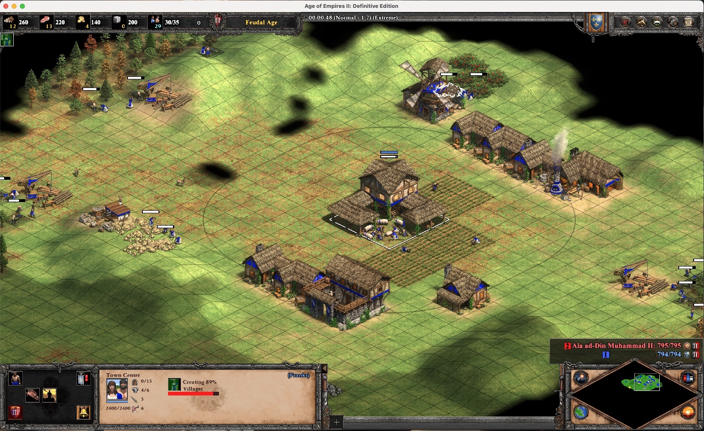
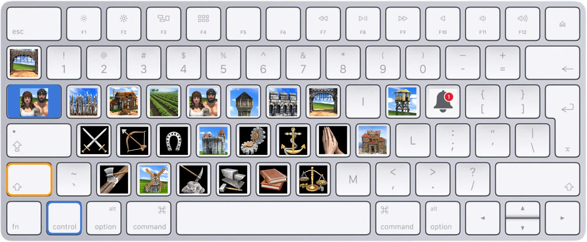

import Warning from '../../../../src/components/MDX/Warning'

Age of Empire 2 is one of my favourite games. I've been playing it since I was a kid and now, since
the release of the Definitive Edition, I started playing it again. I play with my Mac (M1 model) and
people on the internet often ask how I do it. So, here's a quick guide.

Keep in mind that this setup is intended for Silicon chips (M1, M1 max, M2 etc.). If you have an
Intel processor, I recommend using [Boot Camp](https://support.apple.com/en-us/HT201468).

## Option 1 - Crossover

I'm using Crossover which is a paid product.

1. Install [Crossover](https://www.codeweavers.com/crossover#mac) - You can easily find coupons
   online or start with the free trial.
2. On Crossover, clicks "+ Install" and install the "steam" bottle.
   - It should install a Windows 10/64-bit bottle.
   - on the bottle settings, make sure DXVK is enabled
3. Open Steam, log in and install the game
4. Download
   "[ucrtbase.dll](https://community.pcgamingwiki.com/files/file/2081-ucrtbasedll-extracted-from-microsoft-visual-c-2015-redistributable-update-3-rc/)"
5. On the steam bottle, right-click > Open C: drive and place the dll and C:/Windows/System32 (you
   should replace the existing dll).
6. Start the game and enjoy!

<Warning title="Heads-up!">
  A recent update broke the game on Crossover v22. I recommend you to install version 23
  ([details](https://www.codeweavers.com/compatibility/crossover/forum/age-of-empires-ii-definitive-edition?;msg=278919#c35)).
</Warning>

## Option 2 - GeForce NOW

GeForce NOW is the Nvidia cloud gaming platform. Technically, the game won't run on your mac but on
a remote server. But with a good internet connexion, you will barely notice it. The step to start
the games are pretty straightforward:

1. [Download GFN for Mac OS](https://www.nvidia.com/en-us/geforce-now/download/)
2. Create a GFN account, connect your Steam account
3. Select the game and click pay.

I tried it, with my account (on a freemium plan you can play up to 1h/day). I was pleasantly
surprised to see that all my hotkeys, mods and game settings were already there.

Although the game is very fluid, the graphics are not great (maybe because I'm on a free plan).

## Hotkeys

Before starting, keep in mind that hotkeys are personal. I extended the default hotkeys to match my
preferences.

I ended up with this:

I follow a simple logic: if `A` is the key for my barrack, then `ctrl + A` is "Go to Barrack" and
`shift + A` is "Select all Barracks".

For quick walking, Q / Y are also associated with the "villager build" command

Additionally, I use my mouse buttons for this:

- Wheel + up / down - Next idle military unit / Unit stop. (I also use the wheel for rotating doors)
- Mouse extra 1 - Select all TC
- Mouse extra 2 - Go to the next idle villager
- Mouse extra 3 - Go to the last notification (or P)

Your hotkey file will be available here:
`/Users/{MACOS_USER}/Library/Application Support/CrossOver/Bottles/Steam/drive_c/users/crossover/Games/Age of Empires 2 DE/{YOUR_STEAM_ID}/`

## Mods

Again, this is also something very personal. But, here are the mods I use:

- Advanced Idle Pointer
- No more plants
- Short walls
- Anne_HK - New Fish Border
- Anne_HK - Better Resource Panel and Idle Villager Icon
- Anne_HK - Bigger and Eye-catching Relic
- Anne_HK - Selected Small Trees with Grid Shadow
