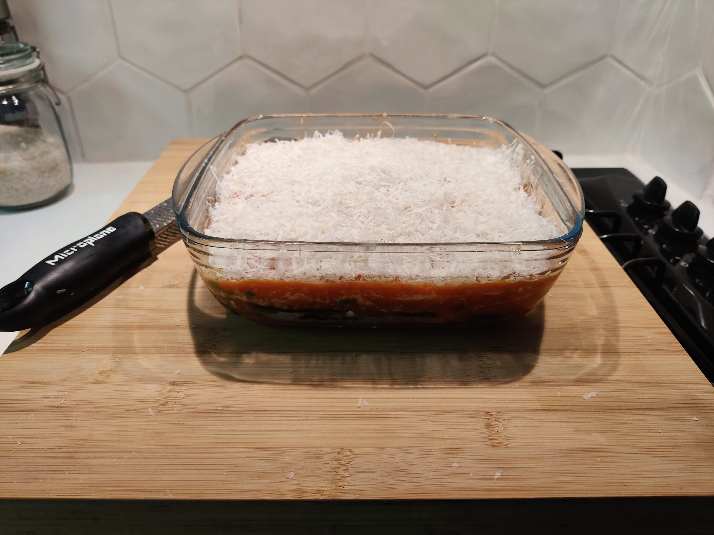

This is a classic Italian dish made with layers of eggplant. The fact that the eggplant is fried,
removed it from the healthy category.

## Ingredients (for 6 persons)

- 2 aubergines
- ~8 tomatoes
- 3 cloves of garlic
- Basil. A lot!
- Parmigiano Reggiano
- Mozzarella (1 or 2 balls)
- Olive oil, salt, pepper

## Steps

### Prepping the eggplant

1. Slice the eggplant lengthwise. Slices should be 0.5 - 0.8cm thick
2. To drain the water, salt both sides of the slices and place them in a grid.
3. After ~30min to 1 hour, rinse them to remove the salt.
4. Dry the slices with absorbent paper
5. Prepare a hot pan with neutral oil
6. Cover each slice with flour and fry them in the pan
7. Once it’s fried, remove the extra oil with absorbent paper

The fried eggplant is crispy on the outside and soft and creamy on the inside

### Prepping the tomato sauce

1. In a hot pan, put the tomato and garlic.
2. Reduce until it’s a slightly chunky and thick sauce. You can help yourself with a hand blender.

### The Parmigiana

1. In a baking dish add some tomato sauce in the bottom
2. Cover everything with eggplant
3. Add one layer of chopped basil
4. Add one layer of parmesan and mozzarella (1/2 ball)
5. Repeat until you run out of eggplant.
6. Finish with a big layer of parmesan
7. Bake for 30-40 mins at 180℃. You know it’s ready when the top becomes melted and bubbly

