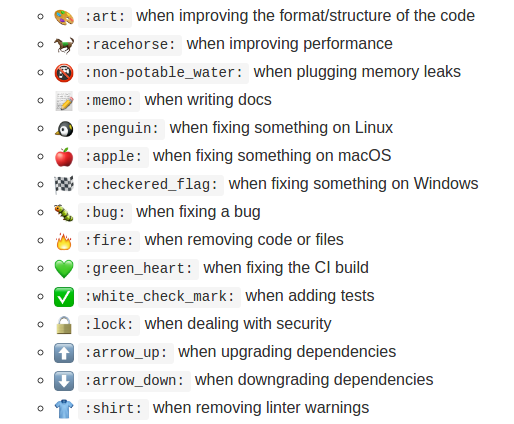

Summary:

- [GitHub = git + hub (Manage your repo by CLI)](#github--git--hub-manage-your-repo-by-cli)
- [Github AKA SVNHub?](#github-aka-svnhub)
- [Markdown on steroid (Github Flavored Markdown)](#markdown-on-steroid-github-flavored-markdown)
- [Gist, another kind of repository](#gist-another-kind-of-repository)
- [Issue/Pull request Templates](#issuepull-request-templates)
- [Github Pages ❤️️](#github-pages-%EF%B8%8F%EF%B8%8F)
- [Sign your commits](#sign-your-commits)
- [Playing with URL](#playing-with-url)
  - [URL everywhere](#url-everywhere)
  - [Disable whitespace on code review](#disable-whitespace-on-code-review)
  - [.diff and .patch](#diff-and-patch)
  - [Highlight lines](#highlight-lines)
  - [Filtering commits](#filtering-commits)
- [Keyboard shortcuts](#keyboard-shortcuts)
- [Emoji 😍](#emoji-)
- [git.io a Github URL shortener](#gitio-a-github-url-shortener)
- [Not only for your code](#not-only-for-your-code)
- [API (~REST or GraphQL)](#api-rest-or-graphql)
- [Bonus: Octodex](#bonus-octodex)

## GitHub = git + hub (Manage your repo by CLI)

[Hub](https://hub.github.com) is a command line wrapper for Git. Once installed, you can use this
new git commands:

- `pull-request` Open a pull request on GitHub
- `fork` Make a fork of a remote repository on GitHub and add as remote
- `create` Create this repository on GitHub and add GitHub as origin
- `browse` Open a GitHub page in the default browser ❤️
- `compare` Open a compare page on GitHub
- `release` List or create releases (beta)
- `issue` List or create issues (beta)
- `ci-status` Show the CI status of a commit

```bash
alias git='hub'
```

Using ZSH? Don't forget to add the plugin!

```bash
#~/.zshrc file
plugins=(git github ...)
```

## Github AKA SVNHub?

You're not using Git? It doesn't matter, GitHub also support Subversion!

```bash
# instead of using:
git clone https://github.com/user/repo
# you can do exactly the same with svn:
svn co --depth empty https://github.com/user/repo
```

...but who uses SVN anyway? ;-)

## Markdown on steroid (Github Flavored Markdown)

Github use his own version of markdown: Github Flavored Markdown (GFM). It provides severals
additional features such as:

- Task lists (`- [ ] <task description>`). On the issue summary, a task list will also appear
  ([example](https://github.com/maxpou-slides/github-tips-tricks/issues))

  ```markdown
  Todo:

  - [x] Write an article about Github tips and tricks
  - [ ] Conquer the world
  ```

  

- Tables:

  ```markdown
  | First Header | Second Header |
  | ------------ | ------------- |
  | Content Cell | Content Cell  |
  | Content Cell | Content Cell  |
  ```

- Syntax color

  ````markdown
  ```javascript
  console.log('youpi')
  ```
  ````

- reference commits/issues/PR ...

- Other interesting HTML tags such as details/summary tags (kind of spoiler tag)

  ```html
  <details>
    <summary>License (MIT)</summary>
    The MIT License (MIT) Copyright (c) 2017 Maxence POUTORD Permission is hereby granted, free of
    charge, to any person obtaining a copy of this software and associated documentation files (the
    "Software") [...]
  </details>
  ```

  The output will be like this: _(click on License)_

  <details>
    <summary>License (MIT)</summary>
    The MIT License (MIT) <br />
    Copyright (c) 2017 Maxence POUTORD
    <br />
    Permission is hereby granted, free of charge, to any person obtaining a copy of this software
    and associated documentation files (the "Software") [...]
  </details>

## Gist, another kind of repository

Each [gist](https://gist.github.com/) is a Github repository. So you can clone and fork them,
exactly like a Github repository:

```bash
git clone https://gist.github.com/maxpou/e6cad8d4699f731c86df628358cba3d6
```

By the way, if you are not logged into Github while creating this gist, it will be an Anonymous
gist. Note that Anonymous gists are hard to delete (need to contact Github).

## Issue/Pull request Templates

Everyone who maintain an open source project on Github had already get this kind of message:

> User1: It's not working on my Machines You: Can you provide the version? And the steps to
> reproduce?
>
> User2: It's not working... You: Can you provide the version? And the steps to reproduce?

To avoid this repetitive task, you can add an issue template to your repository.

```markdown
(ISSUE_TEMPLATE.md)

| Q                | A      |
| ---------------- | ------ |
| Bug report?      | yes/no |
| Feature request? | yes/no |
| BC Break report? | yes/no |
| RFC?             | yes/no |
| Tool version     | x.y.z  |

**Description**

**Version concerned**

**Steps to reproduce the issue:**

1.
2.
3.

**Expected Results:**

**Actual Results:**

**Additional details:**
```

Now you can ensure that each contributors will provide the corrects informations! You can do exactly
the same with Pull-request content (_"what does it fix? Tests status?"_). In this case, call this
file: PULL_REQUEST_TEMPLATE.md.

## Github Pages ❤️️

Github can host severals type of websites:

- plain old HTML pages (can be interesting if you want to test the last trending JS Framework!);
- blogs which use **[Jekyll](https://jekyllrb.com/)**, like this blog where you read this lines :)
  [github.com/maxpou/maxpou.github.io](https://github.com/maxpou/maxpou.github.io).

To deploy, `git push` and that's all!

There is severals url pattern:

- `<username/organisationName>.github.io`
- `<username/organisationName>.github.io/projectname`. In this case, you need to push the
  HTML/Jekyll files in a branch call gh-pages.
- ... or whatever custom domain. In this case, put a CNAME file on your repository. Further more
  informations are available
  [in the documentation](https://help.github.com/articles/using-a-custom-domain-with-github-pages/).

You can also
[secure your Github Pages site with HTTPS](https://help.github.com/articles/securing-your-github-pages-site-with-https/).
Unfortunately it is not compatible with custom domains.

Personally, I'm a big user of Github Pages. For now, they currently host this website
([www.maxpou.fr](https://www.maxpou.fr/)), an other one dedicated to my slides
([slides.maxpou.fr](https://slides.maxpou.fr/)), some Proof of Concepts (_ie:
[Dictionary Game](https://github.com/maxpou/dictionary-game) with VueJs 2_) and all of my slides (I
put them into an [organization](https://github.com/maxpou-slides) for a better visibility).

For managing dependencies, I recommend you to use
[Git submodules](https://git-scm.com/book/en/v2/Git-Tools-Submodules). For instance my slides
repositories use [RevealsJS](https://github.com/hakimel/reveal.js/). I don't want to manage this
library inside each repositories. It is exactly the same for my
[Vim plugins](https://github.com/maxpou/dotfiles/tree/master/vim/bundle). I prefer stock a reference
to the repositories in my dotfiles instead of the repository itself.

## Sign your commits

As you may know, every body can hijack your job. You just need to change your git config and that
it!

```bash
git config --global user.name 'Linus Torvalds'
git config --global user.email linus@fake.com
```

Now, you can usurp the identity of someone else! To avoid this, you can sign a commit. It works with
GPG key.


## Playing with URL

### URL everywhere

One of GitHub's motto is: _to exist, each action must have a specific URL_. By action, I mean:

- commit
- pull request
- comment (on commit, issue, pull request...)
- ...

### Disable whitespace on code review

If a commit is polluted by whitespace simply add `?w=1` at the end of the URI.


Example:
[with](https://github.com/maxpou-slides/github-tips-tricks/commit/2616cbecc713389f8455b066711bc74891a593a6)
and
[without](https://github.com/maxpou-slides/github-tips-tricks/commit/2616cbecc713389f8455b066711bc74891a593a6?w=1)
whitespace pollution.

### .diff and .patch

You can generate a diff/patch file by adding **.diff** or **.patch** at the end of the
Pull-request/commit.

Example:

- Original commit:
  [github.com/user/repo/commit/example](https://github.com/maxpou/maxpou.github.io/commit/470da95b366bbb3efd8fa481308c906c955304db)
- Diff:
  [github.com/user/repo/commit/example.diff](https://github.com/maxpou/maxpou.github.io/commit/470da95b366bbb3efd8fa481308c906c955304db.diff)
- Patch:
  [github.com/user/repo/commit/example.patch](https://github.com/maxpou/maxpou.github.io/commit/470da95b366bbb3efd8fa481308c906c955304db.patch)

### Highlight lines

When visualizing a commit, click on the line number to highlight one line. You can now share the
link:
[github.com/user/repo/commit/example#L3-L5](https://github.com/maxpou/dictionary-game/blob/77df749b615b76d661a6bead1084be5650fd438e/.travis.yml#L3-L5)

For multiple, press shift _(or play with url!)_.

### Filtering commits

A last URL tip, is filtering in URL. If you want to retrieve one of your commit, you can suffix the
URL with `?author=user`.

## Keyboard shortcuts

Even if it's a web application, using your mouse isn't mandatory. In fact, GitHub offer a lot of
different shortcuts. To see them, just press " ? " _(doesn't matter where you are!)_.


## Emoji 😍

Good news, you can use emoji (almost) everywhere on Github!  
But they aren't only present to decorate your text. For example, I prefix everything related to
Docker (repositories/commits) with a whale icon.

A better implementation is the
[Atom contributing's style guides](https://github.com/atom/atom/blob/master/CONTRIBUTING.md#styleguides):



Here's a good [cheat sheet](http://www.webpagefx.com/tools/emoji-cheat-sheet/).

After your can run the following command:

```bash
git log --grep=":penguin:"
```

## git.io a Github URL shortener

[git.io](https://git.io/) is an URL shortener 5such as bit.ly) for your GitHub repositories.

## Not only for your code

GitHub can host specific files like PDF, stl (3D visualisation) and render them. Example with this
file:
[github.com/skalnik/secret-bear-clip/blob/master/stl/clip.stl](https://github.com/skalnik/secret-bear-clip/blob/master/stl/clip.stl)

<script src="https://embed.github.com/view/3d/skalnik/secret-bear-clip/master/stl/clip.stl"></script>

## API (~REST or GraphQL)

Github provide 2 types of API:

- https://api.github.com/
- https://developer.github.com/early-access/graphql/explorer/

{/* prettier-ignore */}
<blockquote class="twitter-tweet" data-lang="en"><p lang="en" dir="ltr">Playing with GitHub GraphQL API 😀 - <a href="https://t.co/Mo2X9HX3l4">https://t.co/Mo2X9HX3l4</a> <a href="https://t.co/9lA5dylfDN">pic.twitter.com/9lA5dylfDN</a></p>&mdash; Maxence POUTORD (@_maxpou) <a href="https://twitter.com/_maxpou/status/776343643867254784">September 15, 2016</a></blockquote>
<script async src="//platform.twitter.com/widgets.js" charset="utf-8"></script>

## Bonus: Octodex

[Octodex (octodex.github.com)](https://octodex.github.com/) is an Octocat gallery, the mascot of
GitHub.


