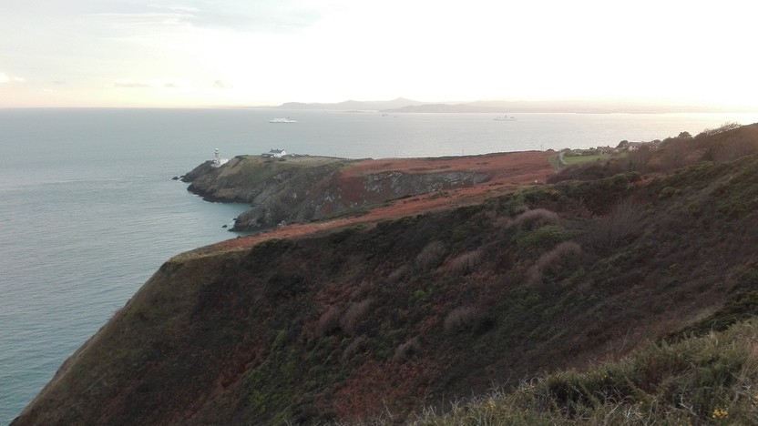

Ca va faire bientôt 8 mois que j'ai quitté Nantes pour venir m'installer en Irlande, à Dublin.
Pourquoi partir ? Comment ça se passe ? Et puis surtout, est-ce que ça vaut le coup ?

## Mais pourquoi ?

Mais oui pourquoi ? A vrai dire, tout se passait pourtant plutôt bien : il faisait plutôt bon vivre
à Nantes, je travaillais dans bonne boîte... Et puis vient ce jour où j'ai vu ce type à une
conférence. Lors de sa présentation, il dit qu'il bosse chez Google à la Silicon Valley. Là, avec
les collègues on était tous à l'envier et se dire qu'on aimerait bien faire pareil mais que l'on ne
pouvait pas parce que [insérez ici la raison de votre choix qui fait que ce n'est pas de votre
faute]. Vous savez tous ces trucs qu'on dit et que l'on ne fait jamais parce que l'on flippe trop de
sortir de sa zone de confort !

_Larry Smith parle très bien de ce biais (cognitif) d'autocomplaisance._

<iframe src="https://embed.ted.com/talks/lang/fr/larry_smith_why_you_will_fail_to_have_a_great_career" width="640" height="360" frameborder="0" scrolling="no" webkitAllowFullScreen mozallowfullscreen allowFullScreen></iframe>

C'est fou les barrières que l'on peut s'inventer juste par plaisir d'échouer (ou par flemme d'aller
au bout de ce que l'on souhaite vraiment) ! Et puis, il y avait aussi une soudaine volonté de vivre
un truc un peu plus fort émotionnellement que de la traditionnelle cuite du samedi soir. Un jour,
cette idée est devenue une évidence.

Après avoir longuement hésité, j'ai finalement opté pour Dublin pour les raisons suivantes :

- pays anglophone,
- pas trop loin (à 1h30 de vol),
- pas de visa, la carte d'identité suffit (je souffre aussi de phobie administrative),
- ... et surtout un bon feeling !

J'ai donc dit au revoir aux copains, quitté mon appart et démissionné de mon job. La préparation
s'est un peu faite en mode YOLO : un billet aller simple, une semaine de réservation en auberge de
jeunesse via [Hostelworld.com](http://www.hostelworld.com) _(et biiim un peu de pub !)_ et le tour
était joué.

Pas de boulot, pas d'appart, rien, que dal.

## Hello ~~world~~ Dublin !

Par le passé, j'étais déjà parti quelques fois à l'étranger, mais jamais tout seul. J'appréhendais
de me retrouver tout seul, mais c'est tout le contraire qui s'est produit. A vrai dire, je n'ai
jamais rencontré autant de monde et d'horizons si différents en si peu de temps. Il faut dire que la
case auberge de jeunesse aide énormément.

Mais tout n'a pas non plus été tout rose. Ma plus grosse claque a été la barrière de la langue.
J'étais conscient que mon anglais était vraiment médiocre, mais pas à ce point ! J'ai donc vécu ces
moments où l'on se sent comme une plante verte au milieu d'une pièce, dans l'incapacité de
comprendre et d'interagir avec ce qu'il se passe autours. Et puis il y a aussi d'autres moments un
peu plus fun. Par exemple, la première fois que je suis allé chez le coiffeur, j'étais le seul mec
dans le salon rempli de nanas qui me regardaient étrangement. J'ai découvert hier que le mot
_coiffeur_ avait deux traductions (_hairdresser_ coiffeur féminin / _barber_ pour coiffeur
masculin). Google Translate est peut-être un bon ami, mais il sait aussi être blagueur.  
Aujourd'hui, mon anglais s'est considérablement amélioré et je n'ai (presque) plus aucuns soucis à
communiquer. Même si l'accent irlandais reste vraiment très difficile à saisir...

Un bon conseil pour améorer son anglais c'est d'éviter les nombreuses
[communautés Françaises à Dublin](https://www.facebook.com/groups/dublinexpat/) (ce groupe facebook
est parfois très utile !).

<iframe width="560" height="315" src="https://www.youtube.com/embed/yKUCvio-g5A" frameborder="0" allowfullscreen></iframe>

## Trouver un logement

Bon je vais parler des trucs qui fâchent dès le début comme ça se sera fait. Chercher un logement à
Dublin est aussi agréable que de se mettre une pomme de pin dans le c#%. Il faut dire qu'il y a un
fossé énorme entre l'offre et la demande. Entre les prix ahurissants, les problèmes d'humidité,
appartements crades, les
[arnaques](http://www.independent.ie/irish-news/exclusive-45-people-1-shower-up-to-10-in-a-room-the-harsh-reality-of-life-in-a-dublin-flat-35137036.html)...
il y a vite fait de se décourager. Et malheureusement, rien ne va en s'améliorant.

Lors de ma toute première visite, le proprio a fait rentrer 30 personnes en même temps dans l'appart
pour 4 chambres. 30 personnes dans un appart !!! C'était un peu comme une soirée, sauf que c'était
le jour, qu'il n'y avait pas d'alcool et que tout le monde tirait la tronche.

Une bonne annonce obtient ~150 mails dès la première heure. La recherche est donc un job à plein
temps où il faut être à la fois réactif et disponible. Et c'est encore pire lorsque l'on arrive en
septembre avec les étudiants !

<blockquote class="twitter-tweet" data-lang="en">
Finding an flatsharing in Dublin isn&#39;t easy... In 2 minutes 400 views !!! <a href="https://t.co/xzohGO2nAY">pic.twitter.com/xzohGO2nAY</a>
&mdash; Maxence POUTORD (@_maxpou) <a href="https://twitter.com/_maxpou/status/775317194393677824">September 12, 2016</a></blockquote>

Après 3 semaines de recherche (à quasi temps plein), j'ai enfin trouvé mon chez moi en plein
centre-ville comme je le souhaitais !

## Boulot & tech

J'avais tâté un peu le terrain avant de partir en mettant mon CV sur un job board. C'était de la
folie, j'ai reçu une flopée de messages. J'ai donc tout retiré et décidé d'attendre d'avoir un
logement avant de me remettre en recherche d'emploi.

Il y a aussi énormément de boîtes de recrutement. Comme en France, leur rémunération est indexée sur
le fait que vous soyez pris ou non à l'issue de la période d'essai (6 mois) ainsi que votre valeur
(salaire). Ne leur faites donc pas aveuglement confiance. Par contre, ils se chargent de négocier le
salaire (utile si vous n'êtes pas à l'aise). Ils vous diront aussi si vos prétentions salariales
sont dans les clous ou non. A ce propos, les salaires ici sont vraiment plus avantageux qu'en France
(province).

Après quelques entretiens, j'ai rejoint Hostelworld.com début novembre. C'est le n°1 des sites de
réservation d'auberge de jeunesse. Je suis dans une équipe pleinement multiculturelle (2 Irlandais,
1 Polonais, 1 Espagnol, 2 Italiens, 1 Vénézuélien et 1 Lituanien). Vu qu'il est difficile de
recruter des développeurs (comme partout ailleurs), beaucoup d'entreprises proposent des à-côtés
souvent très intéressants pour fidéliser les salariés. C'est le cas de mon entreprise qui propose
entre autres boissons (jus de fruits / thé / café / sodas), fruits et gâteaux (en tous genres) en
libre-service ainsi que d'autres à côtés assez plaisants. J'avais déjà vu des choses qui allaient
dans ce sens, mais jamais autant ! Il faut dire que la présence des
<abbr title="Google Apple Facebook Amazon Microsoft">GAFAM</abbr> y joue aussi pour beaucoup.
D'ailleurs si vous souhaitez rentrer dans ce type de boîte, faites ça bien en avance car les process
de recrutement prennent souvent plusieurs mois.

Dublin a énormément de meetups tech. Il n'y a qu'à se rendre sur
[meetup.com](https://www.meetup.com/cities/ie/dublin/tech/) pour voir l'étendue des technos
représentées. Seul hic, il n'y a pas de gros meetup sur une ou plusieurs journées (style
Devoxx/DevFest).

## La vie à Dublin

 _Howth, à 20 minutes de Dublin_

La ville en soit n'est vraiment pas très grande, ce qui permet de (presque) tout faire à pieds. Un
vrai bonheur ! En marchant moins d'une demi-heure à pieds du centre on tombe vite sur des petites
maisons... à se demander si l'on est réellement dans une capitale ! J'ai souvent cette impression
que les Irlandais se sont réveillés que très récemment sur certains sujets (transport, logement...).

Une bonne partie des habitants de Dublin ne sont pas Irlandais (il y a énormément d'expatriés). De
ce que j'en ai vu les Irlandais sont très terre à terre, peace et accueillants. Ce qui m'étonne le
plus, c'est leur capacité à éviter le conflit coûte que coûte. Ça a des avantages, mais aussi des
inconvénients. Par exemple, s'ils n'aiment pas quelque chose, ils ne le diront pas forcément. J'ai
souvent l'impression que les sujets importants ne sont pas traités par peur de vexer quelqu'un. Sur
ce point on est plutôt dans l'autre extrême en France. Après, accepter la culture du pays qui nous
accueille fait partie intégrante de l'expatriation.

Impossible d'aller en Irlande sans rentrer dans un **pub** ! Attention, je ne parle pas du PMU du
coin, non du tout ! Ici, c'est une véritable institution, Dublin et son comté en aurait plus de 700
! Il faut imaginer le pub une sorte de lieu social où on va pouvoir trouver dans un même espace des
jeunes, des moins jeunes, des types en costard qui sortent du travail. Dans certains pubs, il y a de
la musique traditionnelle et des danseurs de claquettes. Ah oui, les irlandais sont plutôt fiers de
leur culture. Par contre, si comme moi vous raffolez des bières belges, faites attention, les
Irlandais eux n'en raffolent pas. Ils consomment pas mal de Guinness d'autres bières Irlandaises
(qui font toutes 4-5°). Ha et oui deuxième point de vigilance : le cidre, présent dans la moitié des
tireuses. On a vite fait de se planter en pensant découvrir une nouvelle bière !

Et enfin en bon français que je suis, difficile aussi de ne pas parler de nourriture. Déjà, comme
pour n'importe quel autre pays, on oublie le saucisson, les crêpes, fromages (ici il n'y a que du
cheddar et de la mozzarella), la charcuterie, le bon pain... En revanche on trouve dans les rayons :
des spaghettis en boîte _(si si, ils ont osé)_, des fruits et légumes _(qui ne cassent pas 3 pattes
à un canard)_, beaucoup de trucs pas très sains et du takeaway (sandwich). Seul point positif : la
viande de bœuf est un régal. Pour pallier ces difficultés, je fais mes courses dans 3 magasins
différents.

## L'herbe est-elle plus verte ici ?

Comme chaque ville/pays, Dublin a son lot
d'[avantages et d'inconvénients](http://nearlyirish.blogspot.ie/2016/09/is-grass-greener-on-other-side.html).
Sur les réseaux sociaux je vois pas mal de Caliméro se plaindre de ci ou de ça.

Alors oui, la question du logement est catastrophique, il n'y pas de protection sociale, il n'y a
pas autant de vacances qu'en France (SVP, ne me parlez surtout pas des RTT), la vie est chère, les
transports coûtent une blinde (~120€/mois) et sont désorganisés au possible... qui a parlé de météo
?!  
Mais il y a aussi des avantages comme rythme de vie à la cool et loin du stress, le côté
multiculturel et cosmopolite de la ville, sa taille (ni trop grande ni trop petite), la facilité à
trouver un job (et pas que dans l'IT) et des salaires plus élevés.

Enfin, s'expatrier s'est aussi une superbe expérience, une ouverture sur le monde et des belles
rencontres. On entend parfois des gens regretter de ne pas avoir plus voyagé ou de ne pas avoir fait
ci ou ça dans leur vie...

Donc si rien (ou pas grand-chose) ne vous retient, partez !
