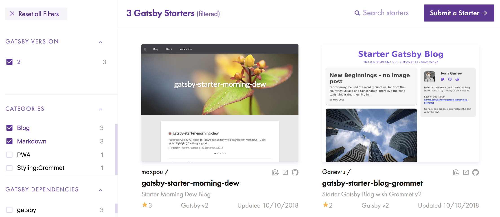

Two months ago, I was in the DublinJS meetup. As usual, the talk I came for, wasn't the most
interesting one. The talk about [ember-ghost](https://github.com/stonecircle/ember-ghost) completely
blew my mind. The speaker shows a static generation website using Ember (JavaScript). It seems that
Jekyll doesn't have the had the monopoly anymore!

By using static generation website in JS, I could take leverage of awesome tools like Webpack (hot
reload), componentization...

## Jekyll pro and cons

I have been running my blog under Jekyll for 3 years. I don't want to blame this tool, my needs have
evolved.

What I like:

- hosted on GitHub for free. The only thing I pay is the domain name _maxpou.fr_ (~6€/year)
- **"backend-less"**! Everything is fully static. I don't want to rely on a DB for a blog!
- Simple to use. There's no over complicated administration panel... well, there's no administration
  at all!
- I write my post in markdown in my IDE. Then, I `git commit` and `git push` to master to publish my
  article!
- ...people can submit PR to fix a typo somewhere (let's be honest: nobody did 😂).
- The theme I use. I like what [@mmistakes](https://github.com/mmistakes) did for the
  [hpstr-jekyll-theme](https://github.com/mmistakes/hpstr-jekyll-theme)!
- it's easy to "pimp" a theme without any Ruby skills!
- Good performances (lighthouse)
- MIT License

What I don't like:

- I don't want to install ruby locally. It's mandatory to get it when working on site structure;
- Jekyll watch mode is slow, even more with docker (2/3 sec to detect a change + 2 sec to recompile
  everything 😴)
- Adding plugins is very complicated. Once, I tried to change the syntax highlighting plugin (Jekyll
  handle markdown to HTML conversion). I spent something like 4 hours, without success. I finally
  drop this idea...
- Service worker management => ☠️. I lost a lot of hairs when trying to make Workbox working...
  without success!

## 🎅 Dear Santa, for my next blog I want...

- Ideally, keep all the thing I like an remove the ones I dislike 😃
- Something easy to install/configure
- Get a static build to deploy on GitHub Pages
- I'm working on a day to day with Vue.js. So, it could be nice if it's something different: React,
  Ember...
- If possible, keep my Disqus comments!
- ... and something that works beyond the classic "getting started" (i.e. manage pagination, ability
  to add new feature...)!

## 🏆 Candidates

Tools I tried:

- [VuePress](https://vuepress.vuejs.org). Good to generate documentation... but there's currently no
  support for blogging. Plus I'm already working with Vue.js.
- [Ember-Ghost](https://github.com/stonecircle/ember-ghost): Looks promising! Unfortunately, I had
  local issues with Ember or Node. I still don't know! (shame, I could have asked the maintainer, I
  know him!)
- [GatsbyJS](https://www.gatsbyjs.org): Gatsby is a React-based, GraphQL powered, static site
  generator.

## 🎉 And the winner is... Gastby!

_(I hope it's not a big surprise, it was in the post's title ;) )_

Pros:

- I ❤️ GraphQL. It's very intuitive! (except when you try to do some custom filters!)
- React is cool. React 16 is even more!
- Looks like Vue.js
- The hot reload is very fast (thanks to Webpack 4)

Cons:

- There is some magic... and I don't like magic. I'm missing a plain old router to match routes with
  pages. Also, the
  [`gatsby-node.js` file](https://github.com/maxpou/maxpou.fr/blob/master/gatsby-node.js) is not
  immediately obvious.
- The [starter library](http://gatsbyjs.org/starters) is not very consistent. And most of the
  starters look like "hello world" project.
- Some small issues with cache invalidation
- ... and that's it!!!

If you want to know the difference between Gatsby and Jekyll, there is a comparative table on
[Gatsby's website](https://www.gatsbyjs.org/features/).

Now let's find the starter:

- [gatsby-starter-casper](https://github.com/haysclark/gatsby-starter-casper): looks very nice but
  use the v1 of Gatsby. I want to start with something on the cutting edge of technology.
- [gatsby-starter-blog](https://github.com/gatsbyjs/gatsby-starter-blog): a very minimalist blog.
  Far away from what I want.
- ...start from scratch?!

I finally opt with the last 2 solutions.

## 🎊 Introducing gatsby-starter-morning-dew

Yes! I did it! I Created my own starter!!! I called it **gatsby-starter-morning-dew**. Why? Well,
check out the list of available starters:

At the moment, there are only 3 available starters for blogging in markdown (the first one is mine
😎). So, **adding an extra one could be a real benefit for the community**!

Before migrating this blog to a new one, I wanted to release the starter first. It took me two
months to get something good. And now I'm very happy with the result.

<i>I removed 9 000 line of code for this new blog!</i>

The full list of features is available on the
[starter's README](https://github.com/maxpou/gatsby-starter-morning-dew). In a nutshell:

- **Markdown:** I still write my post and pages in markdown. There is syntax highlighting syntax
  colour and easily configurable.
- **Configuration:** I don't want people to worry about the internals. That's why almost everything
  is configurable through a JS config file!
- **CSS:** Because I don't want to rely on a framework, I wrote 100% of the CSS! (...I also stole
  fragments 😇)
- **Mobile friendly&PWA**. I felt guilty. I deliver a few talks about Progressive Web Apps and my
  own website wasn't PWA compliant... shame! solved!
- Clear separation between data (posts) and application structures (components, css)
- ... and many other things!

## 🗺 What's next?

I have a lot of ideas for the next:

- manage **pagination**: 25 articles to list is a bit too much for a hello page.
- **css-in-js**: To be honest, I miss the Vuejs's `<style lang="scss" scoped>` tag. I saw different
  React approaches and I like none of them. Maybe if I try one, I'll change my mind? Let see...
- enable **RSS feed**;
- **Markdown syntax checker**. At the moment, it's hard to spot a missing header in a markdown file.
  And the message in the console isn't very helpful;
- clean up the code.

## Show me the code!

Here you go: https://github.com/maxpou/gatsby-starter-morning-dew
