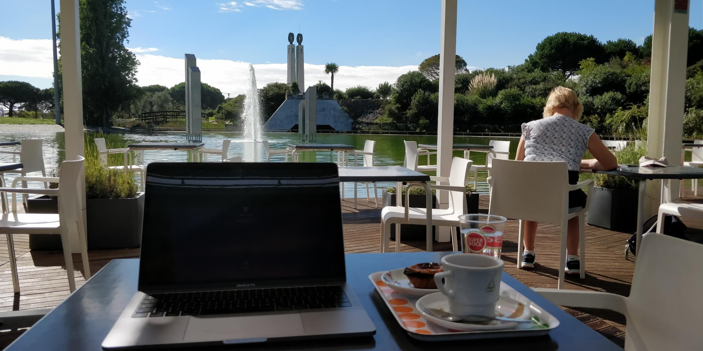
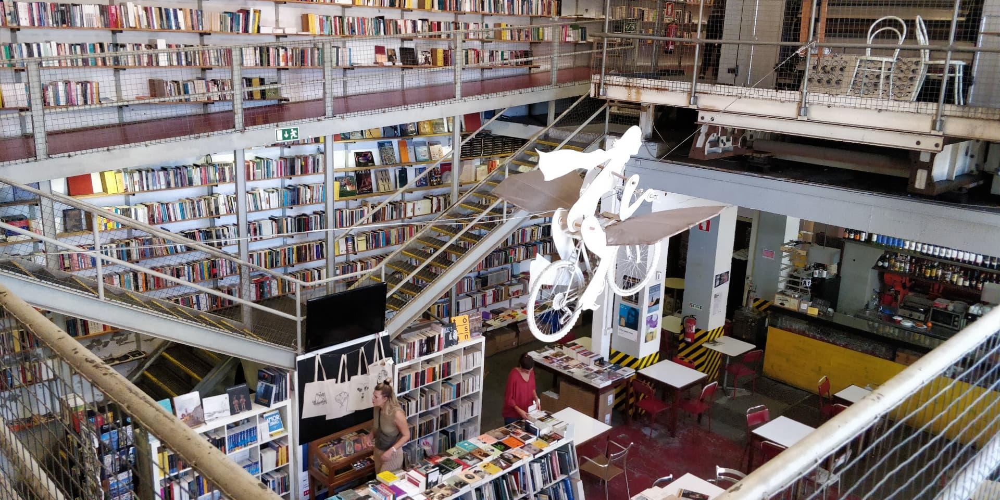
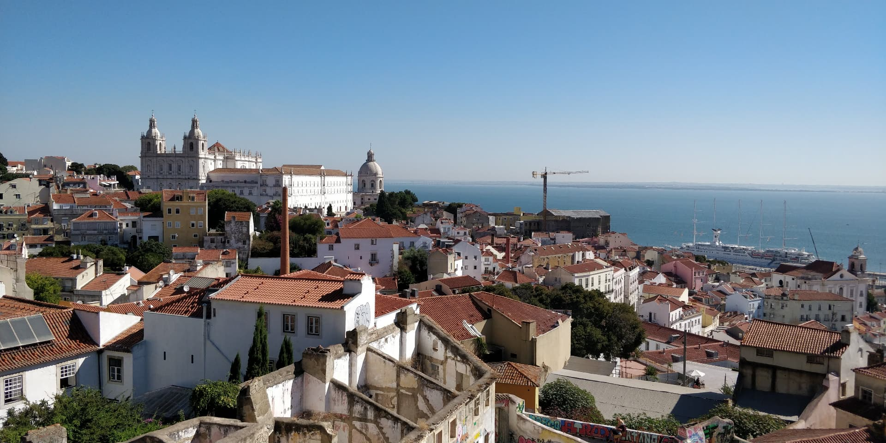

After 2 years, I decided to leave Dublin. I'm still working for the same company but 100% remote.
When it comes to finding a "nomadic friendly" city, usually [Nomad List](https://nomadlist.com/) is
the site to go. I put a few parameters: Europe and good weather (I needed it!).

As you can see, Lisbon appear in the first position. Plus, I heard good things about this city.
That's 2 good reasons to give a try!

## Accommodation

My plan was to stay a month in Lisbon. For short term stay, the best option remains Airbnb. In
Lisbon, you can get something decent from 20 to 50€/night (depends on your expectations). If you
stay longer, you should probably take a look at some
[dedicated Facebook groups](https://www.facebook.com/groups/1544177542561065/).

## Meeting people

The expat and digital communities here are very active. If you want to, you can find something every
day and not only in the evening!

[Meetup.com](https://www.meetup.com/find/events/?allMeetups=true&radius=25&userFreeform=Lisbon%2C+Portugal&mcId=c1032578&change=yes&eventFilter=mysugg)
lists most of the events are. If I had to select just two, it would be
[Lisbon Expats & Locals](https://www.meetup.com/Lisbon-Expats-Locals/) and
[Lisbon Digital Nomads](https://www.meetup.com/Lisbon-Digital-Nomads/). Also, I've found this
[Facebook group (Lisbon Digital Nomads)](https://www.facebook.com/groups/532696873566509/) very
interesting. Mostly if you want to get some tips from other nomads.

## Good places to work from

One thing that really surprised me, is the very strong café culture in the city. It's very frequent
to find people working I usually stay 3-4h / place. If you plan to get there, I recommend you this
places!

**Linha D'Agua**

- 🤗 Amazing view!
- 👎 Unsympathetic staff
- 🔌 Power outlet: few
- 🌐 Network: ok

**Choupana**

- 🤗 Amazing staff, a lot of pastries. Prices are ok.
- 🔌 Power outlet: Almost no one
- 🌐 Network: ok

**Galveias Palace (Library)** - There is also a cafe outside in the yard. I spent a lot of time in
this coffee!

- 👍 Quiet atmosphere, very cheap
- 🔌 Almost a lot (in Library)
- 🌐 Network: bad. Like very bad!

**Wish Coffee** - Located in Lx Factory, an old industrial complex.

- 👍 Well placed.
- ⚠️ No laptop sticker on tables. I came in the morning and it was ok for me to work there for a few
  hours. A bit more expensive than other (2€ for a coffee when the average is 0.7-1€).
- 🔌 Power outlet: few
- 🌐 Network: ok

**Ler Devagar** - Next to Wish Coffee. It's actually a bookshop but there's a lot of tables and a
cafe downstairs.

- 👍 Well placed. The decoration is super nice.
- ⚠️ Can be noisy (visitors). Also, it's allowed to smoke inside 😩
- 🔌 Power outlet: many
- 🌐 Network: ok

**Evolution Hotel**

- 👍 Nice sofa, excellent staff!
- 🔌 Power outlet: many
- 🌐 Network: good

## Mobile application

_(Android but I believe they are also on OS)_

- Foursquare. Say where you are and what you're looking for (coffee, things to do in the city), and
  the app will find it for you! I've found user review more accurate than other applications.
- Meetup.com.
- WifiMap. Show a map of the city with all Wi-Fi access and passwords. It was very helpful. For
  example, one day I've found a very nice coffee but the internet connection was very slow. Thank to
  this app, I've found a better network. Only cons, it contains few adds.

## My feedback about Lisbon

My feedback about Lisbon is **very positive**. I really liked this city and I met very good people
there! I will definitely come back!

- 🌤 **Weather**. I still remember the pilot saying: "Welcome to Lisbon [...] temperature is
  27°c"...in October! Usually, in Winter, it gets around 10-15°c and around 30°c in Summer.
- 🗣 **Language**. The language barrier wasn't very strong. Most of the people there speak with very
  good English.
- 👨🏼‍💻 **Nomad friendly**. As I said in the coffee section above, there are a lot of coffee places to
  work from. Despite the fact that I didn't use coworking spaces at all, there are everywhere in the
  city. When I come back, I'd love one day to try some fancy ones like
  [Second Home](https://secondhome.io/lisbon) :)
- 🍴 **Food**. In general, good is good and cheap! Especially the seafood! I really miss the Pastel
  de Nata with my coffee!
- 🌉 **Size of the city**. For me, it's a perfect size: not too big, not too small. Be careful,
  Lisbon can be hilly sometimes!
- 🚋 **Transports**. Because the city is very walkable, I didn't really use them. But if you're in a
  lazy mood, there's always a way to get somewhere by public transport (bus/metro).
- 🚶‍♀️ **Exploration**. Lisbon offers a wide range of parks. Once you start getting comfortable with
  the city, you can take a train and visit the neighbourhood. You have several options: Sintra,
  Belem (you can skip the tower)...
- 📡 **Wi-Fi**. Overall it's great!
- 👮‍♂️ **Safety**. I've found the city very safe. However, I heard stories about pick-pockets in the
  touristic city centre.
- 💵 **Prices**. I think this city is a victim of its own success. Years ago, this city was very
  cheap so, a lot of people moved there. Now prices are still very decent but it's getting
  unaffordable for locals. I heard a lot of complaints from locals. Apart from that, a coffee is
  around 1€ and a beer around 1-3€. You can eat for 5-10€ or more if you want something fancier.
