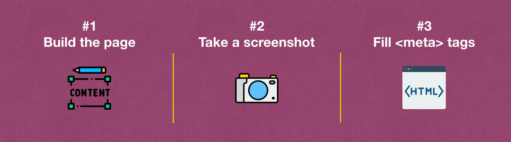
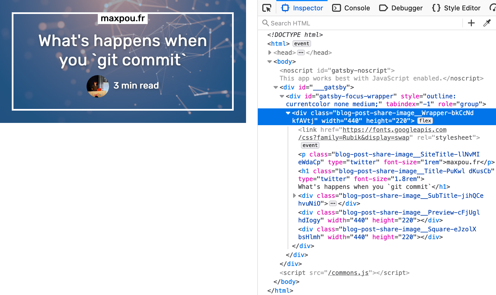
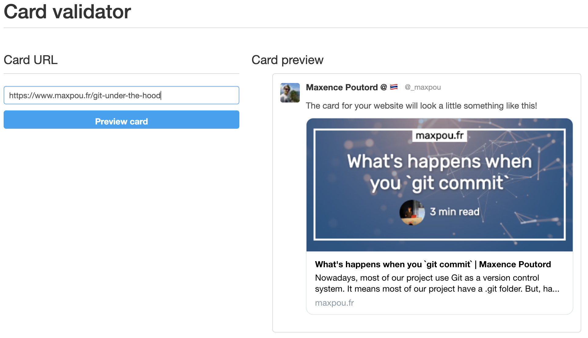

> TL;DR: Generating share images can be done in 3 steps:
>
> 1. create a preview page;
> 2. screenshot it (with Puppeteer);
> 3. add the image in the page's metatags.



---

When you spend hours writing a blog post, you want it to stand out, not to be lost in a feed. That's
why having a social share image attached to your blog post is crucial. People are drawn to visual
content. Our brains respond very quick to images in comparison to plain text.

The idea behind this post is to show you how to generate preview images like this for your Gatsby.js
website.


Social share images are used by social media (Twitter/Facebook/LinkedIn...) and also some
conversational applications (Slack/Telegram/WhatsApp/...).

Before we start, keep in mind that Gatsby is static website generator. We can't generate images _"on
the fly"_ as we do with other dynamic languages (i.e. PHP...).

## Step 1: create the preview page

The preview page is meant to be screenshotted and only screenshotted!

Your blog post page should be generated with something like `createPage()`. So, we are going to
duplicate this statement to create the preview page.

```js {13-18}
// gatsby-node.js
posts.forEach((post, index, posts) => {
  // create the blog post page
  createPage({
    path: post.node.frontmatter.slug,
    component: require.resolve('./src/templates/blog-post.js'),
    context: {
      slug: post.node.frontmatter.slug,
    },
  })

  // create the blogpost page preview
  createPage({
    path: `${post.node.frontmatter.slug}/image_tw`,
    component: require.resolve('./src/templates/blog-post-share-image.js'),
    context: {
      slug: post.node.frontmatter.slug,
    },
  })
})
```

---

💡**How to disable this page in production?**

I guess you don't want to see this page is production right? If you wrap the `createPage` in the
following "if condition". So, the page will be only accessible with `gatsby develop` command.

```js
if (process.env.gatsby_executing_command.includes('develop')) {
  createPage({
    // ...
  })
}
```

---

Then, we need to create the `blog-post-share-image.js`. In the GraphQL query, fetch fields you want
to use (post title, time to read...). And render everything in a rectangle (i.e. 440 x 220 pixels).

If you want,
[here's the template I use for maxpou.fr](https://github.com/maxpou/gatsby-starter-morning-dew/blob/master/src/templates/blog-post-share-image.js).
Now, use your HTML/CSS skill to make the nicest preview 💪.

After that, the preview should be accessible at
`http://localhost:8000/your-article-slug/image_share`.



## Step 2: screenshot the preview

To take a screenshot, I use Puppeteer. Here's a part of the script I am using to take a screenshot:

```js
// scripts/generatePostPreviewImages.js
// full script available here:
// https://github.com/maxpou/gatsby-starter-morning-dew/blob/master/scripts/generatePostPreviewImages.js

// #!/usr/bin/env node
const puppeteer = require('puppeteer')

const takeScreenshot = async (url, destination) => {
  const browser = await puppeteer.launch()
  const page = await browser.newPage()
  await page.goto(url)
  await page.screenshot({
    path: destination,
    clip: {
      x: 0,
      y: 0,
      width: 440,
      height: 220,
    },
  })

  await browser.close()
}

const main = async () => {
  const files = getArticleFiles()

  for (let i = 0; i < files.length; i++) {
    const file = files[i]
    const destinationFile = join(file.directory, `${file.slug}-share.png`)

    // (existsSync check if the file already exist)
    if (!existsSync(destinationFile)) {
      await takeScreenshot(`${baseUrl}${file.slug}/image_share`, destinationFile)
      console.log(`Created ${destinationFile}`)
    }
  }
}

main()
```

...and in the package.json, make the script available as a command.

```json
{
  "scripts": {
    /* ... */
    "generatePostPreviewImages": "./scripts/generatePostPreviewImages.js"
  }
}
```

We are now ready to create the picture! To generate the preview image, open 2 terminals:

- Terminal 1: `npm run gatsby develop`;
- Terminal 2: `npm run generatePostPreviewImages`.

You should have generated some preview images (1 per blog post). The script above put the image
directly in the blog post folder.

## Step 3: integrate the picture in the DOM

The social image is now generated. Before you add it in the HTML's body, don't forget to link the
image with the blog post.

```yml {7}
# ./my-blog-post.md
---
title: 'How to generate social share images with Gatsby'
slug: generate-social-image-share-with-gatsby
cover: ./cover.png
# links preview image
imageShare: ./git-under-the-hood-share.png
---
Your blog post content
```

When you render your blog post, you can add the image generated in an SEO component.

```jsx {8}
class BlogPostTemplate extends React.Component {
  render() {
    const post = this.props.data.post

    return (
      <Layout>
        <SEO
          imageShare={post.frontmatter.imageShare.publicURL}
          /* other: title, description, url... */
        />

        <Wrapper>
          <Article post={post} />
        </Wrapper>
      </Layout>
    )
  }
}
```

The SEO component purpose is to manage all the meta-information located in the page's `<head>`. If
you don't have this component, you can get some inspiration from the
[Gatsby-starter-blog](https://github.com/gatsbyjs/gatsby-starter-blog/blob/master/src/components/seo.js).
Also, feel free to copy/paste
[the code I wrote for my website](https://github.com/maxpou/gatsby-starter-morning-dew/blob/master/src/components/SEO.js#L33-L45).

At the end, you should have something similar in your HTML's body:

```html
<!-- Open Graph meta tags -->
<meta property="og:url" content="https://www.maxpou.fr/super-cool-blog" />
<meta property="og:type" content="article" />
<meta property="og:title" content="My super-cool blog post | maxpou.fr" />
<meta property="og:description" content="This is my very cool blog post description!" />
<meta property="og:image" content="https://www.maxpou.fr/path/to/image/generated.png" />

<!-- Twitter Card Tags -->
<meta name="twitter:card" content="summary_large_image" />
<meta name="twitter:creator" content="_maxpou" />
<meta name="twitter:title" content="My super-cool blog post | gatsby-starter-morning-dew" />
<meta name="twitter:description" content="This is my very cool blog post description!" />
<meta name="twitter:image" content="https://www.maxpou.fr/path/to/image/generated.png" />
```

and... tadaa it should works 🎉

## Conclusion

If you want to check your metatags, you can use
[Twitter cards Validator](https://cards-dev.twitter.com/validator). To test the Open Graph tags, I
usually send a message to myself on Slack.



---

That's it for today! I hope this post will help you to generate your social images share. I copied
all examples from my Gatsby starter/theme:
[gatsby-starter-morning-dew](https://github.com/maxpou/gatsby-starter-morning-dew).
